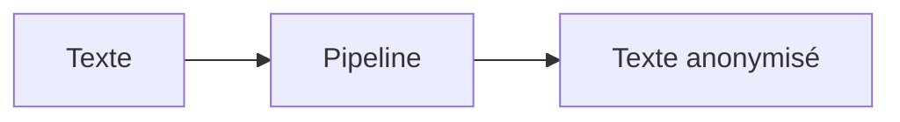
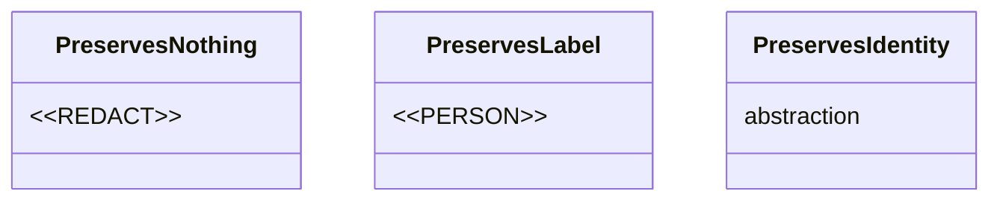

# PIIGhost docs

## Overview

PIIGhost ships **two parallel documentation sites** built with [Zensical](https://zensical.org/), an English one (`docs/en/`) and a French one (`docs/fr/`). Both are deployed via GitHub Pages.

**Iron rule: every change applies to both languages.** A PR that updates only one will look stale and inconsistent the moment it's published. Same files, same headings, same structure, only the prose differs.

## Layout

```
docs/
├── en/                                # canonical English source
│   ├── index.md                       # home (use cases)
│   ├── architecture.md                # layered architecture
│   ├── why-anonymize.md               # threat-model intro
│   ├── extending.md                   # protocol reference for users
│   ├── limitations.md                 # known limits
│   ├── security.md                    # threat model + scope
│   ├── glossary.md
│   ├── placeholder-factories.md       # concept page
│   ├── tool-call-strategies.md        # concept page
│   ├── community/                     # contributing, faq, ...
│   ├── examples/                      # use-case walkthroughs
│   ├── getting-started/               # installation, quickstart, ...
│   ├── reference/                     # API surface
│   ├── stylesheets/extra.css          # CSS overrides
│   └── includes/abbreviations.md      # snippet auto-loaded by zensical
└── fr/                                # mirrors en/, identical layout
zensical.toml       # EN site config (nav, theme, extensions)
zensical.fr.toml    # FR site config
```

## Build & verify

```bash
uv run zensical build --clean              # build EN site (output: site/)
uv run zensical build -f zensical.fr.toml  # build FR site (output: site/fr/)
```

**Always rebuild both sites after a doc change.** CI (`.github/workflows/docs.yml`) runs both in production, so a broken FR build will only surface there if you forget locally.

For iteration, use the dev server:

```bash
uv run zensical serve                      # EN at localhost:8001
uv run zensical serve -f zensical.fr.toml  # FR (run separately)
```

## Page structure

### Frontmatter

```yaml
---
icon: lucide/replace          # any icon from https://lucide.dev/icons
tags:                         # optional, must exist in zensical.toml [project.extra.tags]
  - Advanced
  - Detector
---
```

### Section ordering for concept pages

The two existing concept pages (`placeholder-factories.md`, `tool-call-strategies.md`) follow this structure. Reuse it for new concept pages.

1. `# Title` (matches the nav label)
2. Intro paragraph + `!!! note` admonition for sidebars
3. Bulleted family / variant list as a quick overview
4. `---` separator
5. `## Détail des familles` / `## Family details` — one `### Sub-title` per item
6. `## Tags de préservation` / `## Preservation tags` — formal taxonomy + Mermaid hierarchy
7. `## Factories built-in` / `## Built-in factories` — recap table
8. `## Quel placeholder choisir` / `## Which placeholder to pick` — recommendations table
9. `## Pourquoi …` / `## Why …` — explains middleware constraints
10. `## Écrire la sienne` / `## Writing your own` — extension examples
11. `## Voir aussi` / `## See also` — cross-links to related pages

Use `---` between major sections sparingly. Once between blocks is fine, two in a row is noise.

### Cross-linking

- Same language, same dir: `[Architecture](architecture.md)`
- Same language, subdir: `[FAQ](community/faq.md)`
- **Never link across languages.** Each site is self-contained.

## Placeholder format conventions

The project normalises placeholder examples along a single rule:

- **Synthetic placeholders that do not replicate a PII** (Redact, Type, Type+id, Id-only) wrap the content in `<<` / `>>` so the LLM sees an unambiguous token.
  Examples: `<<REDACT>>`, `<<PERSON>>`, `<<EMAIL>>`, `<<PERSON:1>>`, `<<PERSON:a1b2c3d4>>`, `<<REDACT:a1b2c3d4>>`.
- **Realistic placeholders that replicate a PII format** (Realistic-hashed, Faker, masked) keep no delimiters — the whole point is to look like a real value.
  Examples: `Patient_a1b2c3d4`, `a1b2c3d4@anonymized.local`, `john.doe@example.com`, `Jean Dupont`, `j***@mail.com`, `****4567`.

The built-in factories follow this rule: `LabelPlaceholderFactory` emits `<<PERSON>>`, `LabelHashPlaceholderFactory` emits `<<PERSON:a1b2c3d4>>`, `LabelCounterPlaceholderFactory` emits `<<PERSON:1>>`, `MaskPlaceholderFactory` emits `j***@mail.com`, `FakerPlaceholderFactory` emits `john.doe@example.com`. Apply the same convention in any new doc example or new factory.

## Highlighting PII and placeholders inline

Two CSS classes defined in `stylesheets/extra.css`:

- `.placeholder` (purple) — synthetic tokens
- `.pii` (red) — raw PII values

Apply via `pymdownx.attr_list` *after* a backticked span (note the literal space between the backtick and the brace):

```markdown
Le pipeline transmet `<<PERSON:1>>`{ .placeholder } à la place de `Patrick`{ .pii }.
```

When to tag:

| Inline code | Tag |
|---|---|
| Synthetic placeholder that does **not** replicate a real PII (use `<<...>>` delimiters): `<<PERSON:1>>`, `<<PERSON:a1b2c3d4>>`, `<<PERSON>>`, `<<EMAIL>>`, `<<REDACT>>`, `<<REDACT:a1b2c3d4>>` | `{ .placeholder }` |
| Placeholder that **replicates** a real PII format (no delimiters): `j***@mail.com`, `john.doe@example.com`, `Jean Dupont`, `+33 6 12 34 56 78`, `a1b2c3d4@anonymized.local`, `Patient_a1b2c3d4` | `{ .placeholder }` |
| Raw PII example: `Patrick`, `Marie`, `Paris` (when used as a value to anonymise) | `{ .pii }` |
| Class / tag / method / parameter name: `LabelHashPlaceholderFactory`, `PreservesIdentity`, `abefore_model`, `tool_strategy` | none — plain inline code |

## Mermaid diagrams

Wrap a mermaid block, then add an italic caption tagged with `.figure-caption`:

````markdown


*Pipeline d'anonymisation : du texte brut au texte anonymisé.*
{ .figure-caption }
````

The `.figure-caption` rule in `extra.css` centres the line and dims it. The `{ .figure-caption }` line goes **after** the italic caption, separated only by the caption itself.

For class diagrams (`classDiagram`), embed examples directly inside the class box. **Escape `<` and `>` with `&lt;` / `&gt;`** — mermaid's parser treats them as inheritance arrows otherwise:

````markdown

````

For abstract / intermediate nodes, write the literal word `abstraction` (FR) or `abstraction` (EN, same word) inside the box. Don't use the `<<abstract>>` UML stereotype: zensical's mermaid parser doesn't render it cleanly.

## Tables

### Plain markdown table

Use the default markdown rendering for short, narrow tables (≤4 columns).

### `.wide-table` for dense tables

Wrap a wide markdown table to shrink the font and tighten cell padding without leaving the article column:

```markdown
<div class="wide-table" markdown="1">

| Col1 | Col2 | Col3 | Col4 | Col5 | Col6 |
|---|---|---|---|---|---|
| ... | ... | ... | ... | ... | ... |

</div>
```

The CSS reduces font to `0.82em` and padding to `0.45em / 0.6em`. Native horizontal scroll kicks in when needed. **Do not add negative margins** — earlier attempts to extend the table beyond the article column overlapped the nav and TOC sidebars and were reverted.

### `.security-table` with cell-level colour coding

Used to expose a **privacy / utility gradient** per cell. Two view angles often pair: *confidentiality* (what leaks to the LLM) and *exploitation* (what the agent and system can do). The same answer can flip colour between the two angles — that's the tension the colouring makes explicit.

```markdown
<table class="security-table" markdown="1">
<thead>
<tr><th>Famille</th><th>Type vu ?</th></tr>
</thead>
<tbody>
<tr><td>Marqueur constant</td><td class="c-blue">non</td></tr>
<tr><td>Label seul</td><td class="c-green">oui</td></tr>
</tbody>
</table>
```

Apply colour classes per `<td>`. Available classes:

| Class | Meaning |
|---|---|
| `c-blue` | best — nothing leaks / capability works perfectly |
| `c-green` | acceptable — minimal info, e.g. type alone |
| `c-yellow` | partial — info or conditional collision/risk |
| `c-red` | problematic — real leak / capability broken |

Pair the table with a legend chip set:

```markdown
<small>
Légende :
<span class="sec-legend c-blue">meilleur</span>
<span class="sec-legend c-green">correct</span>
<span class="sec-legend c-yellow">partiel</span>
<span class="sec-legend c-red">problématique</span>
</small>
```

Both light and dark themes are styled in `extra.css` via `[data-md-color-scheme="slate"]` selectors.

## Nav updates

Both `zensical.toml` (EN) and `zensical.fr.toml` (FR) carry a `nav = [...]` array. Always update **both**. The file paths stay the same since `docs_dir` differs per file:

```toml
{ "Concepts" = [
  { "Why anonymize?" = "why-anonymize.md" },
  { "Architecture" = "architecture.md" },
  { "Placeholder factories" = "placeholder-factories.md" },
  { "Tool-call strategies" = "tool-call-strategies.md" },
  { "Glossary" = "glossary.md" },
  { "Limitations" = "limitations.md" },
  { "Security" = "security.md" },
]},
```

Use French labels in the FR config; EN labels in the EN config.

## EN ↔ FR sync rules

- Same number of files in `docs/en/` and `docs/fr/`.
- Same heading structure, same section order, same Mermaid blocks (only captions translate).
- Stylesheets are identical: `diff docs/fr/stylesheets/extra.css docs/en/stylesheets/extra.css` must print nothing.
- Class names, tag names, method names, parameters stay in English in both languages (`PreservesIdentity`, `ThreadAnonymizationPipeline`, `tool_strategy`).
- French prose: avoid anglicisms. Use `se confondre` not `collapser`, `à perte` / `lacunaire` not `lossy`, `caviardage` not `redaction`.
- Code in code fences (Python, shell, etc.) stays in English regardless of page language.

## Common mistakes

| Symptom | Cause | Fix |
|---|---|---|
| Caption appears above the diagram instead of below | `{ .figure-caption }` placed before the italic line | Put `{ .figure-caption }` on the line **after** the italic caption |
| Mermaid renders broken or empty | Used `<<abstract>>` or unescaped `<`/`>` in class members | Use plain `abstraction` text and `&lt;` / `&gt;` for tokens |
| `Unresolved reference` IDE warnings on inline code | Pyrefly tries to resolve identifiers inside markdown tables | Ignore — these are false positives, builds pass |
| Wide table runs under the nav or TOC sidebar | Negative margins on `.wide-table` | Remove the margins, default scroll is correct |
| Doc change shows up only on EN site | Forgot to rebuild FR | Always run both `zensical build --clean` and `zensical build -f zensical.fr.toml` |
| Anchor link broken on FR page (e.g. `#écrire-la-sienne`) | Slugifier with accent inconsistencies | Replace anchor link with prose pointer ("voir la section *X* plus bas") |
| Cell colours don't appear | Tagged the `<tr>` instead of each `<td>` | Move `class="c-..."` onto each `<td>` (per-cell, not per-row) |

## Where styles live

`docs/{en,fr}/stylesheets/extra.css` — keep these two files **identical**:

- `.placeholder` / `.pii` — inline highlight chips
- `.figure-caption` — centred dim caption under diagrams
- `.wide-table` — compact wrapper for dense tables
- `.security-table` cells (`c-blue` / `c-green` / `c-yellow` / `c-red`) — privacy/utility gradient
- `.sec-legend` chips — legend below colour-coded tables

Light + dark mode are both supported via `[data-md-color-scheme="slate"]` selectors.

## See also

- `CLAUDE.md` at repo root — broader project conventions (Python tooling, commit style, type-checking)
- `zensical.toml` and `zensical.fr.toml` — site config including theme features, markdown extensions, custom tags
- `docs/{en,fr}/placeholder-factories.md` and `docs/{en,fr}/tool-call-strategies.md` — reference implementations of the patterns described here
