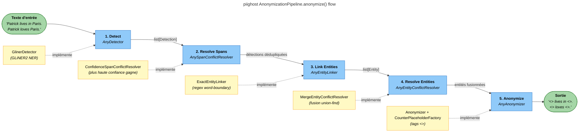
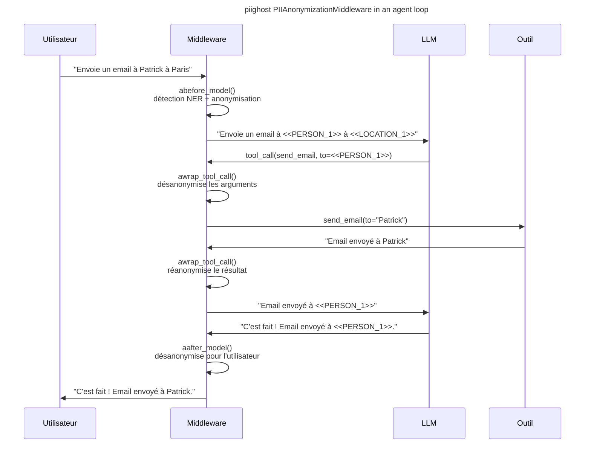

# PIIGhost

[](https://github.com/Athroniaeth/piighost/actions/workflows/ci.yml)

[](https://pypi.org/project/piighost/)
[](https://athroniaeth.github.io/piighost/)
[](https://pytest.org/)
[](https://docs.astral.sh/uv/)
[](https://docs.astral.sh/ruff/)
[](https://github.com/PyCQA/bandit)

`piighost` est une bibliothèque Python qui détecte les données personnelles identifiables (PII), les extrait, puis
anonymise et désanonymise automatiquement les entités sensibles (noms, lieux, etc.). Elle propose des modules
d'anonymisation bidirectionnelle pour les conversations d'agents IA, et s'intègre via un middleware LangChain sans
modification de votre code agent existant.

## Objectifs

Les entreprises qui utilisent des LLM hébergés chez des tiers (GPT, Claude, Gemini) s'exposent à ce que des données
sensibles de leurs utilisateurs soient transmises à ces prestataires. Se reposer uniquement sur des fournisseurs dont
les serveurs d'inférence sont localisés en Europe (Mistral AI, OVHcloud, Scaleway) offre une garantie juridique, mais
pas technique. Vous pourriez renoncer aux modèles propriétaires au profit de modèles open-source auto-hébergés, mais
il vous faut l'infrastructure et accepter de ne pas avoir l'état de l'art.

`piighost` répond à ce compromis : anonymiser les PII avant qu'ils atteignent le LLM, profiter des modèles les plus
capables, et restituer les vraies valeurs à l'utilisateur final, sans que le LLM ni l'hébergeur ne les voient jamais.

Les solutions existantes (Presidio, extensions spaCy, regex) couvrent la détection et l'anonymisation, mais elles :

- ne relient pas les différentes entités entre elles
- ne gèrent pas les chevauchements ou les conflits entre plusieurs NER
- ne tolèrent pas les variantes d'une même entité (casse, fautes d'orthographe, mentions partielles), ce qui entraîne des placeholders incohérents ou des fuites
- laissent au développeur la charge d'orchestrer le cas conversationnel : persistance des placeholders entre les messages, anonymisation/désanonymisation des appels d'outils, etc.

`piighost` crée une surcouche pour améliorer les NER et prendre en charge l'intégralité de ce cycle via un **middleware LangChain bidirectionnel** et une **mémoire de conversation par thread**.

## Cas d'usage

Scénarios concrets où `piighost` trouve naturellement sa place :

- **Chatbot de support client** qui envoie le contenu des tickets à un LLM tiers sans laisser fuir noms, emails ou numéros de compte
- **RAG interne RH** sur des documents contenant des noms de collaborateurs, des salaires ou des notes d'évaluation
- **Assistant juridique** traitant des contrats avec noms de clients et de contreparties
- **Pipelines batch de résumés d'emails** qui ne doivent pas transmettre l'identité de l'expéditeur ou du destinataire
- **Agents outillés** avec accès CRM ou capacité d'envoi d'emails, où le LLM ne voit que des placeholders et où les outils reçoivent les vraies valeurs

## Fonctionnalités

- **Détection** : Détecte les PII avec des modèles NER, des algorithmes, et permet de construire une configuration
  personnalisée via un composant de composition de détecteurs
- **Résolution de spans** : Résout les spans détectés chevauchants ou imbriqués pour garantir des entités propres et non
  redondantes, notamment lors de l'utilisation de plusieurs détecteurs
- **Liaison d'entités** : Relie différentes détections entre elles, offrant une tolérance aux fautes de frappe et
  capturant les mentions qu'un modèle NER pourrait manquer
- **Résolution d'entités** : Résout les conflits entre groupes d'entités liées (par exemple, un détecteur relie A et B,
  un autre B et C) pour garantir des entités finales cohérentes
- **Anonymisation** : Anonymise les entités détectées avec des espaces réservés personnalisables (ex. `<<PERSON_1>>`,
  `<<LOCATION_1>>`) pour protéger la vie privée tout en préservant la structure du texte. Un système de cache mémorise
  les anonymisations appliquées et peut les inverser pour la désanonymisation
- **Placeholder Factory** : Crée des espaces réservés personnalisés pour l'anonymisation, avec des stratégies de nommage
  flexibles (compteurs, UUID, etc.) adaptées à vos besoins
- **Middleware** : Intègre facilement `piighost` dans vos agents LangChain pour une anonymisation transparente avant et
  après les appels au modèle, sans modifier votre code agent existant

## Faiblesses

Il n'existe pas de pipeline d'anonymisation parfaite. Il n'y a que des pipelines adaptées à une situation, et chaque mécanisme de `piighost` corrige certains comportements indésirables au prix d'en introduire d'autres. Identifier les compromis en jeu pour votre cas d'usage fait partie du travail d'intégration.

- **La liaison d'entités amplifie les erreurs du NER.** Après que le détecteur NER a détecté un nom, le linker d'entités (`ExactEntityLinker` par défaut) balaie le reste du texte (et de la conversation) pour rattraper les occurrences manquées. Si la détection initiale est fausse, le linker propage cette erreur à toutes les correspondances. Exemple : `Rose` est correctement détecté comme prénom dans un premier message ; plus loin, le mot `rose` au sens de la fleur est capturé par la même entité et anonymisé comme une personne. Le linker n'a aucun contexte global. Atténuation : remplacez le détecteur par un détecteur plus strict, par exemple le détecteur à correspondance exacte (`ExactMatchDetector`) ou un détecteur à motif (`RegexDetector`), quand vous avez besoin d'un contrôle déterministe, ou désactivez la liaison inter-messages en instanciant un thread frais par message.
- **La résolution floue peut sur-fusionner.** Le resolver flou (`FuzzyEntityConflictResolver`) utilise la similarité Jaro-Winkler pour lier les fautes d'orthographe (`Patric` vers `Patrick`). Sur des noms courts ou proches (`Marin` vs `Martin`, `Lee` vs `Leo`), ce même mécanisme fusionne des personnes distinctes sous un seul placeholder. Atténuation : relevez le seuil de similarité, ou repliez-vous sur le resolver à correspondance exacte (`MergeEntityConflictResolver`, le défaut).

Avant de déployer, vérifiez quelles étapes de la pipeline vous sont réellement utiles : chaque détecteur, linker ou resolver que vous retirez supprime les comportements indésirables qu'il causait, mais réactive ceux qu'il corrigeait. Voir [Architecture](docs/fr/architecture.md) et [Étendre PIIGhost](docs/fr/extending.md) pour les points d'extension.

## Installation

### Installation de base

Ce projet utilise [uv](https://docs.astral.sh/uv/) pour la gestion des dépendances.

```bash
uv add piighost
uv pip install piighost
```

Le paquet principal n'a aucune dépendance obligatoire. Installez les extras selon les fonctionnalités voulues :

```bash
uv add 'piighost[cache]'        # AnonymizationPipeline (aiocache)
uv add 'piighost[gliner2]'      # Gliner2Detector
uv add 'piighost[middleware]'   # PIIAnonymizationMiddleware (langchain + aiocache)
uv add 'piighost[all]'          # Tout
```

### Compatibilité

| Python | LangChain (extra `langchain`) | aiocache (extra `cache`) | GLiNER2 (extra `gliner2`) |
|--------|-------------------------------|--------------------------|---------------------------|
| >=3.10 | >=1.2                         | >=0.12                   | >=1.2                     |

Les versions sont déclarées dans [`pyproject.toml`](pyproject.toml). `piighost` est testé sur Python 3.10 à 3.14.

### Installation en mode développement

Clonez le dépôt et installez avec les dépendances de développement :

```bash
git clone https://github.com/Athroniaeth/piighost.git
cd piighost
uv sync
```

### Commandes Makefile

Lancez la suite de lint complète avec le Makefile fourni :

```bash
make lint
```

Cette commande exécute Ruff (formatage + lint) et PyReFly (vérification de types) via `uv run`.

## Démarrage rapide

### Exemple minimal

Aucun téléchargement de modèle, aucune inférence, juste un dictionnaire fixe apparié par regex aux frontières de mots. Idéal pour essayer `piighost` en moins d'une minute.

```python
import asyncio

from piighost import Anonymizer, ExactMatchDetector
from piighost.pipeline import AnonymizationPipeline

detector = ExactMatchDetector([("Patrick", "PERSON"), ("Paris", "LOCATION")])
pipeline = AnonymizationPipeline(detector=detector, anonymizer=Anonymizer())


async def main():
    anonymized, _ = await pipeline.anonymize("Patrick lives in Paris.")
    print(anonymized)  # <<PERSON_1>> lives in <<LOCATION_1>>.


asyncio.run(main())
```

### Pipeline autonome avec GLiNER2

Vraie détection NER. Télécharge le modèle GLiNER2 depuis HuggingFace lors de la première utilisation.

```python
import asyncio

from piighost.anonymizer import Anonymizer
from piighost.detector.gliner2 import Gliner2Detector
from piighost.pipeline import AnonymizationPipeline

from gliner2 import GLiNER2

model = GLiNER2.from_pretrained("fastino/gliner2-multi-v1")
detector = Gliner2Detector(model=model, labels=["PERSON", "LOCATION"])
pipeline = AnonymizationPipeline(detector=detector, anonymizer=Anonymizer())


async def main():
    text = "Patrick lives in Paris. Patrick loves Paris."
    anonymized, entities = await pipeline.anonymize(text)
    print(anonymized)
    # <<PERSON_1>> lives in <<LOCATION_1>>. <<PERSON_1>> loves <<LOCATION_1>>.

    original, _ = await pipeline.deanonymize(anonymized)
    print(original)
    # Patrick lives in Paris. Patrick loves Paris.


asyncio.run(main())
```

### Avec le middleware LangChain

Un middleware LangChain est un point d'extension qui s'exécute avant et après chaque appel au LLM et chaque appel d'outil. `piighost` s'y branche pour intercepter et transformer les messages, ce qui applique l'anonymisation des PII sans modifier le code de votre agent.

```python
from langchain.agents import create_agent
from langchain_core.tools import tool

from piighost.anonymizer import Anonymizer
from piighost.detector.gliner2 import Gliner2Detector
from piighost.pipeline import ThreadAnonymizationPipeline
from piighost.middleware import PIIAnonymizationMiddleware

from gliner2 import GLiNER2


@tool
def send_email(to: str, subject: str, body: str) -> str:
    """Send an email to a given address."""
    return f"Email successfully sent to {to}."


model = GLiNER2.from_pretrained("fastino/gliner2-multi-v1")
detector = Gliner2Detector(model=model, labels=["PERSON", "LOCATION"])
pipeline = ThreadAnonymizationPipeline(detector=detector, anonymizer=Anonymizer())
middleware = PIIAnonymizationMiddleware(pipeline=pipeline)

graph = create_agent(
    model="openai:gpt-5.4",
    system_prompt="You are a helpful assistant.",
    tools=[send_email],
    middleware=[middleware],
)
```

Le middleware intercepte chaque tour de l'agent : le LLM ne voit que le texte anonymisé, les outils reçoivent les
valeurs réelles, et les messages destinés à l'utilisateur sont désanonymisés automatiquement.

### Composants du pipeline

Le pipeline s'exécute en 5 étapes. Seuls `detector` et `anonymizer` sont obligatoires, les autres ont des valeurs par
défaut raisonnables :

| Étape                | Défaut                           | Rôle                                                                                | Sans cette étape                                                                       |
|----------------------|----------------------------------|-------------------------------------------------------------------------------------|----------------------------------------------------------------------------------------|
| **Detect**           | *(obligatoire)*                  | Trouve les spans PII via NER                                                        | -                                                                                      |
| **Resolve Spans**    | `ConfidenceSpanConflictResolver` | Déduplique les détections chevauchantes (garde la plus haute confiance)             | Les spans chevauchants de plusieurs détecteurs provoquent des remplacements incorrects |
| **Link Entities**    | `ExactEntityLinker`              | Trouve toutes les occurrences de chaque entité via une regex aux frontières de mots | Seules les mentions détectées par NER sont anonymisées ; les autres fuient             |
| **Resolve Entities** | `MergeEntityConflictResolver`    | Fusionne les groupes d'entités partageant une mention (union-find)                  | La même entité pourrait recevoir deux espaces réservés différents                      |
| **Anonymize**        | *(obligatoire)*                  | Remplace les entités par des espaces réservés (`<<PERSON_1>>`)                      | -                                                                                      |

Chaque étape est un **protocole** : remplacez n'importe quelle valeur par défaut par votre propre implémentation.

## Fonctionnement

### Pipeline d'anonymisation



Chaque étape utilise un **protocole** (sous-typage structurel) : remplacez `GlinerDetector` par spaCy, une API distante,
ou un `ExactMatchDetector` pour les tests. Idem pour chaque autre étape.

### Intégration du middleware



## Limites

`piighost` n'est pas une solution miracle. Limites connues à garder en tête avant de déployer :

- **La couverture linguistique** dépend du modèle GLiNER2 chargé. Vérifiez la fiche du modèle avant de supposer qu'une langue est supportée.
- **Les faux négatifs NER** sont inhérents. Pour les entités critiques (emails, numéros de téléphone, identifiants), combinez `GlinerDetector` avec un détecteur regex via `CompositeDetector`.
- **Les PII générées par le LLM dans ses réponses** (entités jamais vues en entrée) ne sont pas couvertes par la liaison d'entités. Gérez-les avec une étape de validation post-réponse au niveau applicatif.
- **Le cache est local** (en mémoire via `aiocache`). Les déploiements multi-instances nécessitent un backend externe (Redis, Memcached) à configurer explicitement.
- **La latence ajoutée n'est pas encore mesurée.** Prévoyez une campagne de mesure sur votre propre charge avant de dimensionner le trafic de production.

Voir [docs/fr/architecture.md](docs/fr/architecture.md) et [docs/fr/extending.md](docs/fr/extending.md) pour les stratégies de mitigation.

## Développement

```bash
uv sync                      # Installer les dépendances
make lint                    # Formatage (ruff), lint (ruff), vérification de types (pyrefly)
uv run pytest                # Lancer tous les tests
uv run pytest tests/ -k "test_name"  # Lancer un test précis
```

## Contribuer

- **Commits** : Conventional Commits via Commitizen (`feat:`, `fix:`, `refactor:`, etc.)
- **Vérification de types** : PyReFly (pas mypy)
- **Formatage/lint** : Ruff
- **Gestionnaire de paquets** : uv (pas pip)
- **Python** : 3.10+

## Écosystème

- **[piighost-api](https://github.com/Athroniaeth/piighost-api)** : Serveur API REST pour l'inférence d'anonymisation
  PII. Charge un pipeline piighost une seule fois côté serveur et expose les opérations anonymize/deanonymize via HTTP,
  de sorte que les clients n'ont besoin que d'un client HTTP léger au lieu d'embarquer le modèle NER.
- **[piighost-chat](https://github.com/Athroniaeth/piighost-chat)** : Application de chat de démonstration illustrant
  des conversations IA respectueuses de la vie privée. Utilise `PIIAnonymizationMiddleware` avec LangChain pour
  anonymiser les messages avant le LLM et désanonymiser les réponses de manière transparente. Construit avec SvelteKit,
  Litestar et Docker Compose.

## Notes complémentaires

- Le modèle GLiNER2 est téléchargé depuis HuggingFace lors de la première utilisation (~500 Mo)
- Tous les modèles de données sont des dataclasses gelées, sûres à partager entre threads
- Les tests utilisent `ExactMatchDetector` pour éviter de charger le vrai modèle GLiNER2 en CI
- Pour le modèle de menaces, ce que `piighost` protège et ce qu'il ne protège pas, ainsi que les considérations de stockage du cache, voir [SECURITY.md](SECURITY.md)
