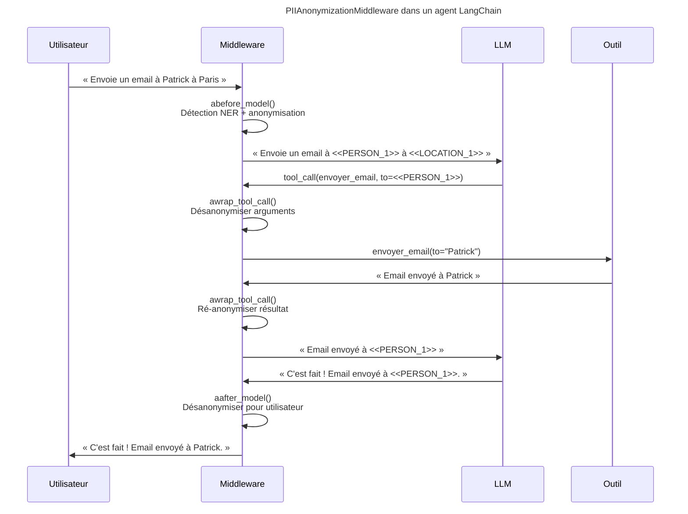

# Hacienda Ghost

> **protège vos données dans votre hacienda numérique.**

[](https://github.com/Athroniaeth/piighost/actions/workflows/ci.yml)
[](https://github.com/jamon8888/hacienda-ghost/actions/workflows/docker.yml)

[](https://pypi.org/project/piighost/)
[](LICENSE)
[](#conformité-rgpd--ai-act)
[](#vérification-de-la-signature-dimage)

**Hacienda Ghost** est un middleware de souveraineté des données pour agents IA. Il détecte les informations personnelles (PII) dans vos prompts, vos documents les remplace par des variantes  opaques avant envoi au LLM, puis les réhydrate dans la réponse. **Vos données sensibles ne quittent jamais votre poste.**

Conçu pour les professionnels européens — avocats, médecins, notaires, DPO, cabinets de conseil — soumis au **RGPD** et à l'**AI Act** (Règlement IA européen, 2024/1689).

---

## Pour qui ?

| Profession | Ce que Hacienda Ghost protège |
|---|---|
| **Avocats** | Noms de clients, montants, adresses, dates d'audience, références de dossiers |
| **Médecins** | Identités de patients, diagnostics, numéros de sécurité sociale, antécédents |
| **Notaires** | Parties prenantes, cadastres, IBAN, clauses familiales sensibles |
| **DPO & RSSI** | Toute PII avant envoi vers un LLM hors UE, avec journal d'audit complet |
| **Cabinets de conseil** | Données clients, secrets industriels, informations contractuelles |

Le principe est simple : **les LLM ne voient que des jetons opaques**. Vous gardez la maîtrise, vos clients gardent leur confidentialité, et vous restez conformes.

---

## Table des matières

- [Pour qui ?](#pour-qui-)
- [En une minute](#en-une-minute)
- [Démarrage rapide](#démarrage-rapide)
- [Fonctionnalités](#fonctionnalités)
- [Comment ça marche ?](#comment-ça-marche-)
- [Installation](#installation)
  - [Installation Python (uv)](#installation-python-uv)
  - [Installation Claude Desktop](#installation-claude-desktop)
  - [Installation Docker](#installation-docker)
  - [Installation automatique par Claude](#installation-automatique-par-claude)
- [Isolation par projet](#isolation-par-projet)
- [Utilisation](#utilisation)
- [Intégrations](#intégrations)
- [Conformité RGPD & AI Act](#conformité-rgpd--ai-act)
- [Architecture](#architecture)
- [Développement](#développement)
- [Écosystème](#écosystème)
- [Licence & support](#licence--support)

---

## En une minute

```python
from piighost.service.core import PIIGhostService

svc = await PIIGhostService.create(vault_dir="~/hacienda-vault")

# Vos données sensibles entrent ici
anon = await svc.anonymize(
    "M. Jean Dupont habite au 12 rue de Rivoli, téléphone 06 12 34 56 78.",
    project="client-dupont",
)
# → Seuls des jetons opaques partent vers le LLM
#   "<PERSON:a3f8…> habite au <ADDRESS:b7e1…>, téléphone <PHONE:c4d2…>."

# Le LLM répond avec les jetons ; vous réhydratez localement
rehydrated = await svc.rehydrate(reponse_llm, project="client-dupont")
# → "M. Jean Dupont habite au 12 rue de Rivoli, …"
```

**Trois garanties fortes :**

1. **Aucune PII ne part** — les LLM OpenAI, Anthropic, Mistral, Ollama ne voient que des hachés déterministes.
2. **Isolation par projet** — chaque dossier client a son propre coffre-fort chiffré, sa propre clé, son propre index.
3. **Audit complet** — chaque anonymisation et chaque révélation est journalisée, horodatée, en append-only, sur votre disque.

---

## Démarrage rapide

Choisissez le chemin qui correspond à votre usage.

### 🏃 En 30 secondes — Python pur

```bash
uv add piighost
```

```python
import asyncio
from piighost.anonymizer import Anonymizer
from piighost.detector.gliner2 import Gliner2Detector
from piighost.pipeline import AnonymizationPipeline
from gliner2 import GLiNER2

model = GLiNER2.from_pretrained("fastino/gliner2-multi-v1")
pipeline = AnonymizationPipeline(
    detector=Gliner2Detector(model=model, labels=["PERSON", "LOCATION"]),
    anonymizer=Anonymizer(),
)

async def main():
    anonymized, entities = await pipeline.anonymize(
        "Patrick habite à Paris. Patrick adore Paris."
    )
    print(anonymized)
    # → <<PERSON_1>> habite à <<LOCATION_1>>. <<PERSON_1>> adore <<LOCATION_1>>.

    original, _ = await pipeline.deanonymize(anonymized)
    print(original)
    # → Patrick habite à Paris. Patrick adore Paris.

asyncio.run(main())
```

### 💬 Avec un agent LangChain

Un middleware transparent : le LLM ne voit que les jetons, vos outils reçoivent les vraies valeurs.

```python
from langchain.agents import create_agent
from langchain_core.tools import tool
from piighost.middleware import PIIAnonymizationMiddleware
from piighost.pipeline import ThreadAnonymizationPipeline
from piighost.detector.gliner2 import Gliner2Detector
from piighost.anonymizer import Anonymizer
from gliner2 import GLiNER2

@tool
def envoyer_email(destinataire: str, sujet: str, corps: str) -> str:
    """Envoie un email à l'adresse indiquée."""
    return f"Email envoyé à {destinataire}."

model = GLiNER2.from_pretrained("fastino/gliner2-multi-v1")
pipeline = ThreadAnonymizationPipeline(
    detector=Gliner2Detector(model=model, labels=["PERSON", "LOCATION", "EMAIL"]),
    anonymizer=Anonymizer(),
)

agent = create_agent(
    model="mistral:mistral-large",
    system_prompt="Tu es un assistant juridique.",
    tools=[envoyer_email],
    middleware=[PIIAnonymizationMiddleware(pipeline=pipeline)],
)
```

### 🖥️ Dans Claude Desktop (MCPB)

1. Téléchargez `hacienda-ghost-full.mcpb` depuis la page [Releases](https://github.com/jamon8888/hacienda-ghost/releases/latest).
2. Double-cliquez ; Claude Desktop installe automatiquement.
3. Choisissez un répertoire de coffre-fort.
4. Redémarrez Claude — les outils `anonymize_text`, `query`, `vault_search` apparaissent.

### 🐳 En Docker

```bash
git clone https://github.com/jamon8888/hacienda-ghost
cd hacienda-ghost
make install   # génère clé de coffre, paire age, .env
make up        # démarre la pile « poste de travail »
```

Claude Desktop se connecte à `http://127.0.0.1:8765`. Aucun port n'est exposé à l'extérieur.

---

## Fonctionnalités

### 🔍 Détection & anonymisation

- **Multi-moteur** — combine détecteurs à règles (regex), modèles NER (**GLiNER2** multilingue) et heuristiques contextuelles. Noms, adresses, emails, téléphones, IBAN, numéros de sécurité sociale, dates de naissance, identifiants fiscaux.
- **Résolution de spans** — fusionne les détections imbriquées ou chevauchantes (`ConfidenceSpanConflictResolver`) pour des entités propres, non redondantes.
- **Liaison d'entités** — relie les mentions d'une même personne même avec fautes de frappe ou variantes (« M. Dupont » = « Jean Dupont » = « Jean D. »).
- **Jetons déterministes** — chaque entité devient un jeton opaque stable (`<PERSON:a3f8…>`) qui survit aux passages multiples dans le LLM.
- **Réhydratation fidèle** — restaure les valeurs originales même si le LLM cite partiellement le jeton.
- **Coffre-fort chiffré AES-256-GCM** — les valeurs originales sont chiffrées au repos, jamais exposées dans les logs ni les erreurs. Clé jamais persistée en clair.
- **Invariant fail-closed** — si l'anonymisation échoue à mi-chemin, aucun texte partiel n'est renvoyé : l'opération échoue en entier.

### 📚 Indexation & recherche (RAG)

- **Ingestion documentaire** — PDF, DOCX, XLSX, ODT, TXT, Markdown, EML, MSG via **Kreuzberg** (OCR intégré pour les PDF scannés).
- **Recherche hybride** — combine **BM25** (mots-clés exacts sur jetons déterministes) et **recherche vectorielle** (embeddings `multilingual-e5-base`). Essentiel pour les documents anonymisés : les jetons n'ont pas de sémantique, donc le vectoriel seul ne suffit pas.
- **Reranking** — modèle cross-encoder (`BAAI/bge-reranker-base`) pour réordonner les résultats selon la pertinence fine.
- **Filtres de requête** — restreignez à un préfixe de chemin ou à une liste d'ID de documents (`QueryFilter(file_path_prefix=…)`).
- **Streaming sûr** — la réhydratation en flux utilise un buffer à fenêtre glissante qui empêche toute fuite de jetons partiels vers l'utilisateur (ex. : `<PERSON:a3` coupé au milieu).
- **Cache de réponses** — requêtes identiques servies instantanément sans ré-invoquer le LLM (backend **aiocache**, TTL configurable). Le cache est cloisonné par projet.

### 🔌 Intégrations

- **LangChain** — `PIIAnonymizationMiddleware`, retrievers hybrides, pipeline `PIIGhostRAG` clé-en-main.
- **Haystack** — composants pipeline compatibles, `CachedRagPipeline`, `streaming_callback` sûr.
- **MCP (Model Context Protocol)** — serveur prêt pour Claude Desktop, via bundle `.mcpb` ou configuration manuelle.
- **CLI `piighost`** — ingestion, requête, gestion du coffre-fort, export portabilité.
- **Démon local** — serveur JSON-RPC pour intégration avec d'autres applications desktop.
- **REST API** — via [piighost-api](https://github.com/Athroniaeth/piighost-api) (paquet séparé).

### 🛡️ Souveraineté & conformité

- **100 % local par défaut** — indexation, embeddings, reranking, coffre-fort : tout tourne sur votre machine.
- **Aucune télémétrie** — pas d'appel sortant sauf vers le LLM que *vous* configurez.
- **LLM au choix** — compatible Mistral, OpenAI, Anthropic, Ollama local, vLLM, LM Studio, LightOn.
- **Images Docker signées** — signature **cosign** keyless (OIDC GitHub Actions) + **SBOM SPDX** attachée.
- **Mises à jour vérifiées** — `piighost self-update` vérifie la signature avant d'épingler un nouveau digest.

---

## Comment ça marche ?

### Pipeline d'anonymisation

Cinq étapes, dont trois interchangeables via protocoles Python (structural subtyping).

```mermaid
---
title: "Flux AnonymizationPipeline.anonymize()"
---
flowchart LR
    classDef stage fill:#90CAF9,stroke:#1565C0,color:#000
    classDef protocol fill:#FFF9C4,stroke:#F9A825,color:#000
    classDef data fill:#A5D6A7,stroke:#2E7D32,color:#000

    INPUT(["`**Texte d'entrée**
    _'Patrick habite à Paris.
    Patrick adore Paris.'_`"]):::data

    DETECT["`**1. Détecter**
    _AnyDetector_`"]:::stage
    RESOLVE_SPANS["`**2. Résoudre spans**
    _AnySpanConflictResolver_`"]:::stage
    LINK["`**3. Lier entités**
    _AnyEntityLinker_`"]:::stage
    RESOLVE_ENTITIES["`**4. Résoudre entités**
    _AnyEntityConflictResolver_`"]:::stage
    ANONYMIZE["`**5. Anonymiser**
    _AnyAnonymizer_`"]:::stage

    OUTPUT(["`**Sortie**
    _'<<PERSON_1>> habite à <<LOCATION_1>>.
    <<PERSON_1>> adore <<LOCATION_1>>.'_`"]):::data

    INPUT --> DETECT
    DETECT -- "list[Detection]" --> RESOLVE_SPANS
    RESOLVE_SPANS -- "détections dédupliquées" --> LINK
    LINK -- "list[Entity]" --> RESOLVE_ENTITIES
    RESOLVE_ENTITIES -- "entités fusionnées" --> ANONYMIZE
    ANONYMIZE --> OUTPUT
```



| Étape | Défaut | Rôle | Sans elle |
|-------|--------|------|-----------|
| **1. Détecter** | *(requis)* | Trouve les spans PII via NER, regex, ou heuristique | — |
| **2. Résoudre spans** | `ConfidenceSpanConflictResolver` | Dédupliqe les détections chevauchantes (garde la plus confiante) | Remplacements corrompus par spans concurrents |
| **3. Lier entités** | `ExactEntityLinker` | Trouve toutes les occurrences de chaque entité (regex word-boundary) | Seules les mentions NER sont anonymisées ; les autres fuitent |
| **4. Résoudre entités** | `MergeEntityConflictResolver` | Fusionne les groupes d'entités partageant une mention (union-find) | Une même entité peut avoir deux jetons différents |
| **5. Anonymiser** | *(requis)* | Remplace les entités par les jetons (`<<PERSON_1>>`) | — |

Chaque étape est un **protocole** : remplacez `Gliner2Detector` par spaCy, une API distante, ou un `ExactMatchDetector` pour les tests. Même principe pour les autres étapes.

### Middleware dans une boucle d'agent



Le LLM ne voit **jamais** le vrai nom. Les outils reçoivent les **vraies** valeurs (pour pouvoir envoyer l'email). L'utilisateur reçoit le texte en clair. Tout est transparent.

---

## Installation

### Installation Python (uv)

Gestion de dépendances via [uv](https://docs.astral.sh/uv/).

```bash
# Dépendances minimales — anonymisation seule
uv add piighost

# Avec le détecteur NER multilingue
uv add "piighost[gliner2]"

# Avec indexation documentaire + RAG
uv add "piighost[index,langchain,haystack]"

# Tout (client, MCP, embeddings locaux, transformers)
uv add "piighost[all]"
```

**Installation depuis les sources pour développement :**

```bash
git clone https://github.com/Athroniaeth/piighost.git
cd piighost
uv sync --all-extras
make lint        # format + lint + type-check
uv run pytest    # lance la suite complète
```

### Installation Claude Desktop

#### Méthode 1 — Bundle MCPB (recommandée)

1. Téléchargez le bundle depuis la page [Releases](https://github.com/jamon8888/hacienda-ghost/releases/latest) :
   - **`hacienda-ghost-core.mcpb`** — anonymisation + coffre-fort seuls (~50 Mo)
   - **`hacienda-ghost-full.mcpb`** — avec indexation documentaire + RAG (~1,5 Go, dépendances lourdes : torch, sentence-transformers)
2. **Double-cliquez** sur le fichier `.mcpb`. Claude Desktop ouvre la fenêtre d'installation.
3. Confirmez et choisissez un **répertoire de coffre-fort** (par exemple `~/Documents/hacienda-vault`).
4. Redémarrez Claude Desktop. Les outils suivants apparaissent dans le menu MCP :

| Outil | Usage |
|---|---|
| `anonymize_text` | Anonymiser un texte avant envoi au LLM |
| `rehydrate_text` | Restaurer les valeurs originales dans une réponse |
| `index_path` | Indexer un dossier (PDF, DOCX, …) |
| `query` | Interroger les documents indexés (RAG) |
| `vault_search` / `vault_show` | Chercher et révéler des jetons (avec audit) |
| `list_projects` / `create_project` / `delete_project` | Gérer les projets (dossiers clients) |

Au premier appel, `uv` installe automatiquement les dépendances Python (quelques minutes la première fois, instantané ensuite).

#### Méthode 2 — Configuration manuelle

Éditez votre fichier `claude_desktop_config.json` :

- **macOS** : `~/Library/Application Support/Claude/claude_desktop_config.json`
- **Windows** : `%APPDATA%\Claude\claude_desktop_config.json`
- **Linux** : `~/.config/Claude/claude_desktop_config.json`

Ajoutez la section `mcpServers` :

```json
{
  "mcpServers": {
    "hacienda-ghost": {
      "command": "uvx",
      "args": [
        "--from", "piighost[mcp]",
        "piighost-mcp",
        "--vault-dir", "/chemin/vers/votre/vault"
      ],
      "env": {
        "PIIGHOST_DETECTOR": "gliner2",
        "PIIGHOST_EMBEDDER": "multilingual-e5",
        "CLOAKPIPE_VAULT_KEY": "<clé-générée-par-piighost-init>"
      }
    }
  }
}
```

Redémarrez Claude Desktop.

#### Méthode 3 — Plugin Cowork `hacienda`

Pour les professionnels qui travaillent dossier par dossier dans **Claude Cowork**, le dépôt fournit un plugin prêt-à-l'emploi sous [`plugin/`](plugin/README.md) — nom de code **hacienda**. Il enveloppe le serveur MCP `piighost` avec des *skills* en langage naturel dédiées au secret professionnel (avocats, notaires, experts-comptables, médecins, CGP/CIF).

```bash
claude plugins add jamon8888/hacienda
```

Ouvrez ensuite un dossier client dans Cowork (glisser-déposer ou **File → Open Folder**) : le plugin indexe automatiquement le dossier et expose les commandes :

| Commande | Rôle |
|---|---|
| `/index` | (Ré-)indexer le dossier actif |
| `/ask` | Question sur le dossier, réponse avec citations (PII anonymisée à la sortie) |
| `/status` | État de l'index et du coffre-fort |
| `/audit` | Rapport de la session courante (anonymisations, révélations) |
| `/redact-outbound` | Force l'anonymisation des brouillons sortants (emails, Slack…) |
| `/knowledge-base` | Navigation documentaire dans le dossier |

Contrairement aux bundles MCPB, le plugin Cowork **n'ajoute aucun code exécutable** : il se contente de déclarer un serveur MCP (`piighost`) et des skills en prose. Voir [`plugin/README.md`](plugin/README.md) pour la liste complète, les limites connues (pas de hook `PreToolUse` côté Cowork v1, un dossier actif à la fois) et les contrats de support payant.

### Installation Docker

Pour les cabinets qui préfèrent une installation isolée, reproductible, et séparée de leur environnement Python local, Hacienda Ghost fournit une pile Docker complète avec **images signées cosign**, **sauvegardes chiffrées**, et **mises à jour vérifiées**.

#### Prérequis

- **Docker Engine** ≥ 24 avec `docker compose` v2 (vérifier : `docker compose version`)
- **4 Go de RAM** et **10 Go de disque** pour l'image `slim`
- **16 Go de RAM** et **40 Go de disque** pour l'image `full` (NER GLiNER, embeddings locaux)
- Un nom de domaine pointant vers la machine (uniquement pour le profil `server`, pour Let's Encrypt)

#### Démarrage « poste de travail »

Pour un professionnel solo sur son ordinateur :

```bash
git clone https://github.com/jamon8888/hacienda-ghost
cd hacienda-ghost

make install   # génère clé de coffre, paire age, fichier .env
make up        # démarre la pile en profil « poste de travail »
make status    # vérifie l'état
```

Claude Desktop se connecte à `http://127.0.0.1:8765`. **Aucun port n'est exposé à l'extérieur.**

#### Déploiement « serveur de cabinet »

Pour un cabinet avec plusieurs postes clients derrière un pare-feu :

```bash
# Adapter le .env
sed -i 's/COMPOSE_PROFILES=workstation/COMPOSE_PROFILES=server/' .env
sed -i 's/PIIGHOST_PUBLIC_HOSTNAME=.*/PIIGHOST_PUBLIC_HOSTNAME=piighost.cabinet.local/' .env
sed -i 's/CADDY_EMAIL=.*/CADDY_EMAIL=dpo@cabinet.local/' .env

# Créer un premier jeton client
docker compose run --rm piighost-daemon \
    piighost token create --name "poste-durand"
# → copier le jeton dans la configuration Claude Desktop du poste

make up-server
```

Caddy obtient automatiquement un certificat TLS via Let's Encrypt et applique l'authentification par jeton bearer. Pour passer en mTLS :

```bash
echo "PIIGHOST_AUTH=mtls" >> .env
make up-server
```

#### Overlays optionnels — souveraineté totale

Pour supprimer toute dépendance aux services cloud externes :

```bash
# Embedder local (sentence-transformers) — l'indexation RAG devient hors-ligne
docker compose --profile server \
    -f docker-compose.yml \
    -f docker-compose.embedder.yml \
    up -d

# Pile souveraine complète : anonymisation + embedder + LLM (Ollama)
make up-sovereign
```

Le réseau `piighost-llm` est marqué `internal: true` — Ollama ne peut communiquer qu'avec Hacienda Ghost, jamais avec Internet.

#### Sauvegardes chiffrées

Une sauvegarde quotidienne chiffrée avec **age** est activée par défaut (02:30 locale). Archives dans `./backups/` au format `piighost-AAAA-MM-JJ.tar.age`, rétention **7 jours + 4 semaines**.

```bash
make backup                                              # sauvegarde immédiate
make restore BACKUP=./backups/piighost-2026-04-20.tar.age  # restauration
```

> ⚠ **Important :** la clé privée age (`docker/secrets/age.key`) doit être conservée **hors de la machine** — papier, HSM, ou gestionnaire de mots de passe d'un associé. Perdre cette clé rend les sauvegardes irrécupérables.

Pour désactiver la sauvegarde intégrée (si vous utilisez déjà Restic, Borg, ou une solution entreprise) :

```bash
COMPOSE_PROFILES=workstation,no-backup make up
```

#### Mises à jour vérifiées

Les images sont épinglées par **digest SHA-256** dans `docker-compose.yml`, jamais par tag mutable.

```bash
piighost self-update        # ou : make update
docker compose pull
docker compose up -d
```

`self-update` :

1. Récupère le dernier digest depuis GHCR
2. **Vérifie la signature `cosign`** (OIDC keyless, émise par GitHub Actions)
3. Affiche le diff et demande confirmation
4. Réécrit `docker-compose.yml` avec le nouveau digest

Pour revenir en arrière : `git revert` sur le commit de mise à jour, puis `docker compose up -d`.

Un sidecar `piighost-update-notify` vérifie chaque nuit la présence d'une nouvelle version et écrit un avis dans `/var/lib/piighost/update-available.json`. Il **ne touche jamais** à la pile en cours.

#### Vérification de la signature d'image

```bash
cosign verify \
    --certificate-identity-regexp 'https://github\.com/jamon8888/.*' \
    --certificate-oidc-issuer 'https://token.actions.githubusercontent.com' \
    ghcr.io/jamon8888/hacienda-ghost:slim
```

La commande doit afficher une signature valide. En cas d'échec, **ne déployez pas l'image** et ouvrez un ticket immédiatement.

#### Posture de sécurité

Chaque conteneur applique par défaut :

- **Utilisateur non-root** (UID 10001)
- **Système de fichiers en lecture seule** (`read_only: true`, `tmpfs` pour `/tmp` et `/run`)
- **Toutes les capacités Linux abandonnées** (`cap_drop: [ALL]`)
- **`no-new-privileges: true`** + profil seccomp par défaut
- **Secrets via Docker secrets** — jamais via variables d'environnement (évite les fuites par `docker inspect`)
- **Base distroless** (`slim`) ou **Chainguard** (`full`) — pas de shell, pas de gestionnaire de paquets, surface d'attaque minimale
- **Réseau interne** (`internal: true`) pour le daemon et l'overlay LLM — **aucun egress**

#### Dépannage

| Symptôme | Cause probable | Remède |
|---|---|---|
| `make up` échoue sur `secrets` | `docker/secrets/vault-key.txt` manquant | `make install` |
| MCP inaccessible depuis Claude Desktop | Pare-feu bloque 8765 (workstation) | `netstat -an \| grep 8765` |
| Caddy ne récupère pas de certificat TLS | DNS incorrect ou port 80/443 bloqué | `docker compose logs caddy` |
| Image trop grosse au téléchargement | Utilisation de `full` au lieu de `slim` | `PIIGHOST_TAG=slim make up` |
| Sauvegarde échoue « recipient file is empty » | `docker/secrets/age-recipient.txt` vide | `age-keygen -y age.key > age-recipient.txt` |

Logs détaillés : `docker compose logs -f piighost-mcp piighost-daemon`

Remise à zéro (⚠ destructive — supprime toutes les données) : `make clean`

### Installation automatique par Claude

Vous pouvez laisser Claude installer Hacienda Ghost à votre place. Copiez-collez simplement ce prompt dans Claude Desktop :

> ````
> Installe Hacienda Ghost localement et configure-le dans Claude Desktop :
>
> 1. Vérifie que `uv` est installé (https://docs.astral.sh/uv/) ; sinon installe-le
>    avec la commande officielle pour mon OS.
> 2. Crée `~/Documents/hacienda-vault` s'il n'existe pas.
> 3. Installe le paquet : `uv tool install "piighost[mcp]"`.
> 4. Initialise le coffre-fort : `piighost --init --vault-dir ~/Documents/hacienda-vault`.
>    Note la clé `CLOAKPIPE_VAULT_KEY` générée et conserve-la dans mon gestionnaire
>    de mots de passe.
> 5. Ouvre `claude_desktop_config.json` (emplacement selon l'OS).
> 6. Ajoute la section `mcpServers.hacienda-ghost` en préservant les autres
>    serveurs MCP existants. La commande doit pointer vers `uvx`, utiliser
>    `--from piighost[mcp] piighost-mcp --vault-dir <chemin>`, et exporter
>    `CLOAKPIPE_VAULT_KEY` depuis l'étape 4.
> 7. Crée un projet démo : `piighost project create demo`.
> 8. Résume-moi : chemin du coffre, nom du projet, emplacement du config, et
>    instructions de redémarrage.
>
> Ne modifie AUCUN autre fichier système. N'envoie AUCUNE donnée à l'extérieur.
> Demande-moi confirmation à chaque étape critique.
> ````

Claude suivra les étapes via ses outils Bash et FileSystem en demandant confirmation aux moments clés.

---

## Isolation par projet

Hacienda Ghost isole strictement les données par **projet** — une unité logique avec son propre index, son propre coffre-fort, et ses propres métadonnées. **Aucune fuite possible entre projets.**

### Structure sur disque

```
~/.hacienda-ghost/
├── vaults/
│   ├── client-dupont/            # Projet 1 — totalement isolé
│   │   ├── vault.db              # Coffre-fort chiffré (clé propre)
│   │   ├── index.lance/          # Index vectoriel
│   │   └── bm25/                 # Index mots-clés
│   ├── dossier-medical-smith/    # Projet 2 — aucune visibilité sur projet 1
│   │   ├── vault.db
│   │   ├── index.lance/
│   │   └── bm25/
│   └── default/                  # Projet par défaut
└── audit.log                     # Journal d'audit global (append-only)
```

### Garanties d'isolation

- **Clés de chiffrement séparées** — chaque projet a sa propre clé AES-256 dérivée. La compromission d'un projet ne menace pas les autres.
- **Jetons non portables** — `<PERSON:a3f8…>` du projet A n'a aucune signification dans le projet B. Impossible de mélanger les contextes par erreur.
- **Recherche cloisonnée** — `svc.query(…, project="client-dupont")` ne retournera jamais un chunk d'un autre projet.
- **Cache RAG cloisonné** — la clé de cache inclut l'ID projet ; deux projets produisent deux entrées distinctes même pour une même question.
- **Suppression atomique** — `piighost project delete client-dupont` efface intégralement (index, coffre, cache) en une opération.

### Commandes

```bash
# Créer un projet
piighost project create client-dupont --description "Contentieux M. Dupont"

# Lister
piighost project list

# Indexer dans un projet spécifique
piighost index ~/docs/client-dupont --project client-dupont

# Requêter
piighost query "Qui est le défendeur ?" --project client-dupont

# Supprimer (refuse par défaut si non vide)
piighost project delete client-dupont --force
```

---

## Utilisation

### Anonymiser une conversation

```python
import asyncio
from piighost.service.core import PIIGhostService
from piighost.service.config import ServiceConfig

async def main():
    cfg = ServiceConfig()
    svc = await PIIGhostService.create(vault_dir="~/hacienda-vault", config=cfg)

    anon = await svc.anonymize(
        "M. Jean Dupont habite au 12 rue de Rivoli à Paris.",
        project="demo",
    )
    print(anon.anonymized)
    # → "<PERSON:a3f8…> habite au <ADDRESS:b7e1…> à <LOCATION:c4d2…>."

    # … envoyez anon.anonymized au LLM distant …
    reponse_llm = "<PERSON:a3f8…> réside à <LOCATION:c4d2…>."

    rehydrated = await svc.rehydrate(reponse_llm, project="demo")
    print(rehydrated.text)
    # → "M. Jean Dupont réside à Paris."

asyncio.run(main())
```

### Interroger un dossier avec RAG

```python
from piighost.integrations.langchain.rag import PIIGhostRAG
from piighost.integrations.langchain.cache import RagCache
from piighost.indexer.filters import QueryFilter
from langchain_mistralai import ChatMistralAI

rag = PIIGhostRAG(svc, project="client-dupont", cache=RagCache(ttl=300))

# Ingestion (PDF, DOCX, XLSX, ODT, EML, MSG, TXT, MD)
await rag.ingest("~/docs/client-dupont/")

# Requête filtrée + reranking + cache
llm = ChatMistralAI(model="mistral-large-latest")
answer = await rag.query(
    "Quelle est la date du procès-verbal ?",
    llm=llm,
    filter=QueryFilter(file_path_prefix="~/docs/client-dupont/2024/"),
    rerank=True,
    top_n=20,
)
print(answer)
# → Aucune PII n'est sortie vers le LLM ; la réponse est réhydratée localement.
```

> **Invariant d'ordre :** l'anonymiseur s'exécute **avant** l'embedder. Une fois correctement câblé, les embedders cloud ne voient que des jetons opaques ; la correspondance jeton → valeur originale reste dans les métadonnées LanceDB, sur votre infrastructure.

### Recherche hybride pour les requêtes riches en PII

Quand le contenu indexé est anonymisé, la recherche vectorielle seule peut rater les recherches par nom exact — les jetons (`<PERSON:…>`) n'ont pas de sémantique. Combinez **BM25** (correspondance exacte sur le jeton déterministe) avec la **recherche vectorielle** via `EnsembleRetriever`. Voir `tests/integrations/langchain/test_hybrid_retrieval.py` pour une recette complète.

### Révélation contrôlée depuis le coffre-fort

```bash
# Lister les jetons d'un projet
piighost vault list --project client-dupont

# Afficher la valeur originale (inscrit dans l'audit)
piighost vault show <PERSON:a3f8...> --project client-dupont --reveal
```

Chaque révélation est **journalisée** dans `audit.log` avec horodatage, utilisateur, et raison si fournie (`--reason "export expertise judiciaire"`).

---

## Intégrations

### LangChain

```python
from piighost.middleware import PIIAnonymizationMiddleware
from piighost.integrations.langchain.rag import PIIGhostRAG
```

- `PIIAnonymizationMiddleware` — middleware de agent `create_agent`
- `PIIGhostRAG` — pipeline RAG clé-en-main (anonymisation + index + reranking + cache)
- Retrievers compatibles `BaseRetriever` pour composition libre

### Haystack

```python
from piighost.integrations.haystack.rag import CachedRagPipeline
```

- Composants compatibles `haystack.Component`
- `CachedRagPipeline` avec `streaming_callback` sûr (fenêtre glissante)

### Model Context Protocol (MCP)

- Serveur `piighost-mcp` avec transport `stdio` (Claude Desktop) ou `sse` (autres clients MCP)
- Outils exposés : `anonymize_text`, `rehydrate_text`, `index_path`, `query`, `vault_*`, `list_projects`, etc.

### CLI

```bash
piighost --help

piighost project create <nom>           # créer un projet
piighost index <chemin> --project <nom> # indexer
piighost query "<question>" --project <nom>
piighost vault list --project <nom>
piighost docker init                     # génère secrets Docker
piighost self-update                     # met à jour les digests cosign-vérifiés
```

---

## Conformité RGPD & AI Act

### RGPD — Règlement Général sur la Protection des Données (UE 2016/679)

Hacienda Ghost est conçu **par défaut** pour la conformité RGPD.

| Principe RGPD | Mise en œuvre |
|---|---|
| **Art. 5(1)(b) — Limitation des finalités** | Les données PII sont traitées uniquement pour l'anonymisation locale. Aucune transmission à des tiers. |
| **Art. 5(1)(c) — Minimisation** | Seuls les jetons opaques partent vers le LLM. Les valeurs originales restent dans votre coffre-fort local. |
| **Art. 5(1)(f) — Intégrité & confidentialité** | Coffre-fort chiffré AES-256-GCM, clé dérivée par utilisateur, stockée hors du projet. |
| **Art. 17 — Droit à l'effacement** | `piighost vault delete` pour un jeton ; `piighost project delete` pour un dossier complet. |
| **Art. 20 — Portabilité** | Export JSON des documents indexés, jetons et métadonnées. |
| **Art. 25 — Privacy by design** | Aucune PII n'est jamais loggée. Les erreurs sont expurgées. Invariants vérifiés à chaque test. |
| **Art. 30 — Registre des traitements** | Journal d'audit local (append-only) de chaque anonymisation et révélation. |
| **Art. 32 — Sécurité du traitement** | Chiffrement en transit (HTTPS vers le LLM) et au repos (AES-256-GCM). Clé jamais loggée. |
| **Art. 33 — Notification de violation** | Détection de tentatives d'accès non autorisé via les logs d'audit. |
| **Art. 44-49 — Transferts hors UE** | Les PII ne sont pas transférées au LLM ; les transferts vers des LLM hors UE (OpenAI, Anthropic US) ne constituent plus un transfert de données personnelles au sens du RGPD. |

### AI Act — Règlement européen sur l'intelligence artificielle (UE 2024/1689)

L'AI Act entre en application progressivement jusqu'en 2026. Hacienda Ghost facilite la conformité pour les systèmes IA à haut risque et les obligations de transparence.

| Article AI Act | Mise en œuvre |
|---|---|
| **Art. 10 — Gouvernance des données** | Données d'entraînement et de contexte envoyées aux LLM tracées, anonymisées, journalisées. |
| **Art. 12 — Journalisation** | Journal d'audit horodaté de chaque interaction LLM (requête anonymisée + réponse réhydratée). |
| **Art. 13 — Transparence** | Jetons `<LABEL:hash>` explicites — l'utilisateur sait qu'une anonymisation a eu lieu. |
| **Art. 14 — Contrôle humain** | Coffre-fort permet la révélation contrôlée (`vault show --reveal`) avec journalisation. |
| **Art. 15 — Exactitude, robustesse, cybersécurité** | Tests d'invariants fail-closed — si l'anonymisation échoue, aucun texte partiel n'est renvoyé. |
| **Art. 50 — Deepfakes et contenu IA** | Les réponses LLM peuvent être marquées d'origine IA via la métadonnée RAG. |

---

## Architecture

```
┌──────────────────────────────────────────────────────────────┐
│  Utilisateur / Claude Desktop / Agent LangChain / Haystack   │
└────────────────────────┬─────────────────────────────────────┘
                         │
┌────────────────────────▼─────────────────────────────────────┐
│  MCP Server (hacienda-ghost)                                 │
│    Outils : anonymize_text, rehydrate_text, query, vault_*   │
└────────────────────────┬─────────────────────────────────────┘
                         │
┌────────────────────────▼─────────────────────────────────────┐
│  PIIGhostService  —  multiplexeur multi-projet                │
│  ┌──────────────┐  ┌──────────────┐  ┌──────────────┐         │
│  │ Projet A     │  │ Projet B     │  │ Projet C     │         │
│  │ Vault AES    │  │ Vault AES    │  │ Vault AES    │         │
│  │ Index LanceDB│  │ Index LanceDB│  │ Index LanceDB│         │
│  │ BM25         │  │ BM25         │  │ BM25         │         │
│  └──────────────┘  └──────────────┘  └──────────────┘         │
└────────────────────────┬─────────────────────────────────────┘
                         │  (jetons opaques uniquement)
┌────────────────────────▼─────────────────────────────────────┐
│  LLM  —  Claude, Mistral, GPT, Ollama, vLLM, LM Studio, …    │
│  Ne voit JAMAIS les PII originales.                          │
└──────────────────────────────────────────────────────────────┘
```

---

## Développement

```bash
# Installation développeur
git clone https://github.com/Athroniaeth/piighost.git
cd piighost
uv sync --all-extras

# Qualité code
make lint                            # format (ruff) + lint (ruff) + type (pyrefly)
uv run pytest                        # suite complète (~800 tests)
uv run pytest -k test_anonymize      # un test
uv run pytest tests/e2e/             # E2E (RAG complet)

# Docker
make install && make up              # démarrage local
docker compose logs -f piighost-mcp  # logs
make down && make clean              # arrêt + purge
```

### Conventions

- **Commits** : [Conventional Commits](https://www.conventionalcommits.org/fr/) via Commitizen (`feat:`, `fix:`, `refactor:`, `docs:`, `test:`, `ci:`, `chore:`)
- **Type checking** : [PyReFly](https://pyrefly.org/) (pas mypy)
- **Formatage & lint** : [Ruff](https://docs.astral.sh/ruff/)
- **Gestion de paquets** : [uv](https://docs.astral.sh/uv/) (pas pip)
- **Python** : 3.12+

### Tester une PR avant merge

```bash
make lint && uv run pytest --no-cov -q
```

Le hook pre-push exécute automatiquement la suite complète avant de pousser sur le remote `jamon`.

---

### Notes complémentaires

- Le modèle GLiNER2 est téléchargé depuis HuggingFace au premier usage (~500 Mo).
- Tous les modèles de données sont des dataclasses figées, sûres à partager entre threads.
- Les tests CI utilisent `ExactMatchDetector` pour éviter de charger le vrai modèle GLiNER2.

---

## Licence & support

**Licence** : [MIT](LICENSE) — utilisation libre, y compris commerciale.


**Issues** : [GitHub Issues (jamon8888)](https://github.com/jamon8888/hacienda-ghost/issues)

**Sécurité** : pour signaler une vulnérabilité de manière responsable, voir [SECURITY.md](SECURITY.md).

**Contact** : rubio.jamin@gmail.com

---

*Hacienda Ghost — le fantôme qui garde vos secrets.*
