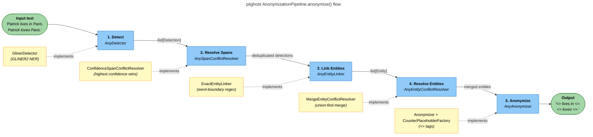
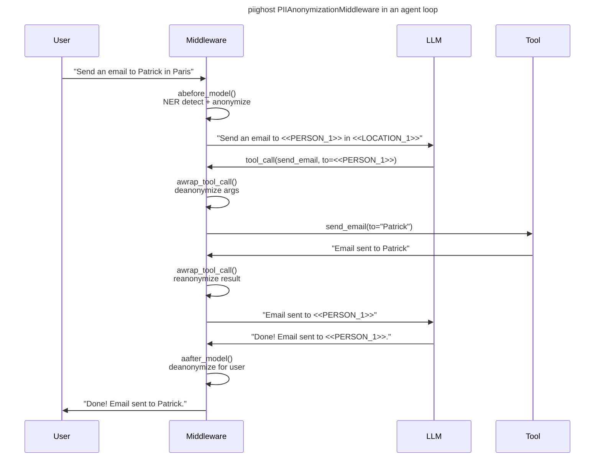

# PIIGhost

[](https://github.com/Athroniaeth/piighost/actions/workflows/ci.yml)

[](https://pypi.org/project/piighost/)
[](https://athroniaeth.github.io/piighost/)
[](https://pytest.org/)
[](https://docs.astral.sh/uv/)
[](https://docs.astral.sh/ruff/)

`piighost` is a Python library that detects PII (personally identifiable information), extracts them, applies corrections, and automatically anonymizes and deanonymizes sensitive entities (names, locations, etc.). With modules for bidirectional anonymization in AI agent conversations, it integrates via a LangChain middleware without modifying your existing agent code.

## Features

- **Detection**: Detect PII with NER models, algorithms, and build your custom configuration with our detector composition component
- **Span resolution**: Resolve overlapping or nested detected spans to guarantee clean, non-redundant entities, especially when using multiple detectors
- **Entity linking**: Link different detections together, enabling typo tolerance and catching mentions that an NER model might miss
- **Entity resolution**: Resolve linked entity conflicts (e.g., one detector links A and B, another links B and C) to guarantee coherent final entities
- **Anonymization**: Anonymize detected entities with customizable placeholders (e.g., `<<PERSON_1>>`, `<<LOCATION_1>>`) to protect privacy while preserving text structure. A cache system remembers the applied anonymization and can reverse it for deanonymization
- **Placeholder Factory**: Create custom placeholders for anonymization, with flexible naming strategies (counters, UUID, etc.) to fit your specific needs
- **Middleware**: Easily integrate `piighost` into your LangChain agents for transparent anonymization before and after model calls, without modifying your existing agent code

## Installation

### Basic installation

This project uses [uv](https://docs.astral.sh/uv/) for dependency management.

```bash
uv add piighost
uv pip install piighost
```

### Development installation

Clone the repository and install with dev dependencies:

```bash
git clone https://github.com/Athroniaeth/piighost.git
cd piighost
uv sync
```

### Makefile helpers

Run the full lint suite with the provided Makefile:

```bash
make lint
```

This runs Ruff (format + lint) and PyReFly (type-check) through `uv run`.

## Quick start

### Standalone pipeline

```python
import asyncio

from piighost.anonymizer import Anonymizer
from piighost.detector.gliner2 import Gliner2Detector
from piighost.pipeline import AnonymizationPipeline

from gliner2 import GLiNER2

model = GLiNER2.from_pretrained("fastino/gliner2-multi-v1")
detector = Gliner2Detector(model=model, labels=["PERSON", "LOCATION"])
pipeline = AnonymizationPipeline(detector=detector, anonymizer=Anonymizer())


async def main():
    text = "Patrick lives in Paris. Patrick loves Paris."
    anonymized, entities = await pipeline.anonymize(text)
    print(anonymized)
    # <<PERSON_1>> lives in <<LOCATION_1>>. <<PERSON_1>> loves <<LOCATION_1>>.

    original, _ = await pipeline.deanonymize(anonymized)
    print(original)
    # Patrick lives in Paris. Patrick loves Paris.


asyncio.run(main())
```

### With LangChain middleware

```python
from langchain.agents import create_agent
from langchain_core.tools import tool

from piighost.anonymizer import Anonymizer
from piighost.detector.gliner2 import Gliner2Detector
from piighost.pipeline import ThreadAnonymizationPipeline
from piighost.middleware import PIIAnonymizationMiddleware

from gliner2 import GLiNER2


@tool
def send_email(to: str, subject: str, body: str) -> str:
    """Send an email to a given address."""
    return f"Email successfully sent to {to}."


model = GLiNER2.from_pretrained("fastino/gliner2-multi-v1")
detector = Gliner2Detector(model=model, labels=["PERSON", "LOCATION"])
pipeline = ThreadAnonymizationPipeline(detector=detector, anonymizer=Anonymizer())
middleware = PIIAnonymizationMiddleware(pipeline=pipeline)

graph = create_agent(
    model="openai:gpt-5.4",
    system_prompt="You are a helpful assistant.",
    tools=[send_email],
    middleware=[middleware],
)
```

The middleware intercepts every agent turn the LLM only sees anonymized text, tools receive real values, and user-facing messages are deanonymized automatically.

### Pipeline components

The pipeline runs 5 stages. Only `detector` and `anonymizer` are required — the others have sensible defaults:

| Stage | Default | Role | Without it |
|-------|---------|------|------------|
| **Detect** | *(required)* | Finds PII spans via NER | — |
| **Resolve Spans** | `ConfidenceSpanConflictResolver` | Deduplicates overlapping detections (keeps highest confidence) | Overlapping spans from multiple detectors cause garbled replacements |
| **Link Entities** | `ExactEntityLinker` | Finds all occurrences of each entity via word-boundary regex | Only NER-detected mentions are anonymized; other occurrences leak through |
| **Resolve Entities** | `MergeEntityConflictResolver` | Merges entity groups that share a mention (union-find) | Same entity could get two different placeholders |
| **Anonymize** | *(required)* | Replaces entities with placeholders (`<<PERSON_1>>`) | — |

Each stage is a **protocol** — swap any default for your own implementation.

## How it works

### Anonymization pipeline



Each stage uses a **protocol** (structural subtyping) swap `GlinerDetector` for spaCy, a remote API, or an `ExactMatchDetector` for tests. Same for every other stage.

### Middleware integration



## Development

```bash
uv sync                      # Install dependencies
make lint                    # Format (ruff), lint (ruff), type-check (pyrefly)
uv run pytest                # Run all tests
uv run pytest tests/ -k "test_name"  # Run a single test
```

## Contributing

- **Commits**: Conventional Commits via Commitizen (`feat:`, `fix:`, `refactor:`, etc.)
- **Type checking**: PyReFly (not mypy)
- **Formatting/linting**: Ruff
- **Package manager**: uv (not pip)
- **Python**: 3.12+

## Ecosystem

- **[piighost-api](https://github.com/Athroniaeth/piighost-api)** — REST API server for PII anonymization inference. Loads a piighost pipeline once server-side and exposes anonymize/deanonymize via HTTP, so clients only need a lightweight HTTP client instead of embedding the NER model.
- **[piighost-chat](https://github.com/Athroniaeth/piighost-chat)** — Demo chat app showcasing privacy-preserving AI conversations. Uses `PIIAnonymizationMiddleware` with LangChain to anonymize messages before the LLM and deanonymize responses transparently. Built with SvelteKit, Litestar, and Docker Compose.

## Additional notes

- The GLiNER2 model is downloaded from HuggingFace on first use (~500 MB)
- All data models are frozen dataclasses safe to share across threads
- Tests use `ExactMatchDetector` to avoid loading the real GLiNER2 model in CI

### Hybrid retrieval for PII-heavy queries

When indexed content is anonymized, pure vector search can miss exact-name
lookups because placeholder tokens (`<PERSON:…>`) have no semantic content.
Combine BM25 (exact keyword match on the deterministic token) with vector
search using `EnsembleRetriever`. See
`tests/integrations/langchain/test_hybrid_retrieval.py` for a working recipe.

> **Ordering invariant.** The anonymizer must run before the embedder. When
> wired correctly, cloud embedders see only opaque tokens; the token→original
> mapping stays in LanceDB metadata on your infrastructure.
