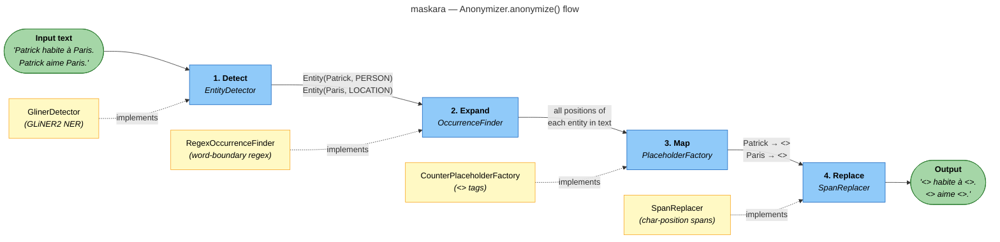
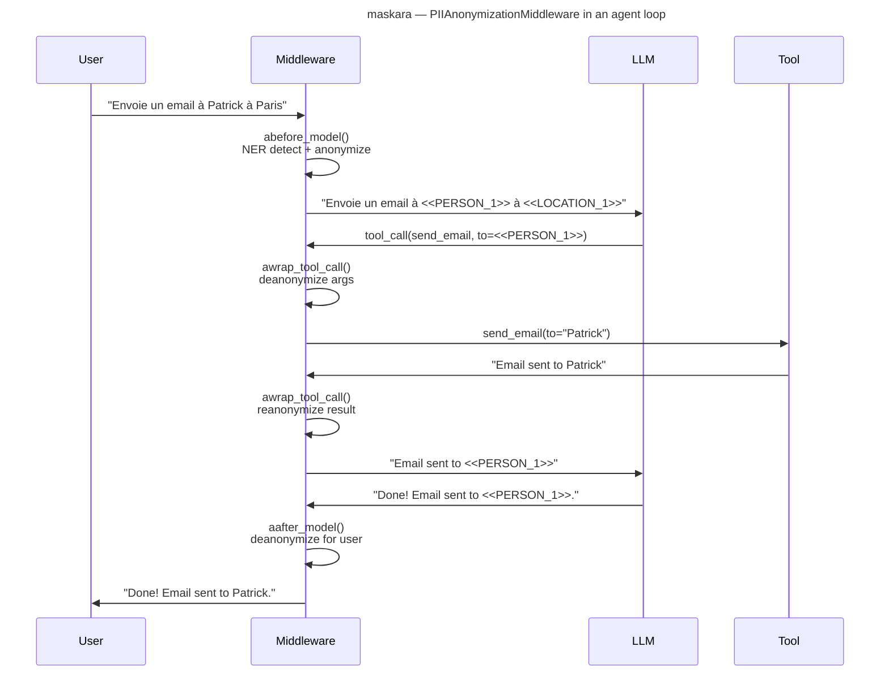

# Maskara


[](https://pytest.org/)
[](https://docs.astral.sh/uv/)
[](https://docs.astral.sh/ruff/)

`maskara` is a PII anonymization library for AI agent conversations. It transparently detects, anonymizes, and deanonymizes sensitive entities (names, locations, etc.) using [GLiNER2](https://github.com/knowledgator/gliner2) NER, with built-in LangChain middleware for seamless integration into LangGraph agents.

## Features

- **4-stage pipeline**: Detect → Expand → Map → Replace — covers every occurrence of each entity, not just the first
- **Bidirectional**: reliable deanonymization via reverse spans, plus fast string-based reanonymization
- **Session caching**: `PlaceholderStore` protocol for cross-session persistence (SHA-256 keyed)
- **LangChain middleware**: transparent hooks on `abefore_model`, `aafter_model`, and `awrap_tool_call` — zero changes to your agent code
- **Protocol-based DI**: every pipeline stage is a swappable protocol — detector, occurrence finder, placeholder factory, span validator
- **Immutable data models**: frozen dataclasses throughout (`Entity`, `Placeholder`, `Span`, `AnonymizationResult`)

## Installation

### Basic installation

This project uses [uv](https://docs.astral.sh/uv/) for dependency management.

```bash
uv add maskara
uv pip install maskara
```

### Development installation

Clone the repository and install with dev dependencies:

```bash
git clone https://github.com/Athroniaeth/maskara.git
cd maskara
uv sync
```

### Makefile helpers

Run the full lint suite with the provided Makefile:

```bash
make lint
```

This runs Ruff (format + lint) and PyReFly (type-check) through `uv run`.

## Quick start

### Standalone anonymization

```python
from gliner2 import GLiNER2
from maskara.anonymizer import Anonymizer, GlinerDetector

model = GLiNER2.from_pretrained("fastino/gliner2-multi-v1")
detector = GlinerDetector(model=model, threshold=0.5, flat_ner=True)
anonymizer = Anonymizer(detector=detector)

result = anonymizer.anonymize(
    "Patrick habite à Paris. Patrick aime Paris.",
    labels=["PERSON", "LOCATION"],
)

print(result.anonymized_text)
# <<PERSON_1>> habite à <<LOCATION_1>>. <<PERSON_1>> aime <<LOCATION_1>>.

original = anonymizer.deanonymize(result)
print(original)
# Patrick habite à Paris. Patrick aime Paris.
```

### With session caching

```python
from maskara.pipeline import AnonymizationPipeline

pipeline = AnonymizationPipeline(
    anonymizer=anonymizer,
    labels=["PERSON", "LOCATION"],
)

result = await pipeline.anonymize("Patrick habite à Paris.")
# result.anonymized_text → '<<PERSON_1>> habite à <<LOCATION_1>>.'

pipeline.deanonymize_text("<<PERSON_1>> habite à <<LOCATION_1>>.")
# → 'Patrick habite à Paris.'

pipeline.reanonymize_text("Résultat pour Patrick à Paris")
# → 'Résultat pour <<PERSON_1>> à <<LOCATION_1>>'
```

### With LangChain middleware

```python
from langchain.agents import create_agent
from langchain_core.tools import tool

from maskara.anonymizer import Anonymizer, GlinerDetector
from maskara.middleware import PIIAnonymizationMiddleware
from maskara.pipeline import AnonymizationPipeline

@tool
def send_email(to: str, subject: str, body: str) -> str:
    """Send an email to a given address."""
    return f"Email successfully sent to {to}."

detector = GlinerDetector(model=model, threshold=0.5, flat_ner=True)
anonymizer = Anonymizer(detector=detector)
pipeline = AnonymizationPipeline(
    anonymizer=anonymizer,
    labels=["PERSON", "LOCATION"],
)
middleware = PIIAnonymizationMiddleware(pipeline=pipeline)

graph = create_agent(
    model="openai:gpt-4",
    system_prompt="You are a helpful assistant.",
    tools=[send_email],
    middleware=[middleware],
)
```

The middleware intercepts every agent turn — the LLM only sees anonymized text, tools receive real values, and user-facing messages are deanonymized automatically.

## How it works

### Anonymization pipeline



Each stage uses a **protocol** (structural subtyping) — swap `GlinerDetector` for spaCy, a remote API, or a `FakeDetector` for tests. Same for every other stage.

### Middleware integration



## Development

```bash
uv sync                      # Install dependencies
make lint                    # Format (ruff), lint (ruff), type-check (pyrefly)
uv run pytest                # Run all tests
uv run pytest tests/ -k "test_name"  # Run a single test
```

## Contributing

- **Commits**: Conventional Commits via Commitizen (`feat:`, `fix:`, `refactor:`, etc.)
- **Type checking**: PyReFly (not mypy)
- **Formatting/linting**: Ruff
- **Package manager**: uv (not pip)
- **Python**: 3.12+

## Additional notes

- The GLiNER2 model is downloaded from HuggingFace on first use (~500 MB)
- All data models are frozen dataclasses — safe to share across threads
- Tests use `FakeDetector` to avoid loading the real GLiNER2 model in CI
