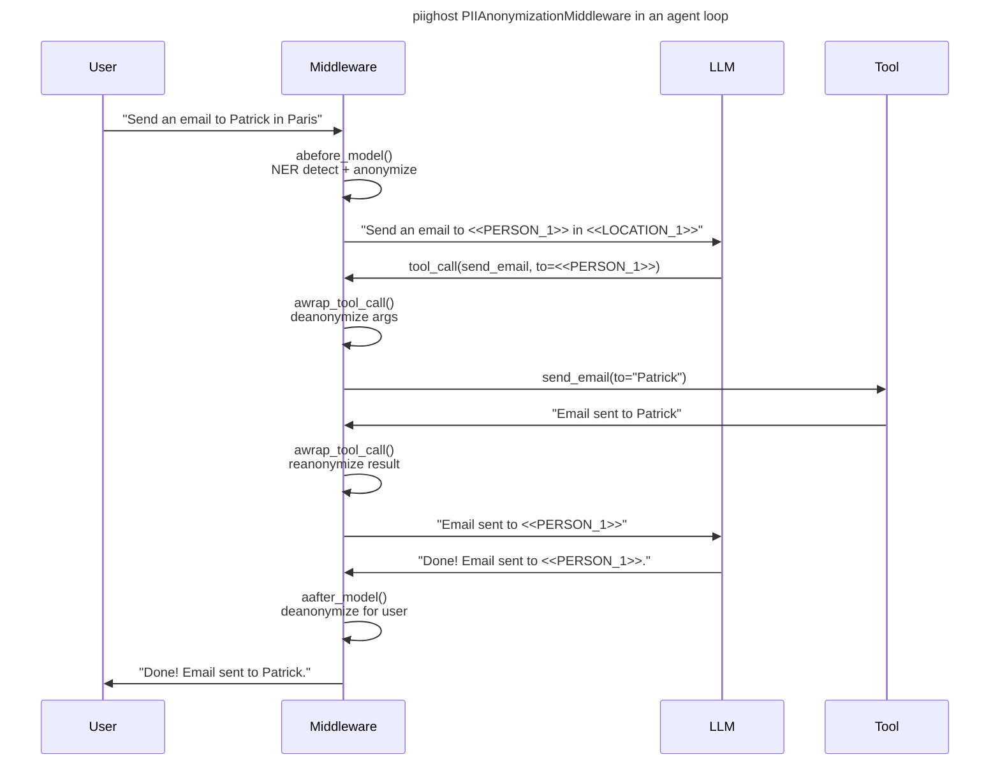

# PIIGhost

[](https://github.com/Athroniaeth/piighost/actions/workflows/ci.yml)

[](https://pypi.org/project/piighost/)
[](https://athroniaeth.github.io/piighost/)
[](https://pytest.org/)
[](https://docs.astral.sh/uv/)
[](https://docs.astral.sh/ruff/)
[](https://github.com/PyCQA/bandit)

[README EN](README.md) - [README FR](README.fr.md)

`piighost` is a Python library that detects PII (personally identifiable information), extracts them, applies corrections, and automatically anonymizes and deanonymizes sensitive entities (names, locations, etc.). With modules for bidirectional anonymization in AI agent conversations, it integrates via a LangChain middleware without modifying your existing agent code.

## Objectives

Companies using third-party hosted LLMs (GPT, Claude, Gemini) risk transmitting their users' sensitive data to those
providers. Relying solely on providers with inference servers located in Europe (Mistral AI, OVHcloud, Scaleway) offers
a legal guarantee, but not a technical one. You could switch from proprietary models to self-hosted open-source
alternatives, but that requires the infrastructure and accepting a step back from the state of the art.

`piighost` answers this trade-off: anonymize PII before they reach the LLM, keep using the most capable models, and
restore real values to the end user, without the LLM or the hosting provider ever seeing them.

Existing solutions (Presidio, spaCy extensions, regex) cover detection and anonymization, but they:

- do not link different occurrences of the same entity together
- do not handle overlapping spans or conflicts between multiple NER models
- do not tolerate entity variants (case differences, typos, partial mentions), leading to inconsistent placeholders or data leaks
- leave the developer responsible for orchestrating the conversational case: placeholder persistence across messages, tool call anonymization/deanonymization, etc.

`piighost` builds a layer on top of NER models to handle this entire cycle via a **bidirectional LangChain middleware**
and **per-thread conversation memory**.

## Use cases

Concrete scenarios where `piighost` fits naturally:

- **Customer support chatbot** sending ticket content to a third-party LLM without leaking customer names, emails, or account numbers
- **Internal HR RAG** over documents containing employee names, salaries, or evaluation notes
- **Legal assistant** processing contracts with client and counterparty names
- **Batch email summarization** pipelines that should not transmit the sender or recipient identity
- **Tool-enabled agents** with CRM access or email-send capability, where the LLM only sees placeholders and tools receive the real values

## Features

- **Detection**: Detect PII with NER models, algorithms, and build your custom configuration with our detector composition component
- **Span resolution**: Resolve overlapping or nested detected spans to guarantee clean, non-redundant entities, especially when using multiple detectors
- **Entity linking**: Link different detections together, enabling typo tolerance and catching mentions that an NER model might miss
- **Entity resolution**: Resolve linked entity conflicts (e.g., one detector links A and B, another links B and C) to guarantee coherent final entities
- **Anonymization**: Anonymize detected entities with customizable placeholders (e.g., `<<PERSON_1>>`, `<<LOCATION_1>>`) to protect privacy while preserving text structure. A cache system remembers the applied anonymization and can reverse it for deanonymization
- **Placeholder Factory**: Create custom placeholders for anonymization, with flexible naming strategies (counters, UUID, etc.) to fit your specific needs
- **Middleware**: Easily integrate `piighost` into your LangChain agents for transparent anonymization before and after model calls, without modifying your existing agent code

## Weaknesses

There is no perfect PII anonymization pipeline. There are only pipelines tuned for a given situation, and every mechanism in `piighost` fixes some undesired behaviours at the cost of introducing others. Knowing which trade-offs are in effect for your use case is part of the integration work.

- **Entity linking amplifies NER mistakes.** After the NER detector detects a name, the entity linker (`ExactEntityLinker` by default) scans the rest of the text (and of the conversation) to catch missed occurrences. If the initial detection was wrong, the linker spreads that wrong detection across every match. Example: `Rose` is correctly detected as a first name in one message; later, the word `rose` as in the flower is captured by the same entity and anonymized as a person. The linker has no global context. Mitigation: swap in a narrower detector such as the exact-match detector (`ExactMatchDetector`) or a pattern-based one (`RegexDetector`) when you need deterministic control, or disable cross-message linking by instantiating a fresh thread per message.
- **Fuzzy resolution can over-merge.** The fuzzy entity conflict resolver (`FuzzyEntityConflictResolver`) uses Jaro-Winkler similarity to link misspellings (`Patric` to `Patrick`). On short or similar names (`Marin` vs `Martin`, `Lee` vs `Leo`), the same mechanism merges distinct people into one placeholder. Mitigation: raise the similarity threshold, or fall back to the exact-match resolver (`MergeEntityConflictResolver`, the default).

Before deploying, review which stage of the pipeline you actually need: every detector, linker, or resolver you remove gets rid of the undesired behaviours it caused, but also brings back the ones it was fixing. See [Architecture](docs/en/architecture.md) and [Extending PIIGhost](docs/en/extending.md) for the extension points.

## Installation

### Basic installation

This project uses [uv](https://docs.astral.sh/uv/) for dependency management.

```bash
uv add piighost
uv pip install piighost
```

The core package has no required dependencies. Install extras for the features you need:

```bash
uv add 'piighost[cache]'        # AnonymizationPipeline (aiocache)
uv add 'piighost[gliner2]'      # Gliner2Detector
uv add 'piighost[middleware]'   # PIIAnonymizationMiddleware (langchain + aiocache)
uv add 'piighost[all]'          # Everything
```

### Compatibility

| Python | LangChain (extra `langchain`) | aiocache (extra `cache`) | GLiNER2 (extra `gliner2`) |
|--------|-------------------------------|--------------------------|---------------------------|
| >=3.10 | >=1.2                         | >=0.12                   | >=1.2                     |

Versions are declared in [`pyproject.toml`](pyproject.toml). `piighost` is tested on Python 3.10 through 3.14.

### Development installation

Clone the repository and install with dev dependencies:

```bash
git clone https://github.com/Athroniaeth/piighost.git
cd piighost
uv sync
```

### Makefile helpers

Run the full lint suite with the provided Makefile:

```bash
make lint
```

This runs Ruff (format + lint) and PyReFly (type-check) through `uv run`.

## Quick start

### Minimal example

No model download, no inference, just a fixed dictionary matched by word-boundary regex. Ideal to try `piighost` in under a minute.

```python
import asyncio

from piighost import Anonymizer, ExactMatchDetector
from piighost.pipeline import AnonymizationPipeline

detector = ExactMatchDetector([("Patrick", "PERSON"), ("Paris", "LOCATION")])
pipeline = AnonymizationPipeline(detector=detector, anonymizer=Anonymizer())


async def main():
    anonymized, _ = await pipeline.anonymize("Patrick lives in Paris.")
    print(anonymized)  # <<PERSON_1>> lives in <<LOCATION_1>>.


asyncio.run(main())
```

### Standalone pipeline with GLiNER2

Real NER detection. Downloads the GLiNER2 model from HuggingFace on first use.

```python
import asyncio

from piighost.anonymizer import Anonymizer
from piighost.detector.gliner2 import Gliner2Detector
from piighost.pipeline import AnonymizationPipeline

from gliner2 import GLiNER2

model = GLiNER2.from_pretrained("fastino/gliner2-multi-v1")
detector = Gliner2Detector(model=model, labels=["PERSON", "LOCATION"])
pipeline = AnonymizationPipeline(detector=detector, anonymizer=Anonymizer())


async def main():
    text = "Patrick lives in Paris. Patrick loves Paris."
    anonymized, entities = await pipeline.anonymize(text)
    print(anonymized)
    # <<PERSON_1>> lives in <<LOCATION_1>>. <<PERSON_1>> loves <<LOCATION_1>>.

    original, _ = await pipeline.deanonymize(anonymized)
    print(original)
    # Patrick lives in Paris. Patrick loves Paris.


asyncio.run(main())
```

### With LangChain middleware

A LangChain middleware is an extension point that runs before and after every LLM call and every tool call. `piighost` hooks into it to intercept and transform messages, so PII anonymization is applied without changing your agent code.

```python
from langchain.agents import create_agent
from langchain_core.tools import tool

from piighost.anonymizer import Anonymizer
from piighost.detector.gliner2 import Gliner2Detector
from piighost.pipeline import ThreadAnonymizationPipeline
from piighost.middleware import PIIAnonymizationMiddleware

from gliner2 import GLiNER2


@tool
def send_email(to: str, subject: str, body: str) -> str:
    """Send an email to a given address."""
    return f"Email successfully sent to {to}."


model = GLiNER2.from_pretrained("fastino/gliner2-multi-v1")
detector = Gliner2Detector(model=model, labels=["PERSON", "LOCATION"])
pipeline = ThreadAnonymizationPipeline(detector=detector, anonymizer=Anonymizer())
middleware = PIIAnonymizationMiddleware(pipeline=pipeline)

graph = create_agent(
    model="openai:gpt-5.4",
    system_prompt="You are a helpful assistant.",
    tools=[send_email],
    middleware=[middleware],
)
```

The middleware intercepts every agent turn the LLM only sees anonymized text, tools receive real values, and user-facing messages are deanonymized automatically.

### Pipeline components

The pipeline runs 5 stages. Only `detector` and `anonymizer` are required; the others have sensible defaults:

| Stage | Default | Role | Without it |
|-------|---------|------|------------|
| **Detect** | *(required)* | Finds PII spans via NER | - |
| **Resolve Spans** | `ConfidenceSpanConflictResolver` | Deduplicates overlapping detections (keeps highest confidence) | Overlapping spans from multiple detectors cause garbled replacements |
| **Link Entities** | `ExactEntityLinker` | Finds all occurrences of each entity via word-boundary regex | Only NER-detected mentions are anonymized; other occurrences leak through |
| **Resolve Entities** | `MergeEntityConflictResolver` | Merges entity groups that share a mention (union-find) | Same entity could get two different placeholders |
| **Anonymize** | *(required)* | Replaces entities with placeholders (`<<PERSON_1>>`) | - |

Each stage is a **protocol**: swap any default for your own implementation.

## How it works

### Anonymization pipeline


Each stage uses a **protocol** (structural subtyping) swap `GlinerDetector` for spaCy, a remote API, or an `ExactMatchDetector` for tests. Same for every other stage.

### Middleware integration



## Limitations

`piighost` is not a silver bullet. Known limitations to keep in mind before deploying:

- **Language coverage** depends on the GLiNER2 model you load. Check the model card before assuming a language works.
- **NER false negatives** are inherent. For critical entities (emails, phone numbers, IDs), combine `GlinerDetector` with a regex detector via `CompositeDetector`.
- **PII generated by the LLM in its responses** (entities never seen in the input) are not covered by entity linking. Handle them with a post-response validation step at the application layer.
- **Cache is local** (in-memory via `aiocache`). Multi-instance deployments need an external backend (Redis, Memcached) configured explicitly.
- **Latency overhead is not yet benchmarked**. Plan a measurement pass for your own workload before sizing production traffic.

See [docs/en/architecture.md](docs/en/architecture.md) and [docs/en/extending.md](docs/en/extending.md) for mitigation strategies.

## Development

```bash
uv sync                      # Install dependencies
make lint                    # Format (ruff), lint (ruff), type-check (pyrefly)
uv run pytest                # Run all tests
uv run pytest tests/ -k "test_name"  # Run a single test
```

## Contributing

- **Commits**: Conventional Commits via Commitizen (`feat:`, `fix:`, `refactor:`, etc.)
- **Type checking**: PyReFly (not mypy)
- **Formatting/linting**: Ruff
- **Package manager**: uv (not pip)
- **Python**: 3.10+

## Ecosystem

- **[piighost-api](https://github.com/Athroniaeth/piighost-api)**: REST API server for PII anonymization inference. Loads a piighost pipeline once server-side and exposes anonymize/deanonymize via HTTP, so clients only need a lightweight HTTP client instead of embedding the NER model.
- **[piighost-chat](https://github.com/Athroniaeth/piighost-chat)**: Demo chat app showcasing privacy-preserving AI conversations. Uses `PIIAnonymizationMiddleware` with LangChain to anonymize messages before the LLM and deanonymize responses transparently. Built with SvelteKit, Litestar, and Docker Compose.

## Additional notes

- The GLiNER2 model is downloaded from HuggingFace on first use (~500 MB)
- All data models are frozen dataclasses safe to share across threads
- Tests use `ExactMatchDetector` to avoid loading the real GLiNER2 model in CI
- For the threat model, what `piighost` protects against and what it does not, and cache storage considerations, see [SECURITY.md](SECURITY.md)
