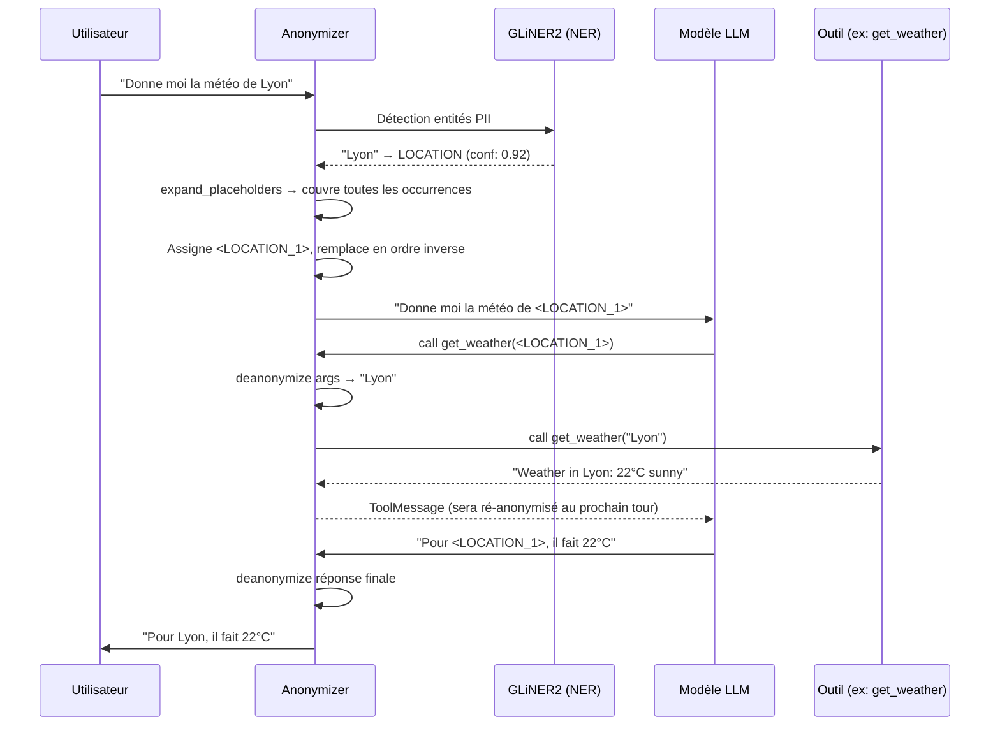
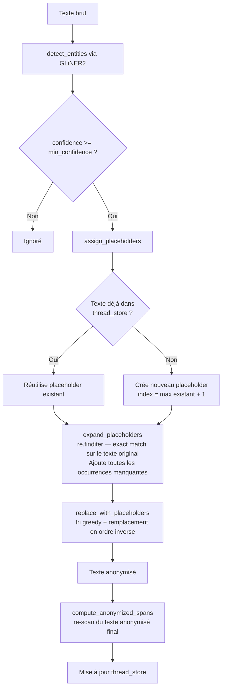
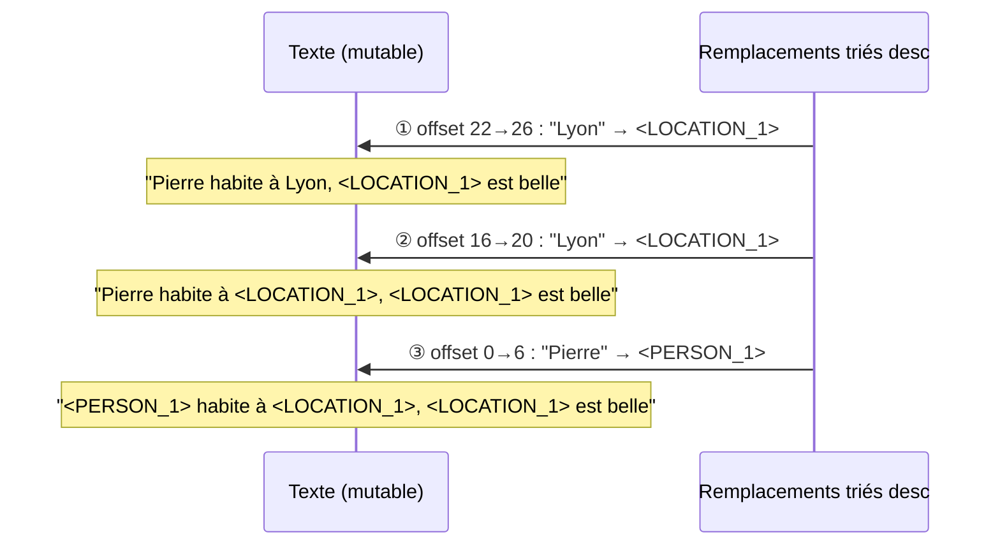
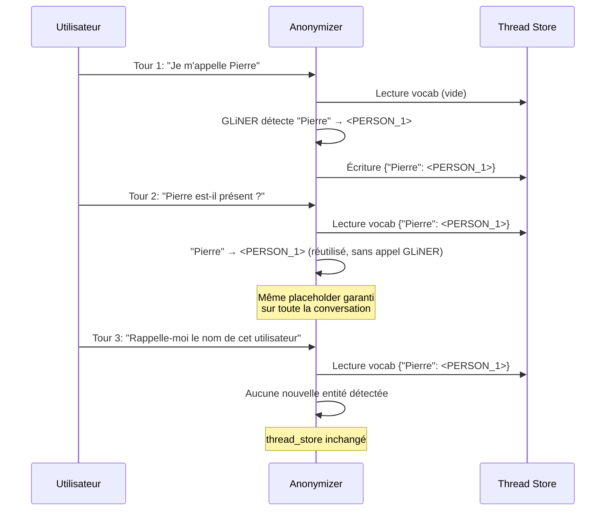

# Architecture & Flux d'anonymisation

Cette page décrit en détail le pipeline d'anonymisation d'Aegra — comment les entités sont détectées, couvertes, remplacées et restituées sans biaiser les offsets de caractères.

---

## Diagramme 1 — Vue globale du flux conversation



---

## Diagramme 2 — Pipeline Anonymizer (bas niveau)



!!! note "Point d'extension — aliases"
    Le diagramme ci-dessus montre le comportement par défaut : `expand_placeholders` effectue un match exact sur la surface textuelle. Pour couvrir des variantes (`"Pari"` → même placeholder que `"Paris"`), il faudrait construire un pattern OR à partir d'un dictionnaire d'aliases (plus long en premier pour éviter la capture partielle). Ce mécanisme n'est pas intégré nativement — voir la section [Variantes et aliases](#variantes-et-aliases) pour le détail.

---

## Mécanismes de robustesse

### Occurrences manquantes — `expand_placeholders`

GLiNER2 ne détecte souvent que la **première occurrence** d'une entité dans un texte.
`expand_placeholders` compense cela en balayant le texte original via `re.finditer` pour trouver toutes les occurrences supplémentaires.

```
Texte   : "Pierre habite à Lyon. Pierre travaille à Lyon."
GLiNER  : "Pierre" @0  "Lyon" @16               ← première occurrence seulement
expand  : "Pierre" @0 @22   "Lyon" @16 @38       ← toutes les occurrences
```

Le matching est **exact** (`re.escape`). Les spans déjà connus (détectés par GLiNER) sont dédupliqués avant l'ajout. Les nouvelles occurrences reçoivent `confidence=1.0`.

---

### Variantes et aliases

Par défaut, `expand_placeholders` ne matche que la surface textuelle exacte.
Pour couvrir des variantes (`"Pari"` → `<LOCATION_1>` comme `"Paris"`), il faut construire un pattern qui couvre **toutes les formes** d'une même entité.

Le principe : construire un `pattern OR` à partir d'un dictionnaire d'aliases, avec le plus long en premier pour éviter qu'une forme courte avale une forme longue :

```python
aliases = {"Pari": "Paris", "Tim": "Tim Cook"}

# Pour l'entité dont la surface canonique est "Paris" :
surfaces = {"Paris"} | {k for k, v in aliases.items() if v == "Paris"}
# → {"Paris", "Pari"}

pattern = "|".join(re.escape(s) for s in sorted(surfaces, key=len, reverse=True))
# → "Paris|Pari"  (plus long en premier)
```

Chaque match crée un `NamedEntity` avec son texte **brut** (pas la forme canonique),
ce qui permet à `deanonymize` de restituer la vraie surface d'origine :

```
"Pari est belle"  →  <LOCATION_1> est belle
deanonymize       →  "Pari est belle"   ← surface brute préservée
```

!!! warning
    Ce mécanisme n'est pas intégré nativement dans `expand_placeholders` — il s'agit d'un point d'extension. Un dictionnaire d'aliases doit être fourni explicitement et appliqué lors de la construction du pattern regex.

---

### Cohérence des offsets — remplacement en ordre inverse

Quand plusieurs entités sont remplacées dans un même texte, chaque remplacement change la longueur du texte et décale les offsets des entités qui suivent. Par exemple :

```
Texte original : "Pierre habite à Lyon, Lyon est belle"
                  0123456789...        16  20 22  26
```

Si on remplace dans l'ordre naturel (gauche → droite) :

```
① "Pierre" (0–6) → <PERSON_1> (10 chars, +4)
   → les offsets de "Lyon" @16 et @22 sont maintenant @20 et @26 — invalides
```

La solution est de trier les remplacements par **position décroissante** et de les appliquer de droite à gauche :



Chaque remplacement ne modifie que le texte **à sa droite** — or les remplacements restants à traiter sont à des offsets **plus petits**, donc non affectés. Les offsets de `NamedEntity.start/end` restent valides jusqu'à leur tour.

#### Biais des offsets avec N placeholders

| Étape | Remplacement | Décalage introduit | Offsets suivants affectés ? |
|-------|-------------|-------------------|-----------------------------|
| ① droite→gauche | `"Lyon"` @38→42 → `<LOCATION_1>` (+8) | +8 | aucun (rien à droite) |
| ② | `"Lyon"` @16→20 → `<LOCATION_1>` (+8) | +8 | aucun (positions 0–15 inchangées) |
| ③ | `"Pierre"` @0→6 → `<PERSON_1>` (+4) | +4 | aucun (c'est le dernier) |

Conclusion : chaque remplacement de droite à gauche ne perturbe que les offsets à sa gauche — or on a déjà traité tout ce qui était à droite.

---

### `compute_anonymized_spans` — pourquoi après coup

Les offsets `anon_start/anon_end` (position du placeholder dans le texte **anonymisé**) ne peuvent pas être calculés à l'avance : ils dépendent du nombre et de la taille de tous les remplacements précédents. La solution est de re-scanner le texte anonymisé final via `re.finditer` une fois tous les remplacements effectués.

L'association occurrence ↔ entité repose sur l'ordre d'apparition : les occurrences de `re.finditer` sont en ordre gauche-droite, et les entités dans `placeholders[placeholder]` sont aussi dans cet ordre (GLiNER d'abord, puis `expand_placeholders` en ordre croissant). Le zip est donc stable.

---

## Diagramme 3 — Cohérence multi-tours (thread memory)



### Pourquoi c'est nécessaire

Sans persistance du vocabulaire entre les tours :

- Tour 1 : `"Pierre"` → `<PERSON_1>` — assigné
- Tour 3 : GLiNER détecte `"Pierre"` à nouveau, `existing_vocab` est vide → `<PERSON_1>` serait réassigné par chance si aucune autre entité n'a été vue, ou `<PERSON_2>` si le slot 1 est occupé

Le `thread_store` (dict `{surface → Placeholder}` indexé par `thread_id`) garantit l'unicité et la stabilité des jetons pour toute la durée d'une conversation.

---

## Format des jetons

```
<TYPE_N>
```

- `TYPE` : label de l'entité en majuscules (`PERSON`, `LOCATION`, `COMPANY`, `PRODUCT`)
- `N` : index 1-based dans ce type, incrémenté par `assign_placeholders`

```
"Tim Cook"   → <PERSON_1>
"Steve Jobs" → <PERSON_2>
"Apple"      → <COMPANY_1>
"Cupertino"  → <LOCATION_1>
```

Un même texte reçoit toujours le même index au sein d'un thread — c'est `assign_placeholders` + `thread_store` qui le garantissent.
