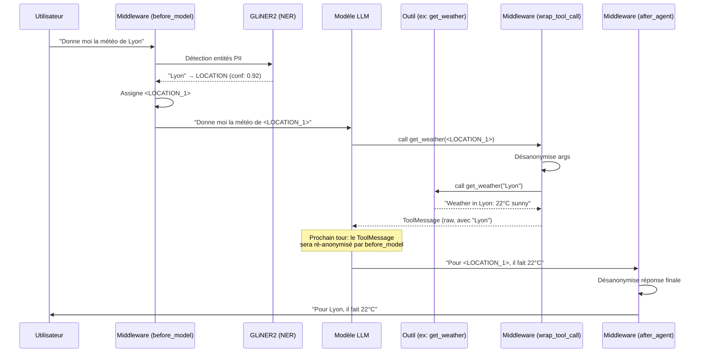
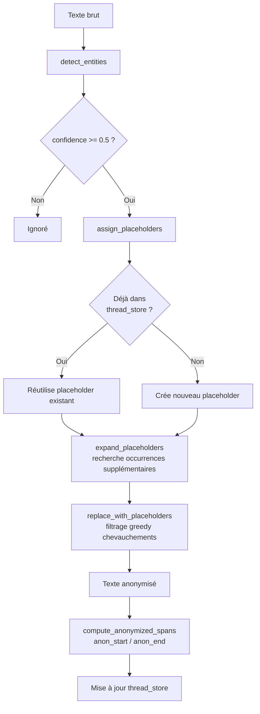
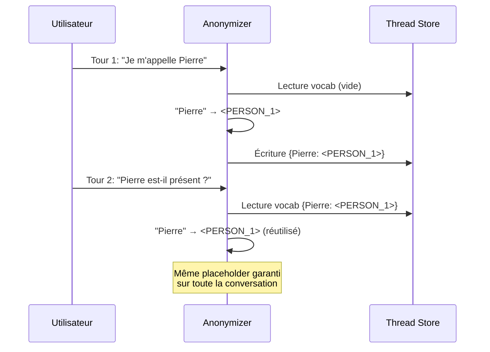

# Architecture & Flux d'anonymisation

Cette page décrit en détail comment Aegra protège les données personnelles tout au long du cycle de vie d'une conversation avec l'agent LLM.

## Vue d'ensemble

Aegra repose sur trois hooks de middleware injectés dans le graphe LangGraph :

| Hook | Moment d'exécution | Opération |
|------|--------------------|-----------|
| `before_model` | Avant chaque appel LLM | Anonymisation des messages entrants |
| `wrap_tool_call` | Avant/après chaque outil | Désanonymisation des arguments, résultat brut stocké |
| `after_agent` | Après la réponse finale | Désanonymisation pour l'utilisateur |

---

## Diagramme 1 — Vue globale du flux conversation

### Pourquoi le LLM ne "connaît" pas les vraies valeurs ?

Le modèle opère **exclusivement** sur des jetons opaques. Il ne reçoit jamais `"Lyon"` directement — il manipule `<LOCATION_1>` (ou `<LOCATION:e5f6a7b8>` dans la variante déterministe). Quand il appelle un outil avec ce jeton, `wrap_tool_call` traduit l'argument **avant** l'exécution. Le résultat de l'outil peut contenir la vraie valeur, mais `before_model` la réanonymise au tour suivant avant que le LLM ne relise ce `ToolMessage`.

---

## Diagramme 2 — Pipeline Anonymizer (bas niveau)

### Étapes détaillées

**`detect_entities`**
: Appelle `GLiNER2.extract_entities()` avec les labels configurés (`company`, `person`, `product`, `location` par défaut). Chaque entité détectée est enrichie avec son score de confiance et ses offsets de caractères.

**`assign_placeholders`**
: Assigne un jeton unique par surface form. Deux occurrences du même texte reçoivent le **même** placeholder. Un texte différent d'un même type reçoit un index supérieur (`<PERSON_2>`, `<PERSON_3>`...).

**`expand_placeholders`**
: GLiNER2 ne détecte souvent que la première occurrence d'une entité. Cette étape balaye le texte complet via regex pour capturer toutes les occurrences supplémentaires.

**`replace_with_placeholders`**
: Algorithme greedy : trie les candidats par confiance puis par longueur de span, accepte les spans non chevauchantes, applique les remplacements en sens inverse pour préserver les indices.

**`compute_anonymized_spans`**
: Après remplacement, calcule `anon_start` / `anon_end` de chaque jeton dans le texte anonymisé (utile pour le rendu frontend).

---

## Diagramme 3 — Cohérence multi-tours (thread memory)

### Pourquoi c'est crucial

Sans persistance du vocabulaire entre les tours, le même nom pourrait être mappé à `<PERSON_1>` au tour 1 et `<PERSON_2>` au tour 3 — rendant la désanonymisation impossible. Le `thread_store` (ou `PIIState` dans la variante middleware) garantit **l'unicité et la stabilité** des jetons pour toute la durée d'une conversation.

---

## Format des jetons

Aegra supporte deux variantes de jetons selon le composant utilisé :

| Variante | Format | Exemple | Déterminisme |
|----------|--------|---------|--------------|
| `Anonymizer` (bas niveau) | `<TYPE_N>` | `<PERSON_1>` | Par ordre d'apparition |
| `PIIAnonymizationMiddleware` | `<TYPE:hash8>` | `<LOCATION:e5f6a7b8>` | SHA-256 de la valeur |

La variante middleware utilise un hash SHA-256 tronqué (8 hex chars) : la même valeur produit **toujours** le même jeton, même dans des sessions différentes.

---

## Sécurité : ce qui ne traverse jamais le LLM

| Donnée | Traverse le LLM ? |
|--------|-------------------|
| Texte brut utilisateur | Non — anonymisé par `before_model` |
| Arguments d'outil | Non — désanonymisés avant exécution |
| Résultats d'outil | Brièvement (1 tour max), puis réanonymisés |
| Réponse finale au LLM | Non — désanonymisée par `after_agent` |
| Mapping jeton↔valeur | Stocké dans `PIIState` (LangGraph checkpoint) |
