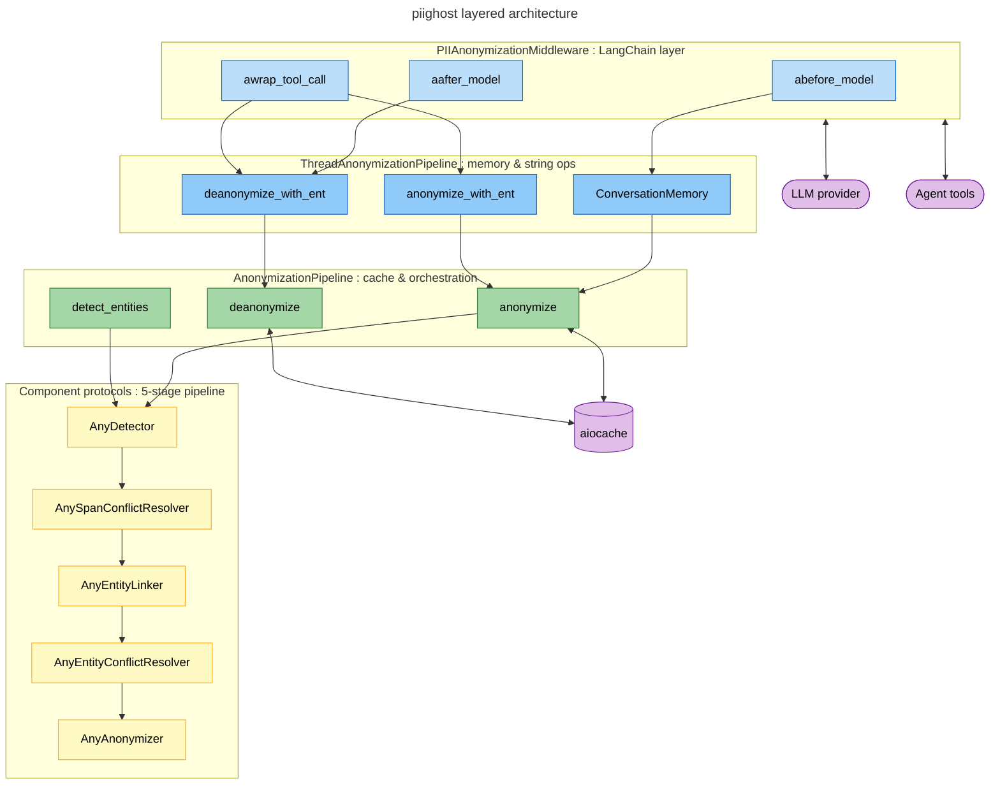
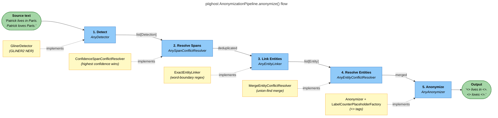
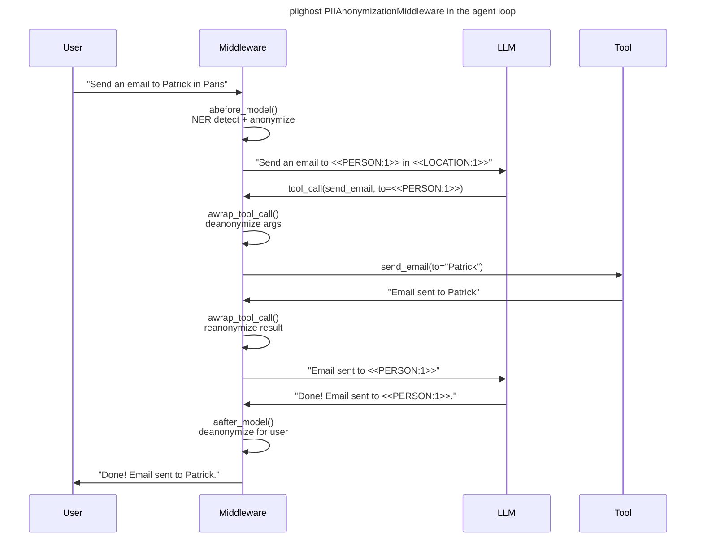
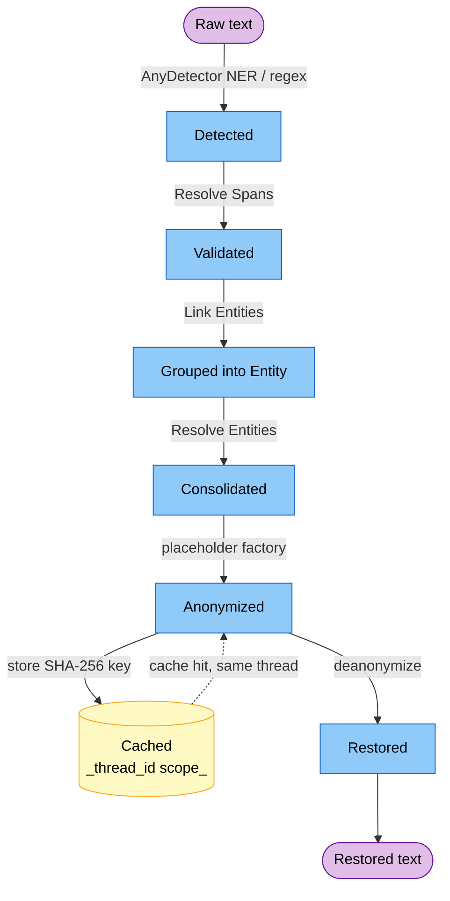

# Architecture

PIIGhost is organized in distinct layers: a **stateless anonymizer** at the core, wrapped in a **pipeline** with caching and entity resolution, extended by a **conversation pipeline** with memory, adapted to LangChain via a **middleware**.

---

## Overview



*Layered architecture: from protocol to LangChain middleware.*
{ .figure-caption }

---

## 5-stage pipeline

!!! tip "Everything is swappable"
    Each stage lives behind a protocol. See [Extending PIIGhost](extending.md) to plug your own detector, linker, resolver or factory.

The core of PIIGhost is `AnonymizationPipeline`, which orchestrates 5 stages each implemented by a swappable protocol.



### Stage 1 Detect

`AnyDetector` runs async NER detection on the source text and returns a list of `Detection` objects (text, label, position, confidence).

The provided implementations include `GlinerDetector` (wraps GLiNER2), `ExactMatchDetector` (word-boundary regex), `RegexDetector` (pattern-based), and `CompositeDetector` (chains multiple detectors).

### Stage 2 Resolve Spans

`AnySpanConflictResolver` handles overlapping detections by keeping the highest-confidence detection when spans overlap.

### Stage 3 Link Entities

`AnyEntityLinker` expands and groups detections into `Entity` objects. `ExactEntityLinker` finds all occurrences of each detected text using word-boundary search and groups them by normalized text.

### Stage 4 Resolve Entities

`AnyEntityConflictResolver` merges entities that refer to the same PII. `MergeEntityConflictResolver` uses a union-find algorithm to merge entities sharing common detections. `FuzzyEntityConflictResolver` merges entities with similar canonical text using Jaro-Winkler similarity.

### Stage 5 Anonymize

`AnyAnonymizer` uses a `AnyPlaceholderFactory` to generate tokens (`<<PERSON:1>>`, `<<LOCATION:1>>`) and performs span-based replacement from right to left.

---

## LangChain middleware flow

`PIIAnonymizationMiddleware` intercepts the agent loop at 3 key points.



### `abefore_model`

Before each LLM call: runs `pipeline.anonymize()` on all messages. This performs full NER detection on `HumanMessage` content and re-anonymizes `AIMessage` / `ToolMessage` content via string replacement.

### `aafter_model`

After each LLM response: deanonymizes all messages. First tries cache-based `pipeline.deanonymize()`, falls back to entity-based `pipeline.deanonymize_with_ent()` on `CacheMissError`.

### `awrap_tool_call`

Wraps each tool call:

1. Deanonymizes `str` arguments before execution → the tool receives real values
2. Executes the tool
3. Reanonymizes the tool response → the LLM never sees personal data

---

## Conversation layer `ThreadAnonymizationPipeline`

`ThreadAnonymizationPipeline` extends `AnonymizationPipeline` with:

| Mechanism | Description |
|-----------|-------------|
| **`ConversationMemory`** | Accumulates entities across messages, deduplicating by `(text.lower(), label)` |
| **`deanonymize_with_ent()`** | String replacement: tokens → original values (longest-first) |
| **`anonymize_with_ent()`** | String replacement: original values → tokens (longest-first) |

```python
# Entities persist across messages
anonymized_1, _ = await conv_pipeline.anonymize("Patrick lives in Paris.")
anonymized_2, _ = await conv_pipeline.anonymize("Tell me about Patrick.")
# Both use <<PERSON:1>> for "Patrick"

# String-based deanonymization on any text
await conv_pipeline.deanonymize_with_ent("Hello <<PERSON:1>>")
# → "Hello Patrick"
```

### PII lifecycle

From a single PII's point of view, here are the states it flows through between initial detection and the user-facing display, and the transitions available (first pass, cache hit, deanonymization).

<figure markdown="1">



<figcaption>PII lifecycle across the pipeline and the conversation cache.</figcaption>

</figure>

`ConversationMemory` shares the mapping of an entity across the whole conversation identified by a `thread_id`. A second message containing the same PII jumps straight to `Anonymized` via the cache, without going through the NER detector again.

---

## Data models

All models are **frozen dataclasses** (immutable, thread-safe):

| Model | Key fields |
|-------|------------|
| `Detection` | `text`, `label`, `position: Span`, `confidence` |
| `Entity` | `detections: tuple[Detection, ...]`, `label` (property) |
| `Span` | `start_pos`, `end_pos`, `overlaps()` method |

---

## Dependency injection

Every stage uses a **protocol** (Python structural subtyping) as its injection point:

```python
detector = GlinerDetector(...)                    # AnyDetector
span_resolver = ConfidenceSpanConflictResolver()  # AnySpanConflictResolver
entity_linker = ExactEntityLinker()               # AnyEntityLinker
entity_resolver = MergeEntityConflictResolver()   # AnyEntityConflictResolver
anonymizer = Anonymizer(ph_factory=LabelCounterPlaceholderFactory())  # AnyAnonymizer

pipeline = AnonymizationPipeline(
    detector=detector,
    span_resolver=span_resolver,
    entity_linker=entity_linker,
    entity_resolver=entity_resolver,
    anonymizer=anonymizer,
)
```

To replace a component, simply provide an object that implements the corresponding protocol. See [Extending PIIGhost](extending.md).
