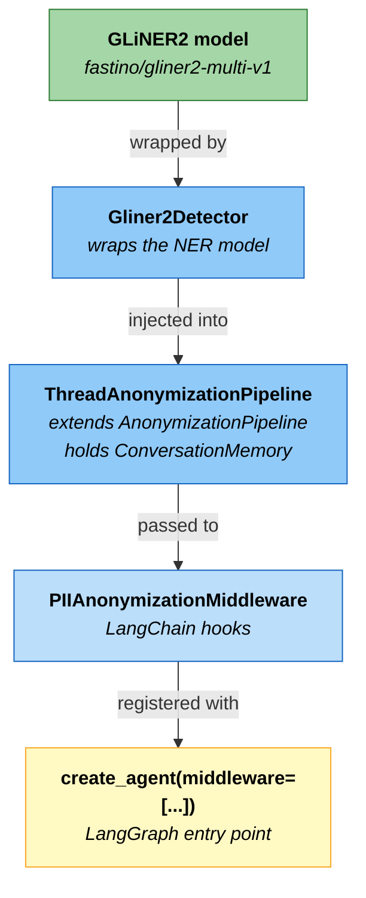
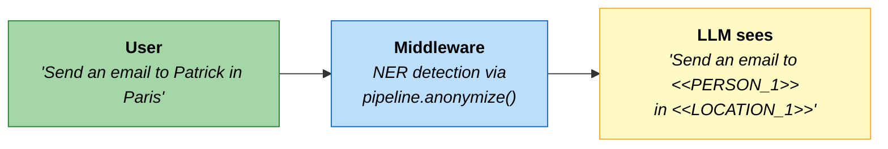
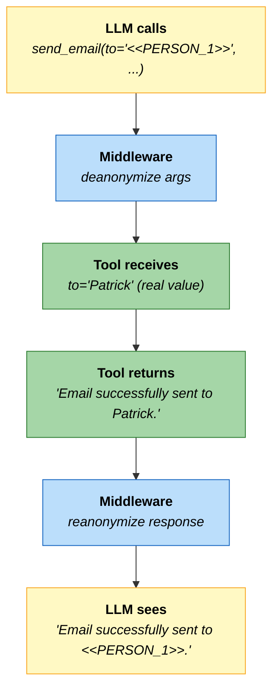
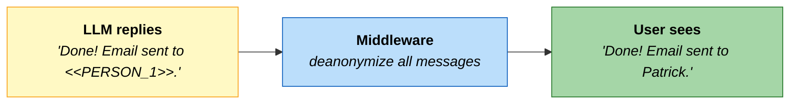

# LangChain integration

This page shows the complete integration of PIIGhost into a LangGraph agent, based on the example available in [`examples/graph/`](https://github.com/Athroniaeth/piighost/tree/main/examples/graph).

---

## Installation

To use the LangChain middleware, install the additional dependencies:

=== "uv"

    ```bash
    uv add piighost[langchain] langchain-openai
    ```

=== "pip"

    ```bash
    pip install piighost langchain langgraph langchain-openai
    ```

!!! warning "Optional dependency"
    `PIIAnonymizationMiddleware` imports `langchain` when instantiated. If `langchain` is not installed, an explicit `ImportError` is raised: `"You must install piighost[langchain] for use middleware"`.

---

## Integration structure



---

## Full example

```python title="agent.py" linenums="1" hl_lines="91 101"
from dotenv import load_dotenv
from gliner2 import GLiNER2
from langchain.agents import create_agent
from langchain_core.tools import tool

from piighost.anonymizer import Anonymizer
from piighost.detector.gliner2 import Gliner2Detector
from piighost.linker.entity import ExactEntityLinker
from piighost.resolver import MergeEntityConflictResolver, ConfidenceSpanConflictResolver
from piighost.middleware import PIIAnonymizationMiddleware
from piighost.pipeline import ThreadAnonymizationPipeline
from piighost.placeholder import LabelCounterPlaceholderFactory

load_dotenv()


# ---------------------------------------------------------------------------
# 1. Define the agent tools
# ---------------------------------------------------------------------------

@tool
def send_email(to: str, subject: str, body: str) -> str:
    """Send an email to the given address.

    Args:
        to: Recipient email address.
        subject: Email subject line.
        body: Email body text.

    Returns:
        Confirmation string.
    """
    return f"Email successfully sent to {to}."


@tool
def get_weather(country_or_city: str) -> str:
    """Get the current weather for a given location.

    Args:
        country_or_city: Name of the city or country.

    Returns:
        A weather summary string.
    """
    return f"The weather in {country_or_city} is 22C and sunny."


# ---------------------------------------------------------------------------
# 2. Configure the system prompt for placeholders
# ---------------------------------------------------------------------------

system_prompt = """\
You are a helpful assistant. Some inputs may contain anonymized placeholders \
that replace real values for privacy reasons.

Rules:
1. Treat every placeholder as if it were the real value. Never comment on its \
format, never say it is a token, never ask the user to reveal it.
2. Placeholders can be passed directly to tools use them as-is as input arguments. \
This preserves the user's privacy while still allowing tools to operate.
3. If the user asks for a specific detail about a placeholder \
(e.g. "what is the first letter?"), reply briefly: "I cannot answer that question \
as the data has been anonymized to protect your personal information."
"""

# ---------------------------------------------------------------------------
# 3. Initialize the anonymization stack
# ---------------------------------------------------------------------------

# Load the GLiNER2 model (HuggingFace download ~500 MB on first run)
extractor = GLiNER2.from_pretrained("fastino/gliner2-multi-v1")

entity_linker = ExactEntityLinker()
entity_resolver = MergeEntityConflictResolver()
span_resolver = ConfidenceSpanConflictResolver()

ph_factory = LabelCounterPlaceholderFactory()
anonymizer = Anonymizer(ph_factory=ph_factory)

detector = Gliner2Detector(
    model=extractor,
    threshold=0.5,
    labels=["PERSON", "LOCATION"],
)
pipeline = ThreadAnonymizationPipeline(
    detector=detector,
    span_resolver=span_resolver,
    entity_linker=entity_linker,
    entity_resolver=entity_resolver,
    anonymizer=anonymizer,
)
middleware = PIIAnonymizationMiddleware(pipeline=pipeline)

# ---------------------------------------------------------------------------
# 4. Create the LangGraph agent with the middleware
# ---------------------------------------------------------------------------

graph = create_agent(
    model="openai:gpt-5.4",
    system_prompt=system_prompt,
    tools=[send_email, get_weather],
    middleware=[middleware],
)
```

---

## How the middleware works

`PIIAnonymizationMiddleware` intercepts each agent turn at three points:

### `abefore_model` before the LLM



### `awrap_tool_call` around tools



### `aafter_model` after the LLM



---

## Using the agent

```python title="main.py"
import asyncio

async def main():
    response = await graph.ainvoke({
        "messages": [{"role": "user", "content": "Send an email to Patrick in Paris"}]
    })
    print(response["messages"][-1].content)
    # Done! Email sent to Patrick.

asyncio.run(main())
```
