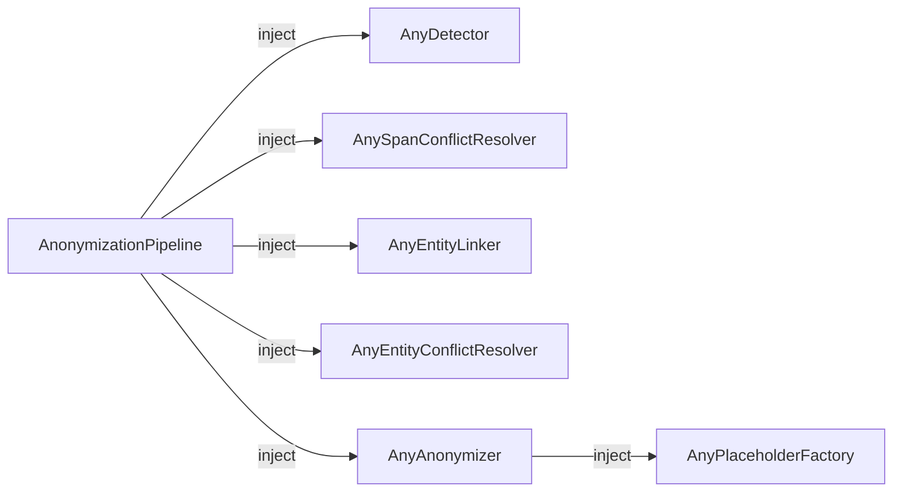

# Extending PIIGhost

PIIGhost is built around **protocols** (Python structural subtyping). Every pipeline stage is an injection point where you can plug in your own implementation without touching the rest of the code.



No base class to inherit from. Simply implement the required method Python checks compatibility at call time.

---

## Custom `AnyDetector`

**When to use**: replace GLiNER2 with spaCy, a remote API call, an allowlist, etc.

### Protocol

```python
class AnyDetector(Protocol):
    async def detect(self, text: str) -> list[Detection]: ...
```

### Example spaCy detector

```python
import spacy
from piighost.models import Detection, Span

class SpacyDetector:
    """NER detector backed by spaCy."""

    def __init__(self, model_name: str = "en_core_web_sm"):
        self._nlp = spacy.load(model_name)

    async def detect(self, text: str) -> list[Detection]:
        doc = self._nlp(text)
        return [
            Detection(
                text=ent.text,
                label=ent.label_,
                position=Span(start_pos=ent.start_char, end_pos=ent.end_char),
                confidence=1.0,
            )
            for ent in doc.ents
        ]
```

### Example allowlist detector

```python
import re
from piighost.models import Detection, Span

class AllowlistDetector:
    """Detects entities from a fixed list (useful for tests or structured data)."""

    def __init__(self, allowlist: dict[str, str]):
        # {"Patrick Dupont": "PERSON", "Paris": "LOCATION"}
        self._allowlist = allowlist

    async def detect(self, text: str) -> list[Detection]:
        detections = []
        for fragment, label in self._allowlist.items():
            for match in re.finditer(re.escape(fragment), text):
                detections.append(Detection(
                    text=match.group(),
                    label=label,
                    position=Span(start_pos=match.start(), end_pos=match.end()),
                    confidence=1.0,
                ))
        return detections
```

### Usage

```python
from piighost.pipeline import AnonymizationPipeline

pipeline = AnonymizationPipeline(
    detector=SpacyDetector("en_core_web_sm"),
    ...,
)
```

---

## Curated regex packs

For structured PII whose syntax is standardised (e-mails, IBANs, phone
numbers, SSN), PIIGhost ships ready-to-use regex dictionaries organised
by region. You pick only the packs you need, and merge them freely.

| Pack | Module | Labels |
|------|--------|--------|
| `GENERIC_PATTERNS` | `piighost.detector.patterns.generic` | `EMAIL`, `URL`, `IPV4`, `CREDIT_CARD` |
| `FR_PATTERNS` | `piighost.detector.patterns.fr` | `FR_PHONE`, `FR_IBAN`, `FR_NIR`, `FR_SIRET` |
| `US_PATTERNS` | `piighost.detector.patterns.us` | `US_SSN`, `US_PHONE`, `US_ZIP` |
| `EU_PATTERNS` | `piighost.detector.patterns.eu` | `IBAN` (any country) |

```python
from piighost.detector import RegexDetector
from piighost.detector.patterns import FR_PATTERNS, GENERIC_PATTERNS

detector = RegexDetector(patterns={**GENERIC_PATTERNS, **FR_PATTERNS})
```

The packs are intentionally **permissive on syntax**: the `CREDIT_CARD`
pattern accepts any 13-19 digit sequence, `IBAN` accepts any country
prefix + 11-30 alphanumerics, `FR_NIR` accepts the full NIR shape
without enforcing the key. Without a validator, those patterns will
over-match (any long digit sequence looks like a card number).

## Checksum validators

PIIGhost ships checksum validators in `piighost.validators` that you can
plug into `RegexDetector` to filter syntactic matches that fail a
domain-specific check:

| Validator | Applies to | Algorithm |
|-----------|-----------|-----------|
| `validate_luhn` | credit cards, IMEIs | mod-10 (Luhn) |
| `validate_iban` | IBANs (any country) | ISO 13616 mod-97 |
| `validate_nir` | French NIR | key = 97 − (body mod 97) |

```python
from piighost.detector import RegexDetector
from piighost.detector.patterns import FR_PATTERNS, GENERIC_PATTERNS
from piighost.validators import validate_iban, validate_luhn, validate_nir

detector = RegexDetector(
    patterns={**GENERIC_PATTERNS, **FR_PATTERNS},
    validators={
        "CREDIT_CARD": validate_luhn,
        "FR_IBAN": validate_iban,
        "FR_NIR": validate_nir,
    },
)
```

A label without an entry in `validators` is accepted on the regex match
alone. Matches rejected by a validator are silently dropped (no log, no
exception); chain with another detector if you want to record the
rejection.

!!! tip "Bring your own validator"
    Any `Callable[[str], bool]` works. Use this to add custom
    checks (SSA invalid-range filter on `US_SSN`, allowlist of accepted
    e-mail domains on `EMAIL`, etc.) without touching the regex.

---

## NER label mapping

The built-in NER detectors (`SpacyDetector`, `Gliner2Detector`, `TransformersDetector`) all inherit from `BaseNERDetector`, which supports **label mapping**: decoupling the label a model produces internally from the label that appears in `Detection.label` (and therefore in placeholders, datasets, etc.).

Pass a `{external: internal}` dict instead of a list to enable mapping:

```python
from piighost.detector.spacy import SpacyDetector

# Without mapping (identity): Detection.label will be "PER" / "LOC"
detector = SpacyDetector(model=nlp, labels=["PER", "LOC"])

# With mapping: Detection.label will be "PERSON" / "LOCATION"
detector = SpacyDetector(
    model=nlp,
    labels={"PERSON": "PER", "LOCATION": "LOC"},
)
```

For GLiNER2, this is especially useful because some query strings perform better than others:

```python
from piighost.detector.gliner2 import Gliner2Detector

# Query GLiNER2 with "person" and "company" (better detection)
# but produce clean "PERSON" / "COMPANY" labels in Detection objects.
detector = Gliner2Detector(
    model=model,
    labels={"PERSON": "person", "COMPANY": "company"},
)
```

This lets you swap the underlying model without changing downstream code (placeholder factories, entity resolvers, test assertions). It is also the foundation for building stable NER training datasets from user input.

You can inspect the resulting labels with `detector.external_labels` and `detector.internal_labels`.

---

## Custom `AnySpanConflictResolver`

**When to use**: different strategy for handling overlapping detections (e.g., prefer longer spans).

### Protocol

```python
class AnySpanConflictResolver(Protocol):
    def resolve(self, detections: list[Detection]) -> list[Detection]: ...
```

### Example longest span wins

```python
from piighost.models import Detection

class LongestSpanResolver:
    """Keeps the longest detection when spans overlap."""

    def resolve(self, detections: list[Detection]) -> list[Detection]:
        # Sort by span length descending
        sorted_dets = sorted(
            detections,
            key=lambda d: d.position.end_pos - d.position.start_pos,
            reverse=True,
        )
        kept: list[Detection] = []
        for det in sorted_dets:
            if not any(det.position.overlaps(k.position) for k in kept):
                kept.append(det)
        return kept
```

---

## Custom `AnyEntityLinker`

**When to use**: different logic for grouping detections into entities (e.g., fuzzy matching, phonetic variants).

### Protocol

```python
class AnyEntityLinker(Protocol):
    def link(self, text: str, detections: list[Detection]) -> list[Entity]: ...
```

---

## Custom `AnyEntityConflictResolver`

**When to use**: different strategy for merging entities that refer to the same PII.

### Protocol

```python
class AnyEntityConflictResolver(Protocol):
    def resolve(self, entities: list[Entity]) -> list[Entity]: ...
```

The built-in implementations:

- `MergeEntityConflictResolver` union-find algorithm merging entities with shared detections
- `FuzzyEntityConflictResolver` merges entities with similar canonical text using Jaro-Winkler similarity

---

## Custom `AnyPlaceholderFactory`

**When to use**: UUID tags for full anonymity, custom format, integration with an external token system.

### Protocol

```python
class AnyPlaceholderFactory(Protocol):
    def create(self, entities: list[Entity]) -> dict[Entity, str]: ...
```

### Example UUID tags

```python
import uuid
from piighost.models import Entity

class UUIDPlaceholderFactory:
    """Generates opaque UUID tags, e.g. <<a3f2-1b4c>>."""

    def create(self, entities: list[Entity]) -> dict[Entity, str]:
        result: dict[Entity, str] = {}
        seen: dict[str, str] = {}  # canonical → token

        for entity in entities:
            canonical = entity.detections[0].text.lower()
            if canonical not in seen:
                seen[canonical] = f"<<{uuid.uuid4().hex[:8]}>>"
            result[entity] = seen[canonical]

        return result
```

### Example custom format

```python
from collections import defaultdict
from piighost.models import Entity

class BracketPlaceholderFactory:
    """Generates tags in the format [PERSON:1], [LOCATION:2], etc."""

    def create(self, entities: list[Entity]) -> dict[Entity, str]:
        result: dict[Entity, str] = {}
        counters: dict[str, int] = defaultdict(int)

        for entity in entities:
            label = entity.label
            counters[label] += 1
            result[entity] = f"[{label}:{counters[label]}]"

        return result
```

### Usage

```python
from piighost.anonymizer import Anonymizer

anonymizer = Anonymizer(ph_factory=UUIDPlaceholderFactory())
```

---

## Full composition

All components are independent and can be freely combined:

```python
from piighost.anonymizer import Anonymizer
from piighost.linker.entity import ExactEntityLinker
from piighost.resolver import FuzzyEntityConflictResolver, ConfidenceSpanConflictResolver
from piighost.middleware import PIIAnonymizationMiddleware
from piighost.pipeline import ThreadAnonymizationPipeline

entity_linker = ExactEntityLinker()  # Or your linker
entity_resolver = FuzzyEntityConflictResolver()  # Fuzzy merging
span_resolver = ConfidenceSpanConflictResolver()  # Or your resolver

ph_factory = UUIDPlaceholderFactory()  # Opaque UUID tags
anonymizer = Anonymizer(ph_factory=ph_factory)

detector = SpacyDetector("en_core_web_sm")  # Your detector
pipeline = ThreadAnonymizationPipeline(
    detector=detector,
    span_resolver=span_resolver,
    entity_linker=entity_linker,
    entity_resolver=entity_resolver,
    anonymizer=anonymizer,
)

middleware = PIIAnonymizationMiddleware(pipeline=pipeline)
```

---

For unit-testing your custom components with `ExactMatchDetector` and pytest, see the [Testing](examples/testing.md) guide.
