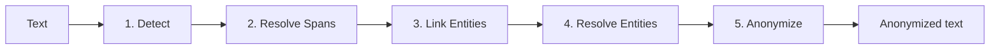

# PIIGhost

## Problem statement

Today, with the rise of LLMs, protecting sensitive data takes on a new dimension. Companies hosting these models
can potentially exploit the data their users send them, and relying solely on GDPR offers a legal guarantee but
not a technical one. At the same time, proprietary models (GPT, Claude, Gemini) remain significantly more capable
than their open-source counterparts: you shouldn't have to choose between performance and privacy. Anonymizing
PII before they reach the LLM lets you benefit from the most capable models while keeping control over your users'
data.

!!! info "What is a PII?"
    A *PII* (**P**ersonally **I**dentifiable **I**nformation) is any piece of data that can identify a person:
    name, address, phone number, email, location, organization… Anonymizing them in AI agent conversations has
    become a privacy concern in its own right: an LLM hosted by a third party should not see your users' sensitive
    data.

Two families of solutions currently exist to detect PII, regex and NER (Named Entity Recognition) models:

- **Regex**: fast and predictable, but limited to structured formats (emails, phone numbers) and incapable of
  capturing arbitrary names or locations.
- **NER models**: extended detection (persons, locations, organizations, etc.), but slower and prone to
  inaccuracies depending on the model.

Each approach has its own shortcomings, and NER models add a few more:

- **False positives**: a word is flagged as PII when it isn't one.
- **False negatives**: an actual PII is missed.
- **Inconsistent detection**: the model detects one occurrence of a PII but misses other occurrences of the same
  PII in the text, which breaks anonymization consistency.

Even if these issues were fixed, several deeper problems remain:

- **Placeholder consistency**: every occurrence of a given PII must be anonymized identically (e.g. `<<PERSON_1>>`
  for "Patrick" throughout the text), in order to preserve the information that all occurrences refer to the same
  entity while still protecting privacy.
- **Fuzzy linking**: detections that are not strictly identical must still be linked together, for instance
  "Patrick" and "patrick" (case difference), "Patric" (typo), or full vs partial mentions ("Patrick Dupont" and
  "Patrick").

### The conversational case (AI agents)

Using anonymization inside AI agents introduces several additional constraints:

- **Transparency**: the user sends their message in plaintext and receives the response in plaintext, without
  having to worry about anonymization.
- **External tool usage**: the agent must be able to call a tool (e.g. fetching the weather for a city mentioned
  in the conversation) with the real values, without the LLM itself seeing them.
- **Cross-message persistence**: an entity anonymized in the first message must stay anonymized the same way in
  every subsequent message, on both the user and agent side, so that the agent can reason about PII identity
  across the whole conversation.

---

## Solution

`piighost` combines existing building blocks to offer PII detection and anonymization that is at once accurate,
consistent, and easy to integrate:

- **Hybrid detection**: compose NER models (GLiNER2) and regex via `CompositeDetector` to get the best of both
  worlds.
- **Entity linking**: automatically groups variants (case, typos, partial mentions) to guarantee consistent
  placeholders.
- **Bidirectional anonymization**: every anonymization is cached and can be reversed on the fly, including on
  text produced by an LLM that never saw the real values.
- **LangChain middleware**: transparent integration into a LangGraph agent, without modifying your agent code.
  The LLM only sees placeholders, tools receive the real values, and the user sees the deanonymized response.

---

## How it works

The core of the library is a 5-stage pipeline, each stage pluggable via an interface:

1. **Detect**: multiple detectors (NER, regex) spot PII candidates.
2. **Resolve Spans**: arbitrate overlaps and nesting between detections.
3. **Link Entities**: group occurrences of the same entity (including typos and case variations).
4. **Resolve Entities**: merge groups that are inconsistent across detectors.
5. **Anonymize**: replace with placeholders via a pluggable factory.

See [Architecture](architecture.md) for the details of each stage.

---

## Features

- **Detection**: detect PII with an NER model (GLiNER2), regex, or a composition of both via `CompositeDetector`.
- **Span resolution**: resolves detected span conflicts (overlap, nesting) to guarantee clean, non-redundant
  entities, especially when using multiple detectors.
- **Entity linking**: links different detections together, with typo tolerance and the ability to catch mentions
  that an NER model might miss.
- **Entity resolution**: resolves conflicts between linked entities (e.g. one detector links `A` and `B` as the
  same entity while another links `B` and `C`) to guarantee coherent final entities.
- **Reversible anonymization**: replaces detected entities with customizable placeholders (`<<PERSON_1>>`,
  `<<LOCATION_1>>`) and keeps the mapping in a cache so the operation can be reversed.
- **Placeholder Factory**: extension point for naming strategies (counters, UUIDs, custom schemes).
- **LangChain middleware**: integrate `piighost` into your LangGraph agents for transparent anonymization before
  and after every model call, without modifying your agent code.

---

## Why not an existing solution?

Other libraries cover part of the scope:

- **[Microsoft Presidio](https://github.com/microsoft/presidio)**: very solid detection and anonymization, but no
  native cross-message linking and no bidirectional LangChain middleware. Excellent as a raw detection engine, but
  leaves the developer responsible for orchestrating the conversational case.
- **spaCy extensions / custom regex**: good for batch processing pipelines, but do not handle the
  anonymization/deanonymization round trip across a conversation.

`piighost`'s differentiator: **persistent cross-message linking** and a **bidirectional middleware**
(text → placeholders → LLM → text → tools → placeholders → user) that works out of the box in LangGraph.

---

## Preview

Input:

> Patrick lives in Paris. Patrick loves Paris.

Output:

> `<<PERSON_1>>` lives in `<<LOCATION_1>>`. `<<PERSON_1>>` loves `<<LOCATION_1>>`.

Both occurrences of "Patrick" are linked, same for "Paris". In a conversation, subsequent messages reuse the same
placeholders, and deanonymization is automatic for the end user.

For installation and the first full example, see [Getting started](getting-started.md).

---

## Navigation

| Section                                                 | Description                                      |
|---------------------------------------------------------|--------------------------------------------------|
| [Getting started](getting-started.md)                   | Installation and first steps                     |
| [Architecture](architecture.md)                         | Pipeline and flow diagrams                       |
| [Examples](examples/basic.md)                           | Basic usage and LangChain integration            |
| [Pre-built detectors](examples/detectors.md)            | Ready-to-use regex patterns for common PII (US & Europe) |
| [Extending PIIGhost](extending.md)                      | Build your own modules                           |
| [API Reference](reference/anonymizer.md)                | Full API documentation                           |
