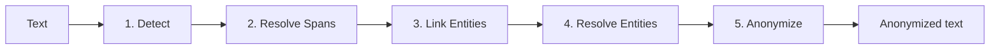

# PIIGhost

`piighost` is a Python library that automatically detects, anonymizes and deanonymizes sensitive entities (names, locations, account numbers…) in AI agent conversations. Its LangChain middleware plugs into LangGraph without changing your existing code: the LLM only sees placeholders, tools receive the real values, the user sees the deanonymized response.

## Use cases

Five families of scenarios where `piighost` fits naturally, from the most defensive (protecting the user) to the most integrated (tool-enabled agents).

**1. Protecting users from third-party LLM providers.** Cloud APIs can store, cross-reference, and exploit PII: commercial profiling, legal requisitions, training on conversations, targeting of journalists, whistleblowers, or politicians.

*Example: a consumer medical assistant whose conversations should never leave your infrastructure with the patient's name attached.*

**2. Structured extraction without JSON leakage.** When an LLM extracts fields into a schema, PII reappear as-is in the output. With `piighost`, the model only manipulates placeholders; deanonymization restores the real values client-side.

*Example: extracting a notarial deed into a JSON (parties, assets, amounts) without the LLM ever accessing the real identities.*

**3. Document redaction.** Produce a shareable version of a confidential document while protecting natural persons, keeping the text readable and usable.

*Example: anonymizing a judgment before open-access publication.*

**4. Enterprise RAG over private documents.** A classic RAG pipeline on a cloud LLM effectively limits you to already-public documents: the moment you feed an internal contract, an HR file, or a strategic note into it, the provider ingests it. By anonymizing retrieved chunks before sending them to the model, you can index genuinely private documents while keeping a hosted LLM.

*Example: an internal legal knowledge base (contracts, annotated case law) queried through a cloud LLM without client names, amounts, or sensitive clauses leaving your infrastructure.*

**5. Agents with internal tools.** The LLM reasons on placeholders; the tools (CRM, email, DB) receive the real values at call time. The model never sees the PII, and the tools work normally.

*Example: a sales agent that queries the CRM and sends emails without the LLM ever having read the client names.*

**6. Bias reduction.** LLMs inherit biases from their training data (gender, ethnicity, age). Anonymising a first name, last name, or location before sending a text to the model prevents those biases from influencing a decision: the LLM judges only the content.

*Example: CV screening where first names, last names, and addresses are replaced with placeholders to neutralise discriminatory bias on the candidate's profile.*

---

## Problem statement

Today, with the rise of LLMs, protecting sensitive data takes on a new dimension. Companies hosting these models
can potentially exploit the data their users send them, and relying solely on GDPR offers a legal guarantee but
not a technical one. At the same time, proprietary models (GPT, Claude, Gemini) remain significantly more capable
than their open-source counterparts: you shouldn't have to choose between performance and privacy. Anonymizing
PII before they reach the LLM lets you benefit from the most capable models while keeping control over your users'
data.

!!! info "What is a PII?"
    A *PII* (**P**ersonally **I**dentifiable **I**nformation) is any piece of data that can identify a person:
    name, address, phone number, email, location, organization… Anonymizing them in AI agent conversations has
    become a privacy concern in its own right: an LLM hosted by a third party should not see your users' sensitive
    data.

!!! tip "New to these terms?"
    See the [Glossary](glossary.md) for definitions of NER, span, entity linking, middleware, placeholder, and more.

Two families of solutions currently exist to detect PII, regex and NER (Named Entity Recognition) models:

- **Regex**: fast and predictable, but limited to structured formats (emails, phone numbers) and incapable of
  capturing arbitrary names or locations.
- **NER models**: extended detection (persons, locations, organizations, etc.), but slower and prone to
  inaccuracies depending on the model.

Each approach has its own shortcomings, and NER models add a few more:

- **False positives**: a word is flagged as PII when it isn't one.
- **False negatives**: an actual PII is missed.
- **Inconsistent detection**: the model detects one occurrence of a PII but misses other occurrences of the same
  PII in the text, which breaks anonymization consistency.

Even if these issues were fixed, several deeper problems remain:

- **Placeholder consistency**: every occurrence of a given PII must be anonymized identically (e.g.
  `<<PERSON:1>>`{ .placeholder } for `Patrick`{ .pii } throughout the text), in order to preserve the information
  that all occurrences refer to the same entity while still protecting privacy.
- **Fuzzy linking**: detections that are not strictly identical must still be linked together, for instance
  `Patrick`{ .pii } and `patrick`{ .pii } (case difference), `Patric`{ .pii } (typo), or full vs partial mentions
  (`Patrick Dupont`{ .pii } and `Patrick`{ .pii }).

`piighost` addresses each of these issues with three pipeline components (span conflict resolution, entity
linking, entity merging). Each component has a **trade-off**: span resolution may discard a legitimate
detection on a false conflict, fuzzy linking may group two distinct entities by mistake, and so on. If your
detections are already clean (or if you prefer to handle these cases yourself), each component can be
**disabled individually** via a `Disabled*` instance that turns it into a passthrough. See
[Extending PIIGhost](extending.md) for the per-section details.

### The conversational case (AI agents)

Using anonymization inside AI agents introduces several additional constraints:

- **Transparency**: the user sends their message in plaintext and receives the response in plaintext, without
  having to worry about anonymization.
- **External tool usage**: the agent must be able to call a tool (e.g. fetching the weather for a city mentioned
  in the conversation) with the real values, without the LLM itself seeing them.
- **Cross-message persistence**: an entity anonymized in the first message must stay anonymized the same way in
  every subsequent message, on both the user and agent side, so that the agent can reason about PII identity
  across the whole conversation.

---

## Solution

`piighost` combines existing building blocks to offer PII detection and anonymization that is at once accurate,
consistent, and easy to integrate:

- **Hybrid detection**: compose one or more NER models (GLiNER2, spaCy, Transformers…) and regex via
  `CompositeDetector` to get the best of both worlds.
- **Entity linking**: automatically groups variants (case, typos, partial mentions) to guarantee consistent
  placeholders.
- **Bidirectional anonymization**: every anonymization is cached and can be reversed on the fly, including on
  text produced by an LLM that never saw the real values.
- **LangChain middleware**: transparent integration into a LangGraph agent, without modifying your agent code.
  The LLM only sees placeholders, tools receive the real values, and the user sees the deanonymized response.

---

## How it works

The core of the library is a 5-stage pipeline, each stage pluggable via an interface:

1. **Detect**: multiple detectors (NER, regex) spot PII candidates.
2. **Resolve Spans**: arbitrate overlaps and nesting between detections.
3. **Link Entities**: group occurrences of the same entity (including typos and case variations).
4. **Resolve Entities**: merge groups that are inconsistent across detectors.
5. **Anonymize**: replace with placeholders via a pluggable factory.

See [Architecture](architecture.md) for the details of each stage.

---

## Why not an existing solution?

Other libraries cover part of the scope:

- **[Microsoft Presidio](https://github.com/microsoft/presidio)**: rich catalogue of built-in recognizers
  (credit cards validated with Luhn, IBANs with checksum, SSNs, passports, emails, phone numbers) enriched by
  keyword-based context scoring, with an NER engine backed by spaCy / stanza / transformers. No native
  cross-message linking and no bidirectional LangChain middleware. Excellent as a raw detection engine, but
  leaves the developer responsible for orchestrating the conversational case.
- **spaCy extensions / custom regex**: good for batch processing pipelines, but do not handle the
  anonymization/deanonymization round trip across a conversation.

`piighost`'s differentiator: **persistent cross-message linking** and a **bidirectional middleware**
(text → placeholders → LLM → text → tools → placeholders → user) that works out of the box in LangGraph.

---

## Preview

Input:

> `Patrick`{ .pii } lives in `Paris`{ .pii }. `Patrick`{ .pii } loves `Paris`{ .pii }.

Output:

> `<<PERSON:1>>`{ .placeholder } lives in `<<LOCATION:1>>`{ .placeholder }. `<<PERSON:1>>`{ .placeholder } loves `<<LOCATION:1>>`{ .placeholder }.

Both occurrences of `Patrick`{ .pii } are linked, same for `Paris`{ .pii }. In a conversation, subsequent messages
reuse the same placeholders, and deanonymization is automatic for the end user.

For installation and the first full example, see [Installation](getting-started/installation.md) then [First pipeline](getting-started/first-pipeline.md).

---

## Navigation

Each page follows a specific role from the [Diátaxis framework](https://diataxis.fr/): tutorial to learn, how-to to solve a task, reference to look up the API, explanation to understand design choices.

-   :lucide-rocket: __Get started__

    ---

    Install and take piighost for a spin.

    - [Installation](getting-started/installation.md)
    - [Quickstart](getting-started/quickstart.md)
    - [First pipeline](getting-started/first-pipeline.md)
    - [Conversational pipeline](getting-started/conversation.md)
    - [LangChain middleware](getting-started/langchain.md)
    - [Remote client](getting-started/api-client.md)
    - [Basic usage](examples/basic.md)

-   :lucide-wrench: __Usage__

    ---

    Recipes for specific use cases.

    - [LangChain integration](examples/langchain.md)
    - [Pre-built detectors](examples/detectors.md)
    - [Extending PIIGhost](extending.md)
    - [Testing](examples/testing.md)
    - [Deployment](deployment.md)

-   :lucide-book-open: __Reference__

    ---

    The full API documentation.

    - [Anonymizer](reference/anonymizer.md)
    - [Pipeline](reference/pipeline.md)
    - [Middleware](reference/middleware.md)
    - [Detectors](reference/detectors.md)

-   :lucide-layers: __Concepts__

    ---

    Understand the design choices.

    - [Architecture](architecture.md)
    - [Glossary](glossary.md)
    - [Limitations](limitations.md)
    - [Security](security.md)

-   :lucide-users: __Community__

    ---

    Participate, report, discuss.

    - [Contributing](community/contributing.md)
    - [Code of conduct](community/code-of-conduct.md)
    - [Bug reports](community/bug-reports.md)
    - [FAQ](community/faq.md)

