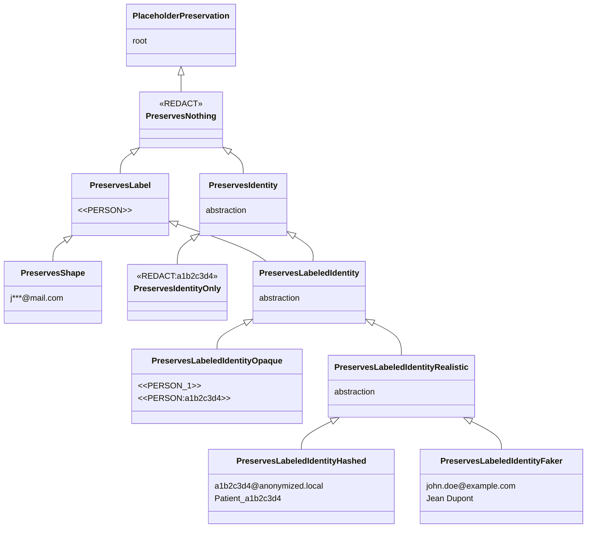

# Placeholder factories

A **placeholder** is the synthetic placeholder that takes the place of a detected PII before the text is handed to the LLM. Instead of sending `"Patrick lives in Paris"` to the LLM, the pipeline sends `"<<PERSON:1>> lives in <<LOCATION:1>>"`. The original values stay in the cache and the conversation memory; the LLM never sees them.

!!! note "Why the name 'placeholder factory'?"

    "Placeholder" because the token holds the place of the original value. We could have called it a "token", but that term is already overloaded in the LLM context (language tokens). "Factory" because the component generates these placeholders on the fly, based on the entities detected in each message.

!!! note "Placeholder format convention"

    Placeholders used throughout this documentation and produced by the built-in factories follow a simple convention:

    - **Synthetic placeholder** (does not look like any real PII): wrapped in `<<` and `>>`. Examples: `<<REDACT>>`{ .placeholder }, `<<PERSON>>`{ .placeholder }, `<<PERSON:1>>`{ .placeholder }, `<<PERSON:a1b2c3d4>>`{ .placeholder }, `<<REDACT:a1b2c3d4>>`{ .placeholder }. The delimiters serve two purposes: an LLM (or a human re-reading) will never mistake the placeholder for a regular word or for an HTML/XML tag the model might emit; and the middleware can perform `str.replace` reliably during deanonymisation (see [Tool-call strategies](tool-call-strategies.md) for why this matters).
    - **Placeholder that replicates a PII format** (Faker, realistic hashed, masked): no delimiters. Examples: `john.doe@example.com`{ .placeholder }, `Patient_a1b2c3d4`{ .placeholder }, `a1b2c3d4@anonymized.local`{ .placeholder }, `j***@mail.com`{ .placeholder }. The absence of delimiters is deliberate: the goal is precisely to look natural so a downstream tool that validates a format (email regex, card length) still accepts the placeholder.

    The rule also applies to any factory you write yourself: purely opaque placeholder? wrap it. Placeholder that mimics a real value? leave it raw.

A **placeholder factory** decides what those placeholders look like and how much information they carry. Two questions structure the choice:

1. *Are placeholders unique per entity?* `Patrick`{ .pii } and `Marie`{ .pii } should not both collapse onto a generic `<<PERSON>>`{ .placeholder }, otherwise the LLM cannot tell them apart. A unique placeholder per entity lets the LLM reason about relations between entities: *"is the manager the same person as `Patrick`{ .pii }?"* becomes *"is `<<PERSON:1>>`{ .placeholder } the same as `<<PERSON:2>>`{ .placeholder }?"* and gets a clear answer.
2. *Are placeholders reversible?* Given a placeholder alone, can the original value be recovered without consulting the cache? This is the precondition for the middleware's string-replacement step on tool arguments. If two placeholders collapse onto the same `<<PERSON>>`{ .placeholder }, there is no way to know which original to restore.

Seven families of factories sit at different points on that spectrum, and the choice has direct consequences on which `ToolCallStrategy` you can use safely. See [Tool-call strategies](tool-call-strategies.md) for the runtime side.

- **No information** (`<<REDACT>>`{ .placeholder }): a constant placeholder that reveals nothing to the LLM. Classic redaction. No reasoning possible on entities (the LLM cannot tell that the value was a city, so it cannot decide to call `get_weather`).
- **Id only** (`<<REDACT:a1b2c3d4>>`{ .placeholder }): a unique hash per entity, without revealing the type. The LLM sees that two distinct entities exist but cannot tell whether they are persons, emails, or credit cards. Keeps reversibility on the tool side without giving any semantic hint to the model.
- **Type only** (`<<PERSON>>`{ .placeholder }, `<<EMAIL>>`{ .placeholder }): the type is revealed but not the identity. Multiple persons in the same conversation collapse onto the same `<<PERSON>>`{ .placeholder } placeholder, so cross-references break.
- **Type + id (opaque)** (`<<PERSON:1>>`{ .placeholder }, `<<PERSON:a1b2c3d4>>`{ .placeholder }): type revealed, stable identity, clearly synthetic placeholder. The LLM can tell that `<<PERSON:1>>`{ .placeholder } and `<<PERSON:2>>`{ .placeholder } are different people. Unique, so reversible by string replacement.
- **Type + partial value** (`p***@mail.com`{ .placeholder }): the format is preserved but real content is partially visible. The LLM sees that it is an email, may guess the domain, but cannot recover the full address. Riskier on privacy (real fragments leak) and reversibility (collisions possible).
- **Type + id (Faker)** (`john.doe@gmail.com`{ .placeholder }): a fully plausible fake value. Natural-looking output, but exposes a coincidental-collision risk with a real-world value.
- **Type + id (realistic hashed)** (`a1b2c3d4@anonymized.local`{ .placeholder }): a realistic fake value with a hash guaranteeing uniqueness. Combines the realistic format with a guarantee of non-collision.

---

## Family details

### No information: total destruction

The placeholder is a fixed string (e.g. `<<REDACT>>`{ .placeholder }). The LLM learns *that* something was redacted but nothing about its type, count, or relations. The conversation loses every internal reference: an agent trying to act on *"send the invoice to the client"* cannot tell whether the client is the one mentioned earlier or someone new. Useful for archival redaction, useless when an agent has to reason.

Built-in: `RedactPlaceholderFactory` (output: `<<REDACT>>`{ .placeholder } by default, configurable via the `value` argument). Tag `PreservesNothing`.

### Id only: identity without type

`<<REDACT:a1b2c3d4>>`{ .placeholder }. Original trade-off: the placeholder keeps the synthetic `<<...>>` shape but does not reveal the label; it does carry a unique hash per entity. The LLM cannot tell whether the entity is a person, an email, or a credit card, but it can see that `<<REDACT:a1b2c3d4>>`{ .placeholder } and `<<REDACT:ef98abcd>>`{ .placeholder } are two distinct entities. One of the most protective levels while remaining usable on the tool side (the hash is unique, so string replacement works).

Built-in: `RedactHashPlaceholderFactory` (output: `<<REDACT:a1b2c3d4>>`{ .placeholder }, prefix configurable). Tag `PreservesIdentityOnly` (under `PreservesIdentity`). The middleware accepts this factory like any other identity-preserving factory through covariance.

### Type only: known type, identities collapsed

`<<PERSON>>`{ .placeholder }, `<<EMAIL>>`{ .placeholder }. The LLM knows that something is a person, an email, a credit card, and can answer questions that depend on the type alone. But two different persons in the same conversation collapse onto the same placeholder. The classic failure mode is cross-reference: *"is `Patrick`{ .pii } the same person as the manager mentioned earlier?"* becomes *"is `<<PERSON>>`{ .placeholder } the same as `<<PERSON>>`{ .placeholder }?"*, which has no answer.

Built-in: `LabelPlaceholderFactory` (output: `<<PERSON>>`{ .placeholder }). Tag `PreservesLabel`.

### Type + id (opaque)

`<<PERSON:1>>`{ .placeholder }, `<<PERSON:a1b2c3d4>>`{ .placeholder }. The string clearly is *not* a person, an email, or a card number, it's a placeholder. The LLM cannot mistake it for real data, audit logs are easy to scan, and there is **zero chance** of collision with a real value. Trade-off: a strict downstream prompt or tool that validates "argument must look like an email" will reject these placeholders.

Built-in: `LabelCounterPlaceholderFactory` (`<<PERSON:1>>`{ .placeholder }), `LabelHashPlaceholderFactory` (`<<PERSON:a1b2c3d4>>`{ .placeholder }). Tag `PreservesLabeledIdentityOpaque`.

### Type + id (realistic hashed)

A custom factory can produce values that **look like the original format** but whose content is driven by a hash, e.g. `a1b2c3d4@anonymized.local`{ .placeholder } for an email, or `Patient_a1b2c3d4`{ .placeholder } for a name. The placeholder passes basic format validation (email regex, length, allowed characters), so downstream tools and prompt templates that expect a real-looking value still work. Because the content is a hash, the placeholder is **unique and impossible to coincidentally match** an existing real value.

Built-in: `FakerHashPlaceholderFactory` (configured with a `label -> strategy` mapping that must cover every label your detector emits, **no fallback**: an unknown label raises `ValueError`). Tag `PreservesLabeledIdentityHashed`. See *Writing your own* below for a complete example.

### Type + id (Faker)

`FakerPlaceholderFactory` returns fully plausible fake data: `john.doe@example.com`{ .placeholder }, `Jean Dupont`{ .placeholder }, `+33 6 12 34 56 78`{ .placeholder }. The LLM cannot tell that the value was anonymised, which is sometimes exactly what you want (clean drafts, no `<<PERSON:1>>`{ .placeholder } strings showing up in user-visible text). Two specific risks come with this:

1. **Coincidental collision with real values.** A Faker email could land on a real person's actual email address. If a tool response then contains that real address, the deanonymisation step cannot tell whether it should be replaced or left alone.
2. **The agent may reason on the value as if it were real.** If a downstream tool routes on the email domain, it will route on the *fake* domain, a feature in `PASSTHROUGH`-style flows but a footgun in `FULL` flows where real PII flows back to the LLM.

Use Faker for archival, demo, or one-shot redaction. Prefer opaque or format-preserving hash placeholders when the agent has tool calls that touch real systems. Tag `PreservesLabeledIdentityFaker`.

### Type + partial value: partial value leak

`j***@mail.com`{ .placeholder }, `****4567`{ .placeholder }, `P******`{ .placeholder }. The placeholder preserves *part* of the original value: the email domain, the last four digits of a card, the first letter of a name. The LLM can reason on more than the type: *"the email is on the company domain"*, *"the card ends in 4567"*, *"the name starts with P"*. Two trade-offs come with this:

1. **Real fragments of the PII reach the LLM.** It cannot reconstruct the full value, but `j***@mail.com`{ .placeholder } already places the user inside a known mail provider.
2. **Collisions are possible.** Two different cards ending in `4567` collapse onto `****4567`{ .placeholder }; two emails sharing the first letter and domain end up identical. The id is "mostly unique" but not guaranteed.

Built-in: `MaskPlaceholderFactory`. Tag `PreservesShape`. The middleware refuses it for the same reason as `PreservesLabel`: an ambiguous placeholder cannot be deanonymised through string replacement.

---

## Preservation tags

Every factory carries a **phantom type** that summarises the preservation level of its placeholders. The type-checker reads this tag to validate a factory against its consumers.

**Identity of each family.**

| Family | Example | Tag |
|---|---|---|
| No information | `<<REDACT>>`{ .placeholder } | `PreservesNothing` |
| Id only | `<<REDACT:a1b2c3d4>>`{ .placeholder } | `PreservesIdentityOnly` |
| Type only | `<<PERSON>>`{ .placeholder } | `PreservesLabel` |
| Type + id (opaque) | `<<PERSON:1>>`{ .placeholder }, `<<PERSON:a1b2c3d4>>`{ .placeholder } | `PreservesLabeledIdentityOpaque` |
| Type + id (realistic hashed) | `a1b2c3d4@anonymized.local`{ .placeholder }, `Patient_a1b2c3d4`{ .placeholder } | `PreservesLabeledIdentityHashed` |
| Type + id (Faker) | `john.doe@example.com`{ .placeholder }, `Jean Dupont`{ .placeholder } | `PreservesLabeledIdentityFaker` |
| Type + partial value | `j***@mail.com`{ .placeholder }, `****4567`{ .placeholder } | `PreservesShape` |

Two angles, two tables. **Confidentiality**: what leaks to the LLM (attacker / privacy point of view). **Exploitation**: what the agent and the system can do with the placeholder (functional capabilities point of view). The same answer can be good in one and problematic in the other; this is exactly the tension we make explicit.

Shared colour code: **blue** = best, **green** = acceptable, **yellow** = partial, **red** = problematic.

#### Confidentiality (what leaks to the LLM)

<table class="security-table" markdown="1">
<thead>
<tr><th>Family</th><th>Type seen?</th><th>PIIs distinguished?</th><th>Real-value leak?</th><th>Collision with a real value?</th></tr>
</thead>
<tbody>
<tr><td>No information</td><td class="c-blue">no</td><td class="c-blue">no</td><td class="c-blue">none</td><td class="c-blue">no</td></tr>
<tr><td>Id only</td><td class="c-blue">no</td><td class="c-green">yes</td><td class="c-blue">none</td><td class="c-blue">no</td></tr>
<tr><td>Type only</td><td class="c-green">yes</td><td class="c-blue">no</td><td class="c-blue">none</td><td class="c-blue">no</td></tr>
<tr><td>Type + id (opaque)</td><td class="c-green">yes</td><td class="c-green">yes</td><td class="c-blue">none</td><td class="c-blue">no</td></tr>
<tr><td>Type + id (realistic hashed)</td><td class="c-green">yes</td><td class="c-green">yes</td><td class="c-blue">none</td><td class="c-blue">no</td></tr>
<tr><td>Type + id (Faker)</td><td class="c-green">yes</td><td class="c-green">yes</td><td class="c-blue">none</td><td class="c-yellow">risk</td></tr>
<tr><td>Type + partial value</td><td class="c-green">yes</td><td class="c-green">yes</td><td class="c-yellow">partial</td><td class="c-yellow">risk</td></tr>
</tbody>
</table>

#### Exploitation by the LLM and the agent

<table class="security-table" markdown="1">
<thead>
<tr><th>Family</th><th>Reason about the type</th><th>Track cross-references</th><th>Reversible at the tool boundary</th><th>Stable across messages</th></tr>
</thead>
<tbody>
<tr><td>No information</td><td class="c-red">no</td><td class="c-red">no</td><td class="c-red">no</td><td class="c-red">no</td></tr>
<tr><td>Id only</td><td class="c-red">no</td><td class="c-blue">yes</td><td class="c-blue">yes</td><td class="c-blue">yes</td></tr>
<tr><td>Type only</td><td class="c-blue">yes</td><td class="c-red">no</td><td class="c-red">no</td><td class="c-yellow">partial</td></tr>
<tr><td>Type + id (opaque)</td><td class="c-blue">yes</td><td class="c-blue">yes</td><td class="c-blue">yes</td><td class="c-blue">yes</td></tr>
<tr><td>Type + id (realistic hashed)</td><td class="c-blue">yes</td><td class="c-blue">yes</td><td class="c-blue">yes</td><td class="c-blue">yes</td></tr>
<tr><td>Type + id (Faker)</td><td class="c-blue">yes</td><td class="c-blue">yes</td><td class="c-blue">yes</td><td class="c-blue">yes</td></tr>
<tr><td>Type + partial value</td><td class="c-blue">yes</td><td class="c-yellow">mostly</td><td class="c-yellow">yes (collisions)</td><td class="c-yellow">yes (collisions)</td></tr>
</tbody>
</table>

<small>
Legend:
<span class="sec-legend c-blue">best</span>
<span class="sec-legend c-green">acceptable</span>
<span class="sec-legend c-yellow">partial</span>
<span class="sec-legend c-red">problematic</span>
</small>

Tags form an **inheritance hierarchy** that the type-checker exploits through the covariance of `AnyPlaceholderFactory[PreservationT_co]`. Two orthogonal axes structure the taxonomy: *Label* (the placeholder reveals the type) and *Identity* (the placeholder is unique per entity). `PreservesLabeledIdentity` combines the two via multiple inheritance, so a `<<PERSON:1>>` factory is both a `PreservesLabel` *and* a `PreservesIdentity`. A consumer typed against `PreservesIdentity` therefore accepts `PreservesIdentityOnly` *and* every `PreservesLabeledIdentity*`, while rejecting `PreservesLabel` / `PreservesShape` / `PreservesNothing` which lack the uniqueness guarantee.



`PreservesLabeledIdentity` inherits from both `PreservesLabel` and `PreservesIdentity` (multiple inheritance). This expresses the **"A is a B but not every B is an A"** relation: every `PreservesLabeledIdentity` is also a `PreservesLabel` and a `PreservesIdentity`, but the reverse is false. A consumer typed against `Pipeline[PreservesIdentity]` therefore accepts factories *with or without* labels, as long as they produce unique placeholders per entity.

A factory declares the **most specific** tag that matches its guarantees:

```python
class LabelCounterPlaceholderFactory(AnyPlaceholderFactory[PreservesLabeledIdentityOpaque]): ...
class LabelHashPlaceholderFactory(AnyPlaceholderFactory[PreservesLabeledIdentityOpaque]): ...
class FakerPlaceholderFactory(AnyPlaceholderFactory[PreservesLabeledIdentityFaker]): ...
class LabelPlaceholderFactory(AnyPlaceholderFactory[PreservesLabel]): ...
class MaskPlaceholderFactory(AnyPlaceholderFactory[PreservesShape]): ...
# No built-in for the id-only branch: implement your own with
# PreservesIdentityOnly for a hashed redact like <<REDACT:a1b2c3d4>>.
```

---

## Built-in factories

| Factory | Style | Mechanism | Output example | Tag |
|---|---|---|---|---|
| `RedactPlaceholderFactory` | Redact | — | `<<REDACT>>`{ .placeholder } | `PreservesNothing` |
| `RedactCounterPlaceholderFactory` | Redact | Counter | `<<REDACT:1>>`{ .placeholder } | `PreservesIdentityOnly` |
| `RedactHashPlaceholderFactory` | Redact | Hash | `<<REDACT:a1b2c3d4>>`{ .placeholder } | `PreservesIdentityOnly` |
| `LabelPlaceholderFactory` | Label | — | `<<PERSON>>`{ .placeholder } | `PreservesLabel` |
| `LabelCounterPlaceholderFactory` (default) | Label | Counter | `<<PERSON:1>>`{ .placeholder } | `PreservesLabeledIdentityOpaque` |
| `LabelHashPlaceholderFactory` | Label | Hash | `<<PERSON:a1b2c3d4>>`{ .placeholder } | `PreservesLabeledIdentityOpaque` |
| `FakerCounterPlaceholderFactory` | Faker | Counter | `John Doe:1`{ .placeholder } | `PreservesLabeledIdentityHashed` |
| `FakerHashPlaceholderFactory` | Faker | Hash | `John Doe:a1b2c3d4`{ .placeholder } | `PreservesLabeledIdentityHashed` |
| `FakerPlaceholderFactory` | Faker | random | `john.doe@example.com`{ .placeholder } | `PreservesLabeledIdentityFaker` |
| `MaskPlaceholderFactory` | Mask | partial | `p***@mail.com`{ .placeholder } | `PreservesShape` |

The naming follows a `<Style><Mechanism>PlaceholderFactory` schema:

- **Style** = what the placeholder preserves (Redact = nothing, Label = type, Faker = PII shape, Mask = partial value)
- **Mechanism** = how uniqueness is achieved (Counter = sequential, Hash = SHA-256; absent when not relevant)

`LabelCounterPlaceholderFactory` and `LabelHashPlaceholderFactory` are the safe defaults. `RedactCounter` / `RedactHash` add uniqueness without leaking the label (useful for bias reduction). `FakerCounter` / `FakerHash` produce a realistic format: you must **explicitly provide a strategy per label** (3 modes: base, template with `{counter}` or `{hash}`, callable like `fake_ip()` or `fake_phone()`). `FakerPlaceholderFactory` is reversible but its placeholders can collide with real values. `RedactPlaceholderFactory`, `LabelPlaceholderFactory` and `MaskPlaceholderFactory` are non-reversible redaction tools (rejected by the middleware).

---

## Which placeholder to pick?

The placeholder factory is the place where the **privacy / agent-capability trade-off** is made explicit. The right choice depends on the use case. Two scenarios cover most needs.

### Case 1: simple anonymisation (one-shot, archival, compliance)

The goal is to produce a sanitised version of a document: redacting a court ruling, scrubbing an HR record before archival, exporting a dataset. No agent, no tools, sometimes not even reversibility.

| Need | Recommended family | Why |
|---|---|---|
| Erase every trace, no reversibility needed | **No information** (`<<REDACT>>`{ .placeholder }) | The most protective, no semantic leak. The document is readable but the LLM cannot infer anything. |
| Keep the text readable (a human reader sees "[email]" rather than "<<REDACT>>") | **Type only** (`<<PERSON>>`{ .placeholder }, `<<EMAIL>>`{ .placeholder }) | The type aids human reading without leaking the value. Built-in: `LabelPlaceholderFactory`. |
| Allow server-side de-anonymisation (local cache) | **Type + id (opaque)** (`<<PERSON:1>>`{ .placeholder }) | Reversible via cache, trivial to audit, no collisions. Built-in: `LabelCounterPlaceholderFactory` or `LabelHashPlaceholderFactory`. |
| Track "who is who" without revealing the type (sensitive: medical, HR) | **Id only** (`<<REDACT:a1b2c3d4>>`{ .placeholder }) | Distinguishes entities without any semantic hint. Custom factory (no built-in). |

### Case 2: anonymisation for an LLM / agent with tools

The LLM reasons about the conversation, and tools (CRM, DB, mail) need real values at call time. The middleware does string replacement on tool arguments, so **it requires a unique placeholder per entity**.

Direct consequence: only families with preserved identity (`Id only`, every `Type + id` variant) are compatible. `No information`, `Type only` and `Type + partial value` are rejected at type-check (and at runtime via `get_preservation_tag`).

| Need | Recommended family | Why |
|---|---|---|
| **Default** | **Type + id (opaque)** (`<<PERSON:1>>`{ .placeholder }, `<<PERSON:a1b2c3d4>>`{ .placeholder }) | Reversible, opaque, zero collision. The safe default. Built-in: `LabelCounterPlaceholderFactory` (per thread) or `LabelHashPlaceholderFactory` (deterministic). |
| Downstream tool validates a format (email regex, card length) | **Type + id (realistic hashed)** (`a1b2c3d4@anonymized.local`{ .placeholder }) | The placeholder passes validation while keeping uniqueness and zero collision. Custom factory (no built-in). |
| User-facing output must read naturally (drafts, demos) | **Type + id (Faker)** (`john.doe@example.com`{ .placeholder }) | Fluent text, no `<<PERSON:1>>`{ .placeholder } leaking to the user. **Risk**: collision with a real value in a tool response. Avoid in `ToolCallStrategy.FULL`. Built-in: `FakerPlaceholderFactory`. |
| Bias reduction (CV screening, hiring) | **Id only** (`<<REDACT:a1b2c3d4>>`{ .placeholder }) | The LLM does not see the type, so genre/origin inferable from a first name vanishes. Distinguishes candidates without biasing reasoning. |
| Sensitive type (medical category, clearance level) | **Id only** (`<<REDACT:a1b2c3d4>>`{ .placeholder }) | Same reason: the type itself is a PII and must not reach the LLM. |

To avoid in an agent:

- `LabelPlaceholderFactory` and `MaskPlaceholderFactory` are rejected by the middleware (no uniqueness guarantee). Usable outside the middleware, or in `ToolCallStrategy.PASSTHROUGH` mode (the agent never receives the real values).
- `FakerPlaceholderFactory` when the pipeline runs `FULL` or `INBOUND_ONLY` *and* tools may return real emails or names: undetectable external collision risk.

The preservation tag exists so this choice is visible to the type-checker, not buried in placeholder-format trivia. A factory tagged `PreservesShape` cannot be plugged into the middleware *by accident*: it will fail at type-check time, not on the first tool call in production.

---

## Why `PIIAnonymizationMiddleware` requires `PreservesIdentity`

The middleware operates on three boundaries: **input messages** (LLM in), **output messages** (LLM out), and **tool calls**. The first two go through the cache; the tool calls cannot.

**Input/output messages.** When `abefore_model` anonymises a message, it stores `hash(anonymized_text) → original` in the cache. The reply from the LLM is looked up by exact hash, so deanonymisation is a clean key lookup. This works for any factory, regardless of whether placeholders are unique.

**Tool calls.** The LLM produces tool arguments by *combining* and *paraphrasing* the placeholders it received. The exact text was never anonymised by the pipeline, so it is not in the cache. The only way to deanonymise is **string replacement**: scan the args for known placeholders and substitute the original value of each. The same is true in reverse for the tool response, which is re-anonymised by replacing known PII values with their placeholders.

That string-replacement step is unambiguous **only if every entity maps to a unique placeholder**. If two entities collapse onto `<<PERSON>>`{ .placeholder }, there is no way to know which original to restore. The middleware therefore narrows its accepted type to `ThreadAnonymizationPipeline[PreservesIdentity]`, which through covariance encompasses both `PreservesIdentityOnly` (hashed redact, no label) and every `PreservesLabeledIdentity*` (with label). Wiring a `PreservesLabel` / `PreservesShape` / `PreservesNothing` factory into the middleware is caught by `pyrefly` / `mypy` *before* the program runs.

`ThreadAnonymizationPipeline` mirrors that constraint at runtime via `get_preservation_tag()`, so untyped or dynamically-built factories that bypass the type-checker are still rejected at construction time.

See [Tool-call strategies](tool-call-strategies.md) for the only escape hatch (`ToolCallStrategy.PASSTHROUGH`, where the tool boundary is never crossed in clear text).

---

## Writing your own

Subclass `AnyPlaceholderFactory[<tag>]` with the right preservation tag for your guarantees, then implement `create()`.

???+ example "UUID tags factory (id without label): `PreservesIdentityOnly`"

    ```python
    import uuid
    from piighost.models import Entity
    from piighost.placeholder import AnyPlaceholderFactory
    from piighost.placeholder_tags import PreservesIdentityOnly

    class UUIDPlaceholderFactory(AnyPlaceholderFactory[PreservesIdentityOnly]):
        """Generates opaque UUID tags, e.g. <<a3f2-1b4c>>."""

        def create(self, entities: list[Entity]) -> dict[Entity, str]:
            result: dict[Entity, str] = {}
            seen: dict[str, str] = {}  # canonical → placeholder

            for entity in entities:
                canonical = entity.detections[0].text.lower()
                if canonical not in seen:
                    seen[canonical] = f"<<{uuid.uuid4().hex[:8]}>>"
                result[entity] = seen[canonical]

            return result
    ```

??? example "Bracket format factory (label + id): `PreservesLabeledIdentityOpaque`"

    ```python
    from collections import defaultdict
    from piighost.models import Entity
    from piighost.placeholder import AnyPlaceholderFactory
    from piighost.placeholder_tags import PreservesLabeledIdentityOpaque

    class BracketPlaceholderFactory(AnyPlaceholderFactory[PreservesLabeledIdentityOpaque]):
        """Generates tags in the format [PERSON:1], [LOCATION:2], etc."""

        def create(self, entities: list[Entity]) -> dict[Entity, str]:
            result: dict[Entity, str] = {}
            counters: dict[str, int] = defaultdict(int)

            for entity in entities:
                label = entity.label
                counters[label] += 1
                result[entity] = f"[{label}:{counters[label]}]"

            return result
    ```

??? example "Configuring `FakerHashPlaceholderFactory` (realistic hashed, no fallback)"

    You provide a `label -> strategy` mapping. Three modes coexist with runtime dispatch:

    1. **Base**: `str` without `{hash}` → factory appends `:hash`. E.g. `"John Doe"` → `John Doe:a1b2c3d4`.
    2. **Template**: `str` with `{hash}` → substitution. E.g. `"{hash}@example.com"` → `a1b2c3d4@example.com`.
    3. **Callable**: `(hash) -> str`. Ideal for types that need a strict format (IP, phone, IBAN…) — use the `fake_*` helpers that seed Faker with the hash.

    **No fallback**: an unknown label raises `ValueError` listing the registered labels. Configuration drift caught immediately.

    ```python
    from piighost.ph_factory.faker_hash import (
        FakerHashPlaceholderFactory,
        fake_ip,
        fake_phone,
        fake_iban,
    )

    factory = FakerHashPlaceholderFactory(
        strategies={
            "person":     "John Doe",                  # base → "John Doe:a1b2c3d4"
            "location":   "Paris",                      # base → "Paris:a1b2c3d4"
            "email":      "{hash}@example.com",         # template → "a1b2c3d4@example.com"
            "url":        "https://example.com/{hash}", # template
            "ip_address": fake_ip(),                    # callable → "192.168.42.7"
            "phone":      fake_phone(),                 # callable → "+33 6 12 34 56 78"
            "iban":       fake_iban(),                  # callable → "FR76..."
        },
        hash_length=8,
    )
    ```

    If you don't provide `strategies`, sensible defaults are used (`person` → `"John Doe"`, `email` → `"{hash}@example.com"`, `phone` → `fake_phone()`, etc.).

??? example "Configuring `FakerCounterPlaceholderFactory` (realistic counted, no fallback)"

    Same 3-mode API as `FakerHashPlaceholderFactory`, but with a sequential per-label counter instead of a hash. The template placeholder is `{counter}`.

    ```python
    from piighost.ph_factory.faker_hash import FakerCounterPlaceholderFactory

    factory = FakerCounterPlaceholderFactory(
        strategies={
            "person":   "John Doe",                  # → "John Doe:1", "John Doe:2"…
            "email":    "{counter}@example.com",     # → "1@example.com", "2@example.com"…
        },
    )
    ```

---

## See also

- [Tool-call strategies](tool-call-strategies.md): how the middleware uses these placeholders, and why `PASSTHROUGH` is the only mode that tolerates weaker tags.
- [Extending PIIGhost](extending.md): the full protocol reference and the rest of the pipeline injection points.
- [Limitations](limitations.md): operational consequences of the factory choice (cache, scaling, hallucinated PII).
