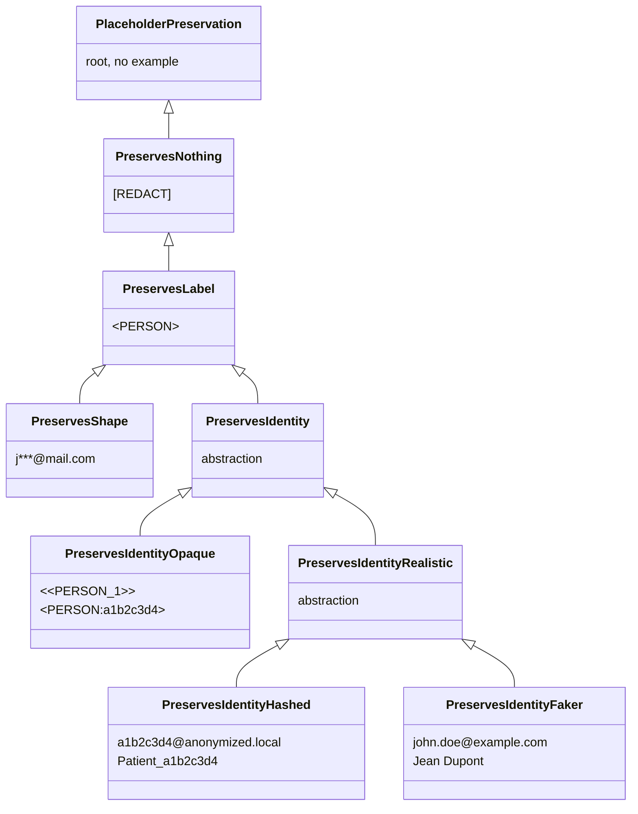

# Placeholder factories

A **placeholder** is the synthetic token that takes the place of a detected PII before the text is handed to the LLM. Instead of sending `"Patrick lives in Paris"` to the LLM, the pipeline sends `"<<PERSON_1>> lives in <<LOCATION_1>>"`. The original values stay in the cache and the conversation memory; the LLM never sees them.

!!! note "Why the name 'placeholder factory'?"

    "Placeholder" because the token holds the place of the original value. We could have called it a "token", but that term is already overloaded in the LLM context (language tokens). "Factory" because the component generates these tokens on the fly, based on the entities detected in each message.

A **placeholder factory** decides what those tokens look like and how much information they carry. Two questions structure the choice:

1. *Are tokens unique per entity?* `Patrick`{ .pii } and `Marie`{ .pii } should not both collapse onto a generic `<PERSON>`{ .placeholder }, otherwise the LLM cannot tell them apart. A unique token per entity lets the LLM reason about relations between entities: *"is the manager the same person as `Patrick`{ .pii }?"* becomes *"is `<<PERSON_1>>`{ .placeholder } the same as `<<PERSON_2>>`{ .placeholder }?"* and gets a clear answer.
2. *Are tokens reversible?* Given a token alone, can the original value be recovered without consulting the cache? This is the precondition for the middleware's string-replacement step on tool arguments. If two placeholders collapse onto the same `<PERSON>`{ .placeholder }, there is no way to know which original to restore.

Six families of factories sit at different points on that spectrum, and the choice has direct consequences on which `ToolCallStrategy` you can use safely. See [Tool-call strategies](tool-call-strategies.md) for the runtime side.

- We can replace a PII with a **constant marker** (`[REDACT]`{ .placeholder }), revealing nothing to the LLM. Classic redaction; gives the LLM no leverage to reason about entities (it cannot tell that the value was a city, so it cannot decide to call `get_weather`).
- We can replace a PII with a token that **carries the type** (`<PERSON>`{ .placeholder }, `<EMAIL>`{ .placeholder }) but no identity. Multiple persons in the same conversation collapse onto the same token, so cross-references break.
- We can replace a PII with a token that carries **type + a stable opaque id** (`<<PERSON_1>>`{ .placeholder }, `<PERSON:a1b2c3d4>`{ .placeholder }). The LLM can tell that `<<PERSON_1>>`{ .placeholder } and `<<PERSON_2>>`{ .placeholder } are different people without seeing their real names. The token is unique inside a given text, so string-based reversal works.
- We can replace a PII with a token that **preserves the format** but masks the content (`p***@mail.com`{ .placeholder }): the LLM sees that it is an email, may guess the domain, but cannot recover the address. Riskier on both privacy (real fragments leak) and reversibility (two different emails can mask to the same token), but produces more natural-looking text.
- We can replace a PII with a **fully plausible fake value** (`john.doe@gmail.com`{ .placeholder }). Output reads naturally, but exposes a coincidental-collision risk: if `john.doe@gmail.com`{ .placeholder } happens to be a real address present in a tool response, the middleware cannot tell the placeholder reference from the real one.
- We can replace a PII with a **plausible fake value driven by a hash** (`a1b2c3d4@anonymized.local`{ .placeholder }), combining realistic format with a guarantee of non-collision.

---

## Family details

### Constant marker: total destruction

The token is a fixed string (e.g. `[REDACT]`{ .placeholder }). The LLM learns *that* something was redacted but nothing about its type, count, or relations. The conversation loses every internal reference: an agent trying to act on *"send the invoice to the client"* cannot tell whether the client is the one mentioned earlier or someone new. Useful for archival redaction, useless when an agent has to reason.

No built-in factory ships with this level. It exists in the taxonomy so that a user-defined factory can declare it explicitly (tag `PreservesNothing`).

### Label only: known type, identities collapsed

`<PERSON>`{ .placeholder }, `<EMAIL>`{ .placeholder }. The LLM knows that something is a person, an email, a credit card, and can answer questions that depend on the type alone. But two different persons in the same conversation collapse onto the same token. The classic failure mode is cross-reference: *"is `Patrick`{ .pii } the same person as the manager mentioned earlier?"* becomes *"is `<PERSON>`{ .placeholder } the same as `<PERSON>`{ .placeholder }?"*, which has no answer.

Built-in: `RedactPlaceholderFactory` (output: `<PERSON>`{ .placeholder }). Tag `PreservesLabel`.

### Type + stable id, opaque

`<<PERSON_1>>`{ .placeholder }, `<PERSON:a1b2c3d4>`{ .placeholder }. The string clearly is *not* a person, an email, or a card number, it's a placeholder. The LLM cannot mistake it for real data, audit logs are easy to scan, and there is **zero chance** of collision with a real value. Trade-off: a strict downstream prompt or tool that validates "argument must look like an email" will reject these tokens.

Built-in: `CounterPlaceholderFactory` (`<<PERSON_1>>`{ .placeholder }), `HashPlaceholderFactory` (`<PERSON:a1b2c3d4>`{ .placeholder }). Tag `PreservesIdentity`.

### Type + stable id, format-preserving and hashed

A custom factory can produce values that **look like the original format** but whose content is driven by a hash, e.g. `a1b2c3d4@anonymized.local`{ .placeholder } for an email, or `Patient_a1b2c3d4`{ .placeholder } for a name. The token passes basic format validation (email regex, length, allowed characters), so downstream tools and prompt templates that expect a real-looking value still work. Because the content is a hash, the token is **unique and impossible to coincidentally match** an existing real value.

No built-in factory ships this pattern; it is the recommended approach when format matters. Subclass `AnyPlaceholderFactory[PreservesIdentity]` and emit a hash inside the desired shape (see *Writing your own* below).

### Type + id, plausible-realistic (Faker)

`FakerPlaceholderFactory` returns fully plausible fake data: `john.doe@example.com`{ .placeholder }, `Jean Dupont`{ .placeholder }, `+33 6 12 34 56 78`{ .placeholder }. The LLM cannot tell that the value was anonymised, which is sometimes exactly what you want (clean drafts, no `<<PERSON_1>>`{ .placeholder } strings showing up in user-visible text). Two specific risks come with this:

1. **Coincidental collision with real values.** A Faker email could land on a real person's actual email address. If a tool response then contains that real address, the deanonymisation step cannot tell whether it should be replaced or left alone.
2. **The agent may reason on the value as if it were real.** If a downstream tool routes on the email domain, it will route on the *fake* domain, a feature in `PASSTHROUGH`-style flows but a footgun in `FULL` flows where real PII flows back to the LLM.

Use Faker for archival, demo, or one-shot redaction. Prefer opaque or format-preserving hash tokens when the agent has tool calls that touch real systems. Tag `PreservesIdentity`.

### Format-masked: partial value leak

`j***@mail.com`{ .placeholder }, `****4567`{ .placeholder }, `P******`{ .placeholder }. The token preserves *part* of the original value: the email domain, the last four digits of a card, the first letter of a name. The LLM can reason on more than the type: *"the email is on the company domain"*, *"the card ends in 4567"*, *"the name starts with P"*. Two trade-offs come with this:

1. **Real fragments of the PII reach the LLM.** It cannot reconstruct the full value, but `j***@mail.com`{ .placeholder } already places the user inside a known mail provider.
2. **Collisions are possible.** Two different cards ending in `4567` collapse onto `****4567`{ .placeholder }; two emails sharing the first letter and domain end up identical. The id is "mostly unique" but not guaranteed.

Built-in: `MaskPlaceholderFactory`. Tag `PreservesShape`. The middleware refuses it for the same reason as `PreservesLabel`: an ambiguous token cannot be deanonymised through string replacement.

---

## Preservation tags

Every factory carries a **phantom type** that summarises the preservation level of its tokens. The type-checker reads this tag to validate a factory against its consumers.

**Identity of each family.**

| Family | Example | Tag |
|---|---|---|
| Constant marker | `[REDACT]`{ .placeholder } | `PreservesNothing` |
| Label only | `<PERSON>`{ .placeholder } | `PreservesLabel` |
| Opaque id | `<<PERSON_1>>`{ .placeholder }, `<PERSON:a1b2c3d4>`{ .placeholder } | `PreservesIdentity` |
| Realistic hashed id | `a1b2c3d4@anonymized.local`{ .placeholder }, `Patient_a1b2c3d4`{ .placeholder } | `PreservesIdentity` |
| Realistic plausible (Faker) | `john.doe@example.com`{ .placeholder }, `Jean Dupont`{ .placeholder } | `PreservesIdentity` |
| Format-masked | `j***@mail.com`{ .placeholder }, `****4567`{ .placeholder } | `PreservesShape` |

**Properties and security.** Each cell is colour-coded by the risk level it represents: **blue** = best (nothing leaks), **green** = acceptable (minimal info, e.g. type alone), **yellow** = partial (info or conditional collision), **red** = problematic (real leak).

<table class="security-table" markdown="1">
<thead>
<tr><th>Family</th><th>Type seen?</th><th>PIIs distinguished?</th><th>Real-value leak?</th><th>Reversible?</th><th>Collision?</th></tr>
</thead>
<tbody>
<tr><td>Constant marker</td><td class="c-blue">no</td><td class="c-blue">no</td><td class="c-blue">none</td><td class="c-blue">no</td><td class="c-blue">no</td></tr>
<tr><td>Label only</td><td class="c-green">yes</td><td class="c-blue">no</td><td class="c-blue">none</td><td class="c-blue">no</td><td class="c-blue">no</td></tr>
<tr><td>Opaque id</td><td class="c-green">yes</td><td class="c-yellow">yes</td><td class="c-blue">none</td><td class="c-yellow">yes</td><td class="c-blue">no</td></tr>
<tr><td>Realistic hashed id</td><td class="c-green">yes</td><td class="c-yellow">yes</td><td class="c-blue">none</td><td class="c-yellow">yes</td><td class="c-blue">no</td></tr>
<tr><td>Faker id</td><td class="c-green">yes</td><td class="c-yellow">yes</td><td class="c-blue">none</td><td class="c-yellow">yes</td><td class="c-yellow">risk</td></tr>
<tr><td>Format-masked</td><td class="c-green">yes</td><td class="c-yellow">yes</td><td class="c-yellow">partial</td><td class="c-yellow">yes</td><td class="c-yellow">risk</td></tr>
</tbody>
</table>

<small>
Legend:
<span class="sec-legend c-blue">best</span>
<span class="sec-legend c-green">acceptable</span>
<span class="sec-legend c-yellow">partial</span>
<span class="sec-legend c-red">problematic</span>
</small>

Tags form an **inheritance hierarchy** that the type-checker exploits through the covariance of `AnyPlaceholderFactory[PreservationT_co]`. Every `PreservesIdentity` is also a `PreservesLabel` (and a `PreservesNothing`), but the converse is false. A consumer typed against `PreservesIdentity` therefore accepts every `Opaque` / `Realistic` / `Hashed` / `Faker` sub-tag and rejects `PreservesShape` / `PreservesLabel` / `PreservesNothing` at type-check time.



A factory declares the **most specific** tag that matches its guarantees:

```python
class CounterPlaceholderFactory(AnyPlaceholderFactory[PreservesIdentityOpaque]): ...
class HashPlaceholderFactory(AnyPlaceholderFactory[PreservesIdentityOpaque]): ...
class FakerPlaceholderFactory(AnyPlaceholderFactory[PreservesIdentityFaker]): ...
class RedactPlaceholderFactory(AnyPlaceholderFactory[PreservesLabel]): ...
class MaskPlaceholderFactory(AnyPlaceholderFactory[PreservesShape]): ...
```

---

## Built-in factories

| Factory | Output example | Tag | Unique per entity? | Reversible? |
|---|---|---|---|---|
| `CounterPlaceholderFactory` (default) | `<<PERSON_1>>`{ .placeholder } | `PreservesIdentity` | yes (per thread) | yes |
| `HashPlaceholderFactory` | `<PERSON:a1b2c3d4>`{ .placeholder } | `PreservesIdentity` | yes (deterministic) | yes |
| `FakerPlaceholderFactory` | random plausible value | `PreservesIdentity` | yes (but may collide with a real value) | yes |
| `RedactPlaceholderFactory` | `<PERSON>`{ .placeholder } | `PreservesLabel` | no (label only) | no |
| `MaskPlaceholderFactory` | `p***@mail.com`{ .placeholder } | `PreservesShape` | partial | yes (with collision risk) |

`CounterPlaceholderFactory` and `HashPlaceholderFactory` are the safe defaults. `FakerPlaceholderFactory` is reversible but its tokens can collide with real values in tool responses. `RedactPlaceholderFactory` and `MaskPlaceholderFactory` are one-shot redaction tools and cannot be reversed.

---

## Choosing the right level

The placeholder factory is the place where the **privacy / reasoning trade-off** is made explicit. The decision depends on what the agent has to do:

- **Customer-support agent that triages tickets**: `PreservesIdentity`. The agent must track *which* person is asking and *which* one they refer to, but never needs the real name to call a tool.
- **Compliance audit, archival redaction, one-shot scrubbing**: `PreservesLabel` or `PreservesNothing`. There is no agent reasoning to preserve, the goal is a clean output to store or hand off.
- **Helpdesk that should suggest "looks like a Visa card ending in `4567`"**: `PreservesShape`, accepting that partial fragments cross the LLM boundary.

The preservation tag exists so this choice is visible to the type-checker, not buried in token-format trivia. A factory tagged `PreservesShape` cannot be plugged into the middleware *by accident*: it will fail at type-check time, not on the first tool call in production.

---

## Why `PIIAnonymizationMiddleware` requires `PreservesIdentity`

The middleware operates on three boundaries: **input messages** (LLM in), **output messages** (LLM out), and **tool calls**. The first two go through the cache; the tool calls cannot.

**Input/output messages.** When `abefore_model` anonymises a message, it stores `hash(anonymized_text) → original` in the cache. The reply from the LLM is looked up by exact hash, so deanonymisation is a clean key lookup. This works for any factory, regardless of whether tokens are unique.

**Tool calls.** The LLM produces tool arguments by *combining* and *paraphrasing* the placeholders it received. The exact text was never anonymised by the pipeline, so it is not in the cache. The only way to deanonymise is **string replacement**: scan the args for known placeholders and substitute the original value of each. The same is true in reverse for the tool response, which is re-anonymised by replacing known PII values with their tokens.

That string-replacement step is unambiguous **only if every entity maps to a unique placeholder**. If two entities collapse onto `<PERSON>`{ .placeholder }, there is no way to know which original to restore. The middleware therefore narrows its accepted type to `ThreadAnonymizationPipeline[PreservesIdentity]`. Wiring a `PreservesLabel` / `PreservesShape` / `PreservesNothing` factory into the middleware is caught by `pyrefly` / `mypy` *before* the program runs.

`ThreadAnonymizationPipeline` mirrors that constraint at runtime via `get_preservation_tag()`, so untyped or dynamically-built factories that bypass the type-checker are still rejected at construction time.

See [Tool-call strategies](tool-call-strategies.md) for the only escape hatch (`ToolCallStrategy.PASSTHROUGH`, where the tool boundary is never crossed in clear text).

---

## Writing your own

Subclass `AnyPlaceholderFactory[<tag>]` with the right preservation tag for your guarantees, then implement `create()`.

???+ example "UUID tags factory: `PreservesIdentity`"

    ```python
    import uuid
    from piighost.models import Entity
    from piighost.placeholder import AnyPlaceholderFactory
    from piighost.placeholder_tags import PreservesIdentity

    class UUIDPlaceholderFactory(AnyPlaceholderFactory[PreservesIdentity]):
        """Generates opaque UUID tags, e.g. <<a3f2-1b4c>>."""

        def create(self, entities: list[Entity]) -> dict[Entity, str]:
            result: dict[Entity, str] = {}
            seen: dict[str, str] = {}  # canonical → token

            for entity in entities:
                canonical = entity.detections[0].text.lower()
                if canonical not in seen:
                    seen[canonical] = f"<<{uuid.uuid4().hex[:8]}>>"
                result[entity] = seen[canonical]

            return result
    ```

??? example "Bracket format factory: `PreservesIdentity`"

    ```python
    from collections import defaultdict
    from piighost.models import Entity
    from piighost.placeholder import AnyPlaceholderFactory
    from piighost.placeholder_tags import PreservesIdentity

    class BracketPlaceholderFactory(AnyPlaceholderFactory[PreservesIdentity]):
        """Generates tags in the format [PERSON:1], [LOCATION:2], etc."""

        def create(self, entities: list[Entity]) -> dict[Entity, str]:
            result: dict[Entity, str] = {}
            counters: dict[str, int] = defaultdict(int)

            for entity in entities:
                label = entity.label
                counters[label] += 1
                result[entity] = f"[{label}:{counters[label]}]"

            return result
    ```

---

## See also

- [Tool-call strategies](tool-call-strategies.md): how the middleware uses these placeholders, and why `PASSTHROUGH` is the only mode that tolerates weaker tags.
- [Extending PIIGhost](extending.md): the full protocol reference and the rest of the pipeline injection points.
- [Limitations](limitations.md): operational consequences of the factory choice (cache, scaling, hallucinated PII).
