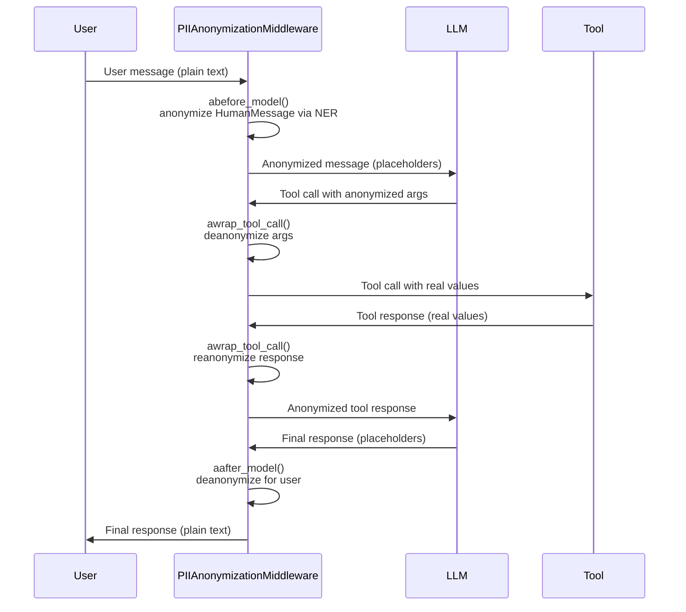

# Reference Middleware

Module: `piighost.middleware`

---

## `PIIAnonymizationMiddleware`

LangChain middleware that transparently anonymizes personal data around the LLM / tools boundary.

Extends `AgentMiddleware` from LangChain and intercepts the agent loop at **3 points**:

| Hook | When | Operation |
|------|------|-----------|
| `abefore_model` | Before each LLM call | Anonymizes all messages |
| `aafter_model` | After each LLM response | Deanonymizes for the user |
| `awrap_tool_call` | Around each tool | Deanonymizes args, reanonymizes response |

### Constructor

```python
PIIAnonymizationMiddleware(pipeline: ThreadAnonymizationPipeline)
```

| Parameter | Type | Description |
|-----------|------|-------------|
| `pipeline` | `ThreadAnonymizationPipeline` | Configured conversation pipeline with memory |

### Usage

```python
from piighost.middleware import PIIAnonymizationMiddleware
from piighost.pipeline import ThreadAnonymizationPipeline
from langchain.agents import create_agent

middleware = PIIAnonymizationMiddleware(pipeline=conv_pipeline)

agent = create_agent(
    model="openai:gpt-5.4",
    tools=[...],
    middleware=[middleware],
)
```

---

## Hooks in detail

### `abefore_model(state, runtime) -> dict | None` *(async)*

Called before each LLM call. Anonymizes all messages in the conversation via `pipeline.anonymize()`.

**Behavior by message type:**

- `HumanMessage` → full NER detection and anonymization
- `AIMessage` → anonymization (re-anonymizes any deanonymized values)
- `ToolMessage` → anonymization (re-anonymizes tool responses)

```python
# Before abefore_model:
# [HumanMessage("Send an email to Patrick in Paris")]

# After abefore_model:
# [HumanMessage("Send an email to <<PERSON:1>> in <<LOCATION:1>>")]
```

**Returns**: `{"messages": [...]}` if modifications were made, `None` otherwise.

---

### `aafter_model(state, runtime) -> dict | None` *(async)*

Called after each LLM response. Deanonymizes all messages so the user sees real values. First tries `pipeline.deanonymize()` (cache-based), falls back to `pipeline.deanonymize_with_ent()` (entity-based) on `CacheMissError`.

```python
# Before aafter_model:
# [AIMessage("Done! Email sent to <<PERSON:1>>.")]

# After aafter_model:
# [AIMessage("Done! Email sent to Patrick.")]
```

**Returns**: `{"messages": [...]}` if modifications were made, `None` otherwise.

---

### `awrap_tool_call(request, handler) -> ToolMessage | Command` *(async)*

Wraps each tool call in 3 steps:

1. **Deanonymizes** `str` arguments → the tool receives real values
2. **Executes** the tool via `handler(request)`
3. **Reanonymizes** the tool response via `pipeline.anonymize()` → the LLM never sees personal data

```python
# LLM calls : send_email(to="<<PERSON:1>>", subject="Hello")
#                      ↓  deanonymize args
# Tool gets  : send_email(to="Patrick", subject="Hello")
# Tool returns: "Email successfully sent to Patrick."
#                      ↓  reanonymize response
# LLM sees   : "Email successfully sent to <<PERSON:1>>."
```

Only `str` arguments are deanonymized. Non-string types are passed through unchanged.

---

## Full flow



---

## LangChain dependency

`PIIAnonymizationMiddleware` requires `langchain` to be installed. If not, an `ImportError` is raised on import:

```
ImportError: You must install piighost[langchain] for use middleware
```

Installation:

```bash
uv add piighost[langchain]
```

---

## Full example

```python
import asyncio
from gliner2 import GLiNER2
from langchain.agents import create_agent
from langchain_core.tools import tool

from piighost.anonymizer import Anonymizer
from piighost.detector.gliner2 import Gliner2Detector
from piighost.linker.entity import ExactEntityLinker
from piighost.resolver import MergeEntityConflictResolver, ConfidenceSpanConflictResolver
from piighost.middleware import PIIAnonymizationMiddleware
from piighost.pipeline import ThreadAnonymizationPipeline
from piighost.placeholder import LabelCounterPlaceholderFactory


@tool
def get_info(person: str) -> str:
    """Returns information about a person."""
    return f"{person} is a software engineer in Paris."


model = GLiNER2.from_pretrained("fastino/gliner2-multi-v1")

entity_linker = ExactEntityLinker()
entity_resolver = MergeEntityConflictResolver()
span_resolver = ConfidenceSpanConflictResolver()

ph_factory = LabelCounterPlaceholderFactory()
anonymizer = Anonymizer(ph_factory=ph_factory)

detector = Gliner2Detector(
    model=model,
    threshold=0.5,
    labels=["PERSON", "LOCATION"],
)
pipeline = ThreadAnonymizationPipeline(
    detector=detector,
    span_resolver=span_resolver,
    entity_linker=entity_linker,
    entity_resolver=entity_resolver,
    anonymizer=anonymizer,
)
middleware = PIIAnonymizationMiddleware(pipeline=pipeline)

agent = create_agent(
    model="openai:gpt-5.4",
    system_prompt="You are a helpful assistant. Treat placeholders as real values.",
    tools=[get_info],
    middleware=[middleware],
)


async def main():
    result = await agent.ainvoke({
        "messages": [{"role": "user", "content": "Who is Patrick?"}]
    })
    print(result["messages"][-1].content)


asyncio.run(main())
```
