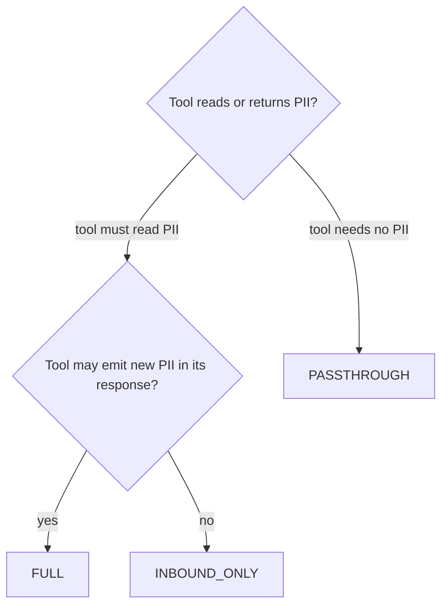

# Tool-call strategies

`PIIAnonymizationMiddleware` sits on **two distinct channels**, and they have very different reliability guarantees. Picking the right `ToolCallStrategy` starts with understanding why.

---

## Two channels, two mechanisms

### The LLM channel: cache-based, reliable

In `abefore_model`, the middleware sends an *exact* anonymised text to the LLM and stores the mapping `hash(anonymized_text) → original` in cache. When the LLM replies, `aafter_model` looks up the reply by hash and restores the original. This is a deterministic key lookup, it cannot be ambiguous, and it works regardless of whether two entities share a placeholder: the key is the full text, not the placeholders themselves.

As long as the LLM forwards back the exact anonymised string (which is the contract for inbound messages), this channel is reliable.

### The tool channel: string-replacement, fragile

In `awrap_tool_call`, the LLM produces tool arguments by combining, splitting, paraphrasing the placeholders it just saw. That arbitrary text was never produced by the pipeline, so it is **not in the cache**. The same is true of the tool response: PIIGhost has never seen it before.

Both directions therefore fall back on **plain string replacement**:

- *Tool args (LLM → tool)*: scan the args for known placeholders, replace each with the original value of its entity.
- *Tool response (tool → LLM)*: scan the response for known PII values, replace each with the corresponding placeholder.

Plain replacement only works when the mapping is **unambiguous**. If two entities share the placeholder `<<PERSON>>`{ .placeholder }, there is no way to decide which original to restore in the args. If two entities collapse onto the same masked placeholder in the response, the conversation memory becomes lossy. This is the structural reason the middleware accepts only factories tagged `PreservesIdentity`. See [Placeholder factories](placeholder-factories.md).

---

## The three strategies

`ToolCallStrategy` is the dial that decides what crosses the tool boundary.

| Strategy | Tool sees | Response handling | When to use |
|---|---|---|---|
| `FULL` (default) | real values (deanonymised args) | re-detected and re-anonymised through the full pipeline | tools that may emit new PII (DBs, CRMs, search APIs) |
| `INBOUND_ONLY` | real values (deanonymised args) | passed through unchanged; lazily re-anonymised on the next `abefore_model` | tools whose response is known PII-free or already-anonymised |
| `PASSTHROUGH` | placeholders verbatim | passed through unchanged | tools that must never see real PII, or that don't need them |

### `FULL`

Symmetric: deanonymise args, run the response through `pipeline.anonymize()`, which re-detects and re-anonymises. New PII the tool returned is caught and turned into placeholders before the LLM sees it. Pay one detection pass per tool call.

### `INBOUND_ONLY`

Cheaper: skip the detection pass on the response and let the next `abefore_model` catch any PII as ambient text. Picks up some latency from the deferred work, but avoids re-running NER on a structured tool output that is known to be clean (an internal id lookup, a status flag, a numeric count).

### `PASSTHROUGH`

Strictest privacy boundary: tools never observe real PII. The tool receives the placeholder string as-is, and its response is forwarded back without rewriting. Useful when the agent's tools work on opaque identifiers, or when the tool is itself the LLM-facing layer of a separate anonymisation system.

`PASSTHROUGH` is the only mode that tolerates a `PreservesLabel` / `PreservesShape` / `PreservesNothing` factory. Since the tool boundary is never crossed in clear text, the unique-placeholder requirement disappears. (You still cannot wire such a factory into `PIIAnonymizationMiddleware` directly, because the type-checker rejects it; the escape hatch is to use the bare pipeline outside the middleware.)

---

## Picking a strategy

Rule of thumb:

- Default to `FULL`. It is the most defensive setting and the only one that catches tool-introduced PII automatically.
- Drop to `INBOUND_ONLY` only when you can prove the tool response shape is PII-free, and the latency saving matters.
- Use `PASSTHROUGH` when privacy outweighs functionality, or when the tool is engineered to work on placeholders.

---

## See also

- [Placeholder factories](placeholder-factories.md): the unique-placeholder constraint that drives `PreservesIdentity`.
- [Architecture](architecture.md): sequence diagrams of the LLM and tool channels.
- [Limitations](limitations.md): cache backend choice and how it interacts with the strategy.
