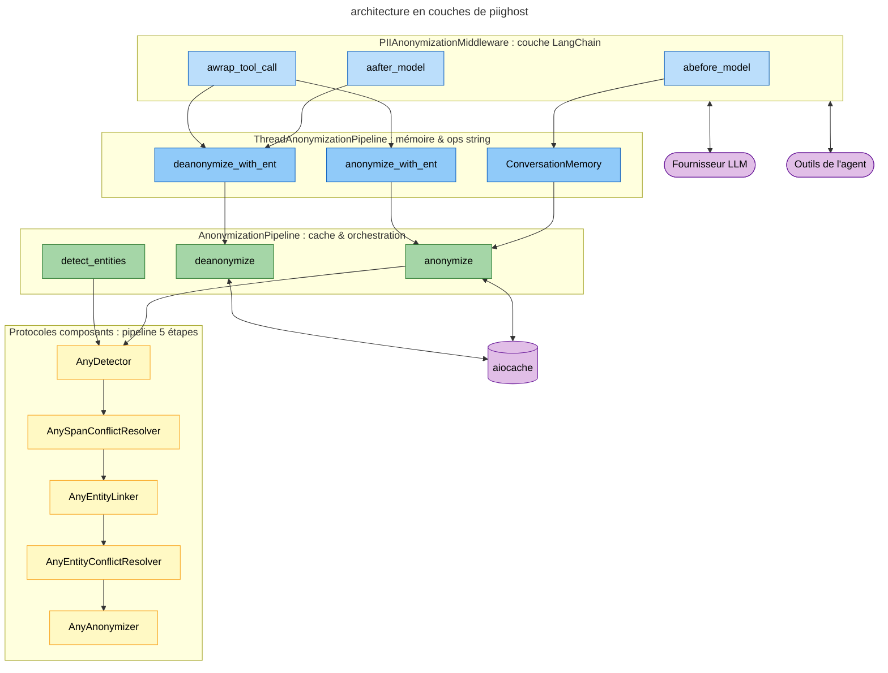
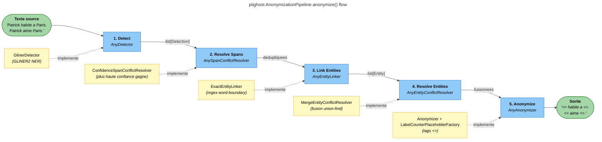
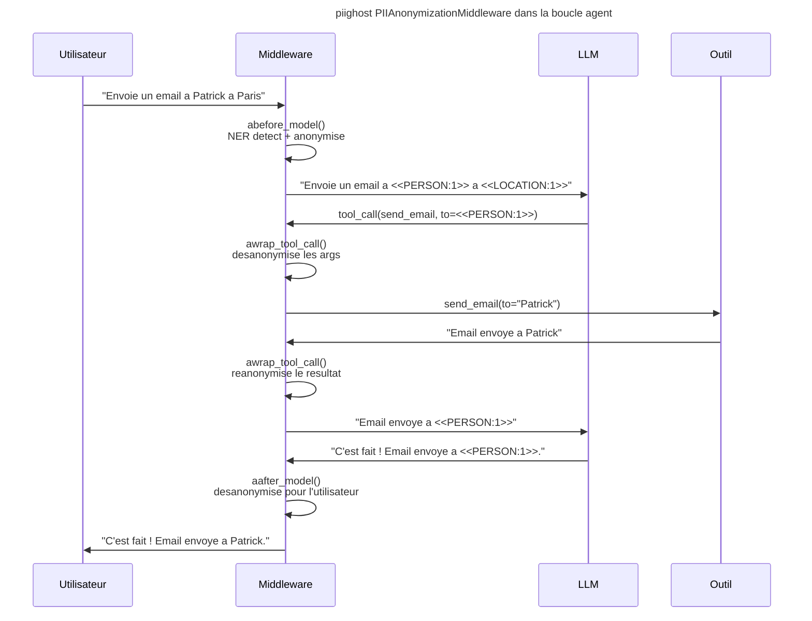
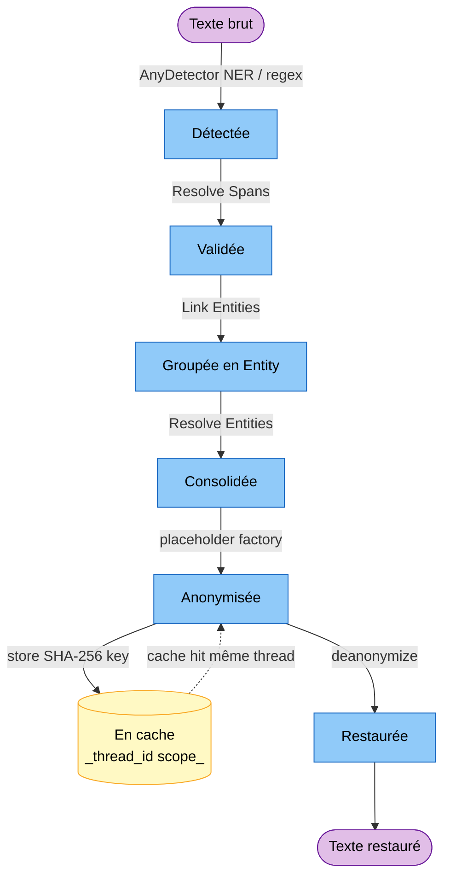

# Architecture

PIIGhost est organise en couches distinctes : un **anonymiseur stateless** au coeur, encapsule dans un **pipeline** avec cache et resolution d'entites, etendu par un **pipeline conversationnel** avec memoire, adapte au monde LangChain via un **middleware**.

---

## Vue d'ensemble



*Architecture en couches : du protocole au middleware LangChain.*
{ .figure-caption }

---

## Pipeline 5 etapes

!!! tip "Tout est remplaçable"
    Chaque étape se trouve derrière un protocole. Voir [Étendre PIIGhost](extending.md) pour brancher votre propre détecteur, linker, résolveur ou factory.

Le coeur de PIIGhost est `AnonymizationPipeline` qui orchestre 5 etapes, chacune implementee par un protocole swappable.



### Etape 1 Detect

`AnyDetector` execute la detection NER async sur le texte source et retourne une liste d'objets `Detection` (text, label, position, confidence).

Les implementations fournies incluent `GlinerDetector` (GLiNER2), `ExactMatchDetector` (regex word-boundary), `RegexDetector` (patterns), et `CompositeDetector` (chaine plusieurs detecteurs).

### Etape 2 Resolve Spans

`AnySpanConflictResolver` gere les detections qui se chevauchent en gardant celle avec la plus haute confiance.

### Etape 3 Link Entities

`AnyEntityLinker` etend et groupe les detections en objets `Entity`. `ExactEntityLinker` trouve toutes les occurrences de chaque texte detecte par recherche word-boundary et les groupe par texte normalise.

### Etape 4 Resolve Entities

`AnyEntityConflictResolver` fusionne les entites qui referent au meme PII. `MergeEntityConflictResolver` utilise un algorithme union-find pour fusionner les entites partageant des detections communes. `FuzzyEntityConflictResolver` fusionne les entites avec un texte canonique similaire via similarite Jaro-Winkler.

### Etape 5 Anonymize

`AnyAnonymizer` utilise un `AnyPlaceholderFactory` pour generer les tokens (`<<PERSON:1>>`{ .placeholder }, `<<LOCATION:1>>`{ .placeholder }) et effectue le remplacement par spans de droite a gauche.

---

## Flux middleware LangChain

Le `PIIAnonymizationMiddleware` intercepte le cycle de l'agent a 3 points cles.



### `abefore_model`

Avant chaque appel LLM : execute `pipeline.anonymize()` sur tous les messages. Detection NER complete sur `HumanMessage`, reanonymisation sur `AIMessage` / `ToolMessage`.

### `aafter_model`

Apres chaque reponse LLM : desanonymise tous les messages. Essaie d'abord `pipeline.deanonymize()` (cache), puis `pipeline.deanonymize_with_ent()` (entites) en cas de `CacheMissError`.

### `awrap_tool_call`

Enveloppe chaque appel d'outil :

1. Desanonymise les arguments `str` avant l'execution → l'outil recoit les vraies valeurs
2. Execute l'outil
3. Reanonymise la reponse de l'outil → le LLM ne voit pas de vraies donnees

---

## Couche conversation `ThreadAnonymizationPipeline`

`ThreadAnonymizationPipeline` étend `AnonymizationPipeline` avec :

| Mecanisme | Description |
|-----------|-------------|
| **`ConversationMemory`** | Accumule les entites entre les messages, dedupliquees par `(text.lower(), label)` |
| **`deanonymize_with_ent()`** | Remplacement de chaine : tokens → valeurs originales (plus long d'abord) |
| **`anonymize_with_ent()`** | Remplacement de chaine : valeurs originales → tokens (plus long d'abord) |

### Cycle de vie d'une PII

Du point de vue d'une PII donnée, voici les états qu'elle traverse entre sa détection initiale et son affichage à l'utilisateur final, et les transitions possibles (premier passage, cache hit, désanonymisation).



*Cycle de vie d'une PII au fil du pipeline et du cache de conversation.*
{ .figure-caption }

La mémoire (`ConversationMemory`) partage le mapping d'une entité sur toute la conversation identifiée par un `thread_id`. Un second message contenant la même PII saute directement à l'état `Anonymisée` via le cache, sans repasser par le détecteur NER.

---

## Modeles de donnees

Tous les modeles sont des **dataclasses gelees** (immutables, thread-safe) :

| Modele | Champs cles |
|--------|-------------|
| `Detection` | `text`, `label`, `position: Span`, `confidence` |
| `Entity` | `detections: tuple[Detection, ...]`, `label` (propriete) |
| `Span` | `start_pos`, `end_pos`, `overlaps()` |

---

## Injection de dependances

Chaque etape utilise un **protocole** (typage structurel Python) comme point d'injection :

```python
AnonymizationPipeline(
    detector=GlinerDetector(...),                    # AnyDetector
    span_resolver=ConfidenceSpanConflictResolver(),  # AnySpanConflictResolver
    entity_linker=ExactEntityLinker(),               # AnyEntityLinker
    entity_resolver=MergeEntityConflictResolver(),   # AnyEntityConflictResolver
    anonymizer=Anonymizer(LabelCounterPlaceholderFactory()),  # AnyAnonymizer
)
```

Pour remplacer un composant, il suffit de fournir un objet implementant le protocole correspondant. Voir [Etendre PIIGhost](extending.md).
