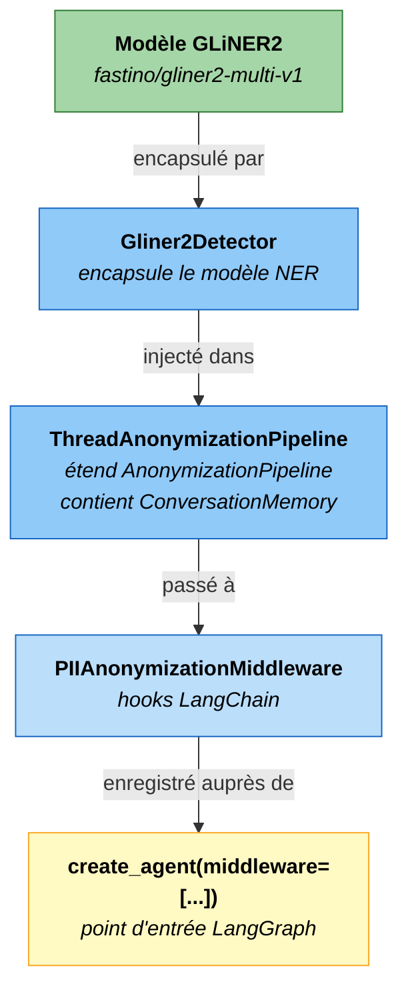
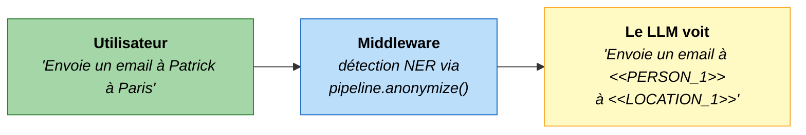
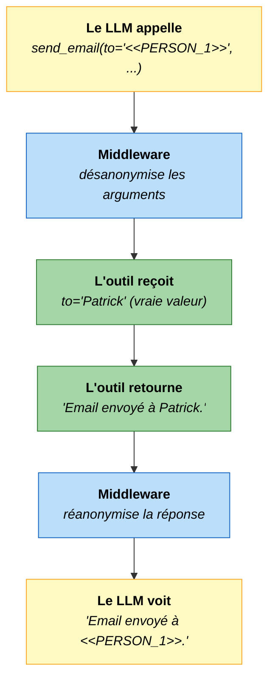
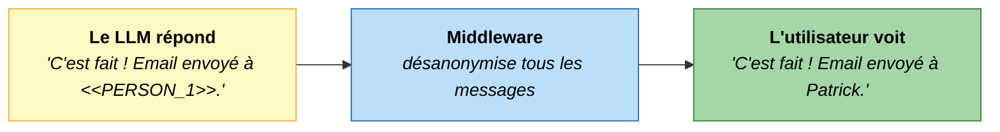

# Integration LangChain

Cette page presente l'integration complete de PIIGhost dans un agent LangGraph, basee sur l'exemple disponible dans [`examples/graph/`](https://github.com/Athroniaeth/piighost/tree/main/examples/graph).

---

## Installation

Pour utiliser le middleware LangChain, installez les dependances supplementaires :

=== "uv"

    ```bash
    uv add piighost[langchain] langchain-openai
    ```

=== "pip"

    ```bash
    pip install piighost langchain langgraph langchain-openai
    ```

!!! warning "Dependance optionnelle"
    `PIIAnonymizationMiddleware` importe `langchain` au moment de son instanciation. Si `langchain` n'est pas installe, une `ImportError` explicite est levee avec le message `"You must install piighost[langchain] for use middleware"`.

---

## Structure de l'integration



---

## Exemple complet

```python
from dotenv import load_dotenv
from gliner2 import GLiNER2
from langchain.agents import create_agent
from langchain_core.tools import tool

from piighost.anonymizer import Anonymizer
from piighost.pipeline import ThreadAnonymizationPipeline
from piighost.detector import Gliner2Detector
from piighost.linker.entity import ExactEntityLinker
from piighost.entity_resolver import MergeEntityConflictResolver
from piighost.middleware import PIIAnonymizationMiddleware
from piighost.placeholder import CounterPlaceholderFactory
from piighost.span_resolver import ConfidenceSpanConflictResolver

load_dotenv()


# ---------------------------------------------------------------------------
# 1. Definir les outils de l'agent
# ---------------------------------------------------------------------------

@tool
def send_email(to: str, subject: str, body: str) -> str:
    """Envoie un email a l'adresse donnee.

    Args:
        to: Adresse email du destinataire.
        subject: Objet de l'email.
        body: Corps du message.

    Returns:
        Confirmation d'envoi.
    """
    return f"Email envoye a {to}."


@tool
def get_weather(country_or_city: str) -> str:
    """Retourne la meteo actuelle pour un lieu donne.

    Args:
        country_or_city: Nom de la ville ou du pays.

    Returns:
        Resume meteo.
    """
    return f"Il fait 22C et ensoleille a {country_or_city}."


# ---------------------------------------------------------------------------
# 2. Configurer le system prompt pour les placeholders
# ---------------------------------------------------------------------------

system_prompt = """\
Tu es un assistant utile. Certaines entrees peuvent contenir des placeholders \
anonymises qui remplacent des valeurs reelles pour des raisons de confidentialite.

Regles :
1. Traite chaque placeholder comme s'il etait la vraie valeur. Ne commente jamais \
son format, ne dis pas que c'est un token, ne demande pas a l'utilisateur de le reveler.
2. Les placeholders peuvent etre passes directement aux outils. Cela preserve la \
confidentialite de l'utilisateur tout en permettant aux outils de fonctionner.
3. Si l'utilisateur demande un detail specifique sur un placeholder \
(ex: "quelle est la premiere lettre ?"), reponds brievement : "Je ne peux pas \
repondre a cette question car les donnees ont ete anonymisees pour proteger vos \
informations personnelles."
"""

# ---------------------------------------------------------------------------
# 3. Initialiser la stack d'anonymisation
# ---------------------------------------------------------------------------

# Charger le modele GLiNER2 (telechargement HuggingFace ~500 Mo a la premiere execution)
extractor = GLiNER2.from_pretrained("fastino/gliner2-multi-v1")

# Instancier chaque composant
detector = Gliner2Detector(model=extractor, labels=["PERSON", "LOCATION"], threshold=0.5)
span_resolver = ConfidenceSpanConflictResolver()
entity_linker = ExactEntityLinker()
entity_resolver = MergeEntityConflictResolver()
anonymizer = Anonymizer(CounterPlaceholderFactory())

# Assembler le pipeline puis le middleware
pipeline = ThreadAnonymizationPipeline(
    detector=detector,
    span_resolver=span_resolver,
    entity_linker=entity_linker,
    entity_resolver=entity_resolver,
    anonymizer=anonymizer,
)
middleware = PIIAnonymizationMiddleware(pipeline=pipeline)

# ---------------------------------------------------------------------------
# 4. Creer l'agent LangGraph avec le middleware
# ---------------------------------------------------------------------------

graph = create_agent(
    model="openai:gpt-5.4",
    system_prompt=system_prompt,
    tools=[send_email, get_weather],
    middleware=[middleware],
)
```

---

## Comment fonctionne le middleware

Le `PIIAnonymizationMiddleware` intercepte chaque tour de l'agent en trois points :

### `abefore_model` avant le LLM



### `awrap_tool_call` autour des outils



### `aafter_model` après le LLM



---

## Utiliser l'agent

```python
import asyncio

async def main():
    response = await graph.ainvoke({
        "messages": [{"role": "user", "content": "Envoie un email a Patrick a Paris"}]
    })
    print(response["messages"][-1].content)
    # C'est fait ! Email envoye a Patrick.

asyncio.run(main())
```
