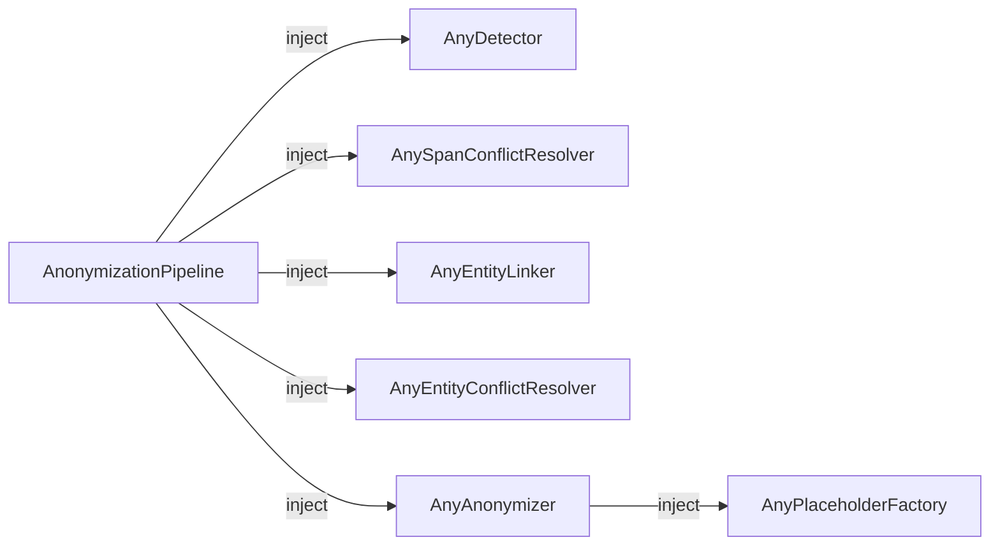

# Etendre PIIGhost

PIIGhost est concu autour de **protocoles** (typage structurel Python). Chaque etape du pipeline est un point d'injection ou vous pouvez brancher votre propre implementation sans toucher au reste du code.



Aucune classe de base a heriter. Il suffit d'implementer la methode requise Python verifie la compatibilite au moment de l'appel.

---

## Creer un `AnyDetector` personnalise

**Quand l'utiliser** : remplacer GLiNER2 par spaCy, un appel API distant, une liste blanche, etc.

### Protocole

```python
class AnyDetector(Protocol):
    async def detect(self, text: str) -> list[Detection]: ...
```

### Exemple Detecteur spaCy

```python
import spacy
from piighost.models import Detection, Span

class SpacyDetector:
    """Detecteur NER base sur spaCy."""

    def __init__(self, model_name: str = "fr_core_news_sm"):
        self._nlp = spacy.load(model_name)

    async def detect(self, text: str) -> list[Detection]:
        doc = self._nlp(text)
        return [
            Detection(
                text=ent.text,
                label=ent.label_,
                position=Span(start_pos=ent.start_char, end_pos=ent.end_char),
                confidence=1.0,
            )
            for ent in doc.ents
        ]
```

### Exemple Detecteur par liste blanche

```python
import re
from piighost.models import Detection, Span

class AllowlistDetector:
    """Detecte les entites d'une liste fixe (utile pour les tests ou les donnees structurees)."""

    def __init__(self, allowlist: dict[str, str]):
        # {"Patrick Dupont": "PERSON", "Paris": "LOCATION"}
        self._allowlist = allowlist

    async def detect(self, text: str) -> list[Detection]:
        detections = []
        for fragment, label in self._allowlist.items():
            for match in re.finditer(re.escape(fragment), text):
                detections.append(Detection(
                    text=match.group(),
                    label=label,
                    position=Span(start_pos=match.start(), end_pos=match.end()),
                    confidence=1.0,
                ))
        return detections
```

### Utilisation

```python
from piighost.pipeline import AnonymizationPipeline

pipeline = AnonymizationPipeline(
    detector=SpacyDetector("fr_core_news_sm"),
    ...,
)
```

---

## Packs regex prêts à l'emploi

Pour les PII structurées dont la syntaxe est standardisée (e-mails,
IBAN, téléphones, SSN), PIIGhost fournit des dictionnaires regex
organisés par zone géographique. Vous piochez uniquement ceux dont vous
avez besoin, et vous les fusionnez librement.

| Pack | Module | Labels |
|------|--------|--------|
| `GENERIC_PATTERNS` | `piighost.detector.patterns.generic` | `EMAIL`, `URL`, `IPV4`, `CREDIT_CARD` |
| `FR_PATTERNS` | `piighost.detector.patterns.fr` | `FR_PHONE`, `FR_IBAN`, `FR_NIR`, `FR_SIRET` |
| `US_PATTERNS` | `piighost.detector.patterns.us` | `US_SSN`, `US_PHONE`, `US_ZIP` |
| `EU_PATTERNS` | `piighost.detector.patterns.eu` | `IBAN` (tout pays) |

```python
from piighost.detector import RegexDetector
from piighost.detector.patterns import FR_PATTERNS, GENERIC_PATTERNS

detector = RegexDetector(patterns={**GENERIC_PATTERNS, **FR_PATTERNS})
```

Les packs sont volontairement **permissifs sur la syntaxe** : le motif
`CREDIT_CARD` accepte n'importe quelle séquence de 13 à 19 chiffres,
`IBAN` accepte un préfixe de 2 lettres suivi de 11 à 30 alphanumériques,
`FR_NIR` accepte la forme complète du NIR sans contrôler la clé. Sans
validateur, ces motifs produisent beaucoup de faux positifs (toute
longue séquence numérique ressemble à un numéro de carte).

## Validateurs de checksum

PIIGhost fournit des validateurs dans `piighost.validators` qui se
branchent directement sur `RegexDetector` pour filtrer les matches
syntaxiquement corrects mais invalides selon un contrôle métier :

| Validateur | S'applique à | Algorithme |
|------------|--------------|------------|
| `validate_luhn` | cartes bancaires, IMEI | mod-10 (Luhn) |
| `validate_iban` | IBAN (tout pays) | mod-97 ISO 13616 |
| `validate_nir` | NIR français | clé = 97 − (corps mod 97) |

```python
from piighost.detector import RegexDetector
from piighost.detector.patterns import FR_PATTERNS, GENERIC_PATTERNS
from piighost.validators import validate_iban, validate_luhn, validate_nir

detector = RegexDetector(
    patterns={**GENERIC_PATTERNS, **FR_PATTERNS},
    validators={
        "CREDIT_CARD": validate_luhn,
        "FR_IBAN": validate_iban,
        "FR_NIR": validate_nir,
    },
)
```

Un label sans entrée dans `validators` est accepté sur la seule base du
match regex. Les matches rejetés par un validateur sont silencieusement
écartés (aucun log, aucune exception) ; chaînez un autre détecteur si
vous voulez enregistrer le rejet.

!!! tip "Votre propre validateur"
    N'importe quel `Callable[[str], bool]` convient. Utilisez-le pour
    ajouter un contrôle spécifique (filtre des plages SSN réservées sur
    `US_SSN`, liste blanche de domaines sur `EMAIL`, etc.) sans toucher
    au regex.

---

## Mapping de labels NER

Les détecteurs NER fournis (`SpacyDetector`, `Gliner2Detector`, `TransformersDetector`) héritent tous de `BaseNERDetector`, qui supporte le **mapping de labels** : découpler le label produit en interne par le modèle du label qui apparaît dans `Detection.label` (et donc dans les placeholders, datasets, etc.).

Passez un dict `{externe: interne}` au lieu d'une liste pour activer le mapping :

```python
from piighost.detector.spacy import SpacyDetector

# Sans mapping (identité) : Detection.label sera "PER" / "LOC"
detector = SpacyDetector(model=nlp, labels=["PER", "LOC"])

# Avec mapping : Detection.label sera "PERSON" / "LOCATION"
detector = SpacyDetector(
    model=nlp,
    labels={"PERSON": "PER", "LOCATION": "LOC"},
)
```

Pour GLiNER2, c'est particulièrement utile car certaines chaînes de requête fonctionnent mieux que d'autres :

```python
from piighost.detector.gliner2 import Gliner2Detector

# Interroger GLiNER2 avec "person" et "company" (meilleure détection)
# mais produire des labels propres "PERSON" / "COMPANY" dans les Detection.
detector = Gliner2Detector(
    model=model,
    labels={"PERSON": "person", "COMPANY": "company"},
)
```

Cela permet de changer le modèle sous-jacent sans modifier le code en aval (placeholder factories, entity resolvers, assertions de tests). C'est aussi le prérequis pour construire des datasets NER stables à partir des saisies utilisateur.

Vous pouvez inspecter les labels résultants avec `detector.external_labels` et `detector.internal_labels`.

---

## Creer un `AnySpanConflictResolver` personnalise

**Quand l'utiliser** : strategie differente pour gerer les detections qui se chevauchent (ex: preferer les spans les plus longs).

### Protocole

```python
class AnySpanConflictResolver(Protocol):
    def resolve(self, detections: list[Detection]) -> list[Detection]: ...
```

---

## Creer un `AnyEntityLinker` personnalise

**Quand l'utiliser** : logique differente pour grouper les detections en entites (ex: correspondance floue, variantes phonetiques).

### Protocole

```python
class AnyEntityLinker(Protocol):
    def link(self, text: str, detections: list[Detection]) -> list[Entity]: ...
```

---

## Creer un `AnyEntityConflictResolver` personnalise

**Quand l'utiliser** : strategie differente pour fusionner les entites qui referent au meme PII.

### Protocole

```python
class AnyEntityConflictResolver(Protocol):
    def resolve(self, entities: list[Entity]) -> list[Entity]: ...
```

Implementations fournies :

- `MergeEntityConflictResolver` algorithme union-find fusionnant les entites avec des detections communes
- `FuzzyEntityConflictResolver` fusionne les entites avec un texte canonique similaire via similarite Jaro-Winkler

---

## Creer un `AnyPlaceholderFactory` personnalise

**Quand l'utiliser** : tags UUID pour l'anonymat total, format personnalise, integration avec un systeme de tokens externe.

### Protocole

```python
class AnyPlaceholderFactory(Protocol):
    def create(self, entities: list[Entity]) -> dict[Entity, str]: ...
```

### Exemple Tags UUID

```python
import uuid
from piighost.models import Entity

class UUIDPlaceholderFactory:
    """Genere des tags UUID opaques, ex: <<a3f2-1b4c>>."""

    def create(self, entities: list[Entity]) -> dict[Entity, str]:
        result: dict[Entity, str] = {}
        seen: dict[str, str] = {}

        for entity in entities:
            canonical = entity.detections[0].text.lower()
            if canonical not in seen:
                seen[canonical] = f"<<{uuid.uuid4().hex[:8]}>>"
            result[entity] = seen[canonical]

        return result
```

### Exemple Format personnalise

```python
from collections import defaultdict
from piighost.models import Entity

class BracketPlaceholderFactory:
    """Genere des tags au format [PERSON:1], [LOCATION:2], etc."""

    def create(self, entities: list[Entity]) -> dict[Entity, str]:
        result: dict[Entity, str] = {}
        counters: dict[str, int] = defaultdict(int)

        for entity in entities:
            label = entity.label
            counters[label] += 1
            result[entity] = f"[{label}:{counters[label]}]"

        return result
```

### Utilisation

```python
from piighost.anonymizer import Anonymizer

anonymizer = Anonymizer(ph_factory=UUIDPlaceholderFactory())
```

---

## Composition complete

Tous les composants sont independants et peuvent etre combines librement :

```python
from piighost.anonymizer import Anonymizer
from piighost.pipeline import ThreadAnonymizationPipeline
from piighost.linker.entity import ExactEntityLinker
from piighost.entity_resolver import FuzzyEntityConflictResolver
from piighost.middleware import PIIAnonymizationMiddleware
from piighost.span_resolver import ConfidenceSpanConflictResolver

detector = SpacyDetector("fr_core_news_sm")              # Votre detecteur
span_resolver = ConfidenceSpanConflictResolver()         # Ou votre resolver
entity_linker = ExactEntityLinker()                      # Ou votre linker
entity_resolver = FuzzyEntityConflictResolver()          # Fusion floue
anonymizer = Anonymizer(UUIDPlaceholderFactory())        # Tags UUID opaques

pipeline = ThreadAnonymizationPipeline(
    detector=detector,
    span_resolver=span_resolver,
    entity_linker=entity_linker,
    entity_resolver=entity_resolver,
    anonymizer=anonymizer,
)

middleware = PIIAnonymizationMiddleware(pipeline=pipeline)
```

---

Pour tester unitairement vos composants personnalisés avec `ExactMatchDetector` et pytest, voir le guide [Tests](examples/testing.md).
