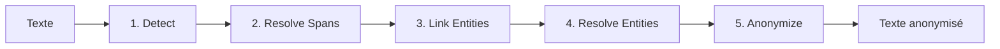

# PIIGhost

`piighost` est une bibliothèque Python qui détecte, anonymise et désanonymise automatiquement les entités sensibles (noms, lieux, numéros de compte…) dans les conversations d'agents IA. Son middleware LangChain s'intègre dans LangGraph sans modifier votre code existant : le LLM ne voit que des placeholders, les outils reçoivent les vraies valeurs, l'utilisateur voit la réponse désanonymisée.

## Cas d'usage

Scénarios concrets où `piighost` trouve naturellement sa place :

- **Chatbot de support client** qui envoie le contenu des tickets à un LLM tiers sans laisser fuir noms, emails ou numéros de compte.
- **RAG interne RH** sur des documents contenant des noms de collaborateurs, des salaires ou des notes d'évaluation.
- **Assistant juridique** traitant des contrats avec noms de clients et de contreparties.
- **Pipelines batch de résumés d'emails** qui ne doivent pas transmettre l'identité de l'expéditeur ou du destinataire.
- **Agents outillés** avec accès CRM ou capacité d'envoi d'emails, où le LLM ne voit que des placeholders et où les outils reçoivent les vraies valeurs.

---

## Problématiques

Aujourd'hui, avec l'essor des LLM, la question de la protection des données sensibles prend une nouvelle dimension. Les
entreprises qui hébergent ces modèles peuvent potentiellement exploiter les données que leurs utilisateurs leur
envoient, et se reposer uniquement sur le RGPD offre une garantie juridique mais pas technique. Parallèlement, les
modèles propriétaires (GPT, Claude, Gemini) restent souvent plus puissants que leurs équivalents open-source : on
ne veut pas avoir à choisir entre performance et confidentialité. Anonymiser les PII avant qu'ils atteignent le LLM
permet de profiter des modèles les plus capables tout en gardant la main sur les données de ses utilisateurs.

!!! info "Qu'est-ce qu'un PII ?"
    Un *PII* (**P**ersonal **I**dentifiable **I**nformation) est une donnée qui permet d'identifier une personne :
    nom, adresse, téléphone, email, lieu, organisation… Les anonymiser dans les conversations d'agents IA est devenu
    un enjeu de confidentialité à part entière : un LLM hébergé chez un tiers ne devrait pas voir les données
    sensibles de vos utilisateurs.

!!! tip "Première fois sur ces termes ?"
    Consultez le [Glossaire](glossary.md) pour les définitions de NER, span, liaison d'entités, middleware, placeholder et plus.

Il existe actuellement deux familles de solutions pour détecter les PII, les regex et les modèles NER
(Named Entity Recognition) :

- **Regex** : rapide et prédictible, mais limité aux formats structurés (emails, numéros de téléphone) et incapable
  de capturer des noms ou lieux arbitraires.
- **Modèles NER** : détection étendue (personnes, lieux, organisations, etc.), mais plus lente et sujette à des
  imprécisions selon le modèle.

Chaque approche a ses failles propres, et les modèles NER en ajoutent quelques-unes :

- **Faux positifs** : un mot est détecté comme PII alors qu'il n'en est pas un.
- **Faux négatifs** : un PII bien réel n'est pas détecté.
- **Détection incohérente** : le modèle détecte une occurrence d'un PII mais manque les autres occurrences du même
  PII dans le texte, ce qui rend l'anonymisation incohérente.

Même en corrigeant ces défauts, il reste plusieurs problèmes de fond :

- **Cohérence des placeholders** : toutes les occurrences d'un même PII doivent être anonymisées de la même manière
  (ex. `<<PERSON_1>>`{ .placeholder } pour `Patrick`{ .pii } dans tout le texte), afin de préserver l'information
  qu'il s'agit de la même entité tout en protégeant la confidentialité.
- **Liaison floue** : il faut pouvoir lier des détections qui ne sont pas strictement identiques, par exemple
  `Patrick`{ .pii } et `patrick`{ .pii } (différence de casse), `Patric`{ .pii } (faute d'orthographe), ou encore
  mention complète vs partielle (`Patrick Dupont`{ .pii } et `Patrick`{ .pii }).

### Le cas conversationnel (agents IA)

Pour utiliser l'anonymisation dans des agents IA, plusieurs contraintes supplémentaires apparaissent :

- **Transparence** : l'utilisateur envoie son message en clair et reçoit la réponse en clair, sans avoir à se
  soucier de l'anonymisation.
- **Utilisation par des outils externes** : l'agent doit pouvoir appeler un outil (ex. récupérer la météo d'une
  ville mentionnée) avec les vraies valeurs, sans que le LLM lui-même les voie.
- **Persistance inter-messages** : une entité anonymisée dans le premier message doit l'être de la même manière
  dans tous les messages suivants, côté utilisateur comme côté agent, pour que l'agent puisse raisonner sur
  l'identité des PII au fil de la conversation.

---

## Solution

`piighost` combine les briques existantes pour offrir une détection et une anonymisation des PII à la fois précises,
cohérentes et faciles à intégrer :

- **Détection hybride** : composez modèles NER (GLiNER2) et regex via `CompositeDetector` pour tirer parti des
  deux mondes.
- **Liaison d'entités** : regroupe automatiquement les variantes (casse, fautes, mentions partielles) pour
  garantir des placeholders cohérents.
- **Anonymisation bidirectionnelle** : chaque anonymisation est cachée et peut être inversée à la volée, y compris
  sur du texte produit par un LLM qui n'a jamais vu les vraies valeurs.
- **Middleware LangChain** : intégration transparente dans un agent LangGraph, sans modifier votre code d'agent.
  Le LLM ne voit que des placeholders, les outils reçoivent les vraies valeurs, l'utilisateur voit la réponse
  désanonymisée.

---

## Comment ça marche

Le cœur de la librairie est un pipeline en 5 étapes, chacune branchable via une interface :

1. **Detect** : plusieurs détecteurs (NER, regex) repèrent les candidats PII.
2. **Resolve Spans** : arbitrage des chevauchements et imbrications entre détections.
3. **Link Entities** : regroupement des occurrences d'une même entité (y compris fautes et variations de casse).
4. **Resolve Entities** : fusion des groupes incohérents entre détecteurs.
5. **Anonymize** : remplacement par des placeholders via une factory pluggable.

Voir [Architecture](architecture.md) pour les détails de chaque étape.

---

## Pourquoi pas une solution existante ?

D'autres librairies couvrent une partie du périmètre :

- **[Microsoft Presidio](https://github.com/microsoft/presidio)** : catalogue riche de recognizers prêts à
  l'emploi (cartes bancaires validées par Luhn, IBAN avec checksum, SSN, passeports, emails, téléphones) enrichis
  par scoring contextuel par mots-clés, avec un moteur NER branché sur spaCy / stanza / transformers. Pas de
  liaison inter-messages native ni de middleware LangChain bidirectionnel. Excellent comme moteur de détection
  brut, mais laisse au développeur la charge d'orchestrer le cas conversationnel.
- **Extensions spaCy / regex custom** : bon pour des pipelines de traitement batch, mais ne gèrent pas l'aller-retour
  anonymisation/désanonymisation au fil d'une conversation.

Le différenciateur de `piighost` : **la liaison persistante inter-messages** et un **middleware bidirectionnel**
(texte → placeholders → LLM → texte → outils → placeholders → utilisateur) qui fonctionne tel quel dans LangGraph.

---

## Aperçu

Entrée :

> `Patrick`{ .pii } habite à `Paris`{ .pii }. `Patrick`{ .pii } adore `Paris`{ .pii }.

Sortie :

> `<<PERSON_1>>`{ .placeholder } habite à `<<LOCATION_1>>`{ .placeholder }. `<<PERSON_1>>`{ .placeholder } adore `<<LOCATION_1>>`{ .placeholder }.

Les deux occurrences de `Patrick`{ .pii } sont reliées, idem pour `Paris`{ .pii }. Dans une conversation, les
messages suivants réutilisent les mêmes placeholders, et la désanonymisation est automatique pour l'utilisateur final.

Pour l'installation et le premier exemple complet, voir [Démarrage rapide](getting-started.md).

---

## Navigation

Chaque page suit un rôle précis du [framework Diátaxis](https://diataxis.fr/) : tutoriel pour apprendre, how-to pour résoudre une tâche, référence pour consulter l'API, explication pour comprendre les choix de design.

-   :lucide-rocket: __Démarrer__

    ---

    Installer et prendre piighost en main.

    - [Démarrage rapide](getting-started.md)
    - [Usage basique](examples/basic.md)

-   :lucide-wrench: __Usage__

    ---

    Recettes ciblées pour un cas d'usage.

    - [Intégration LangChain](examples/langchain.md)
    - [Détecteurs prêts à l'emploi](examples/detectors.md)
    - [Étendre PIIGhost](extending.md)
    - [Tests](examples/testing.md)
    - [Déploiement](deployment.md)

-   :lucide-book-open: __Référence__

    ---

    La documentation d'API complète.

    - [Anonymizer](reference/anonymizer.md)
    - [Pipeline](reference/pipeline.md)
    - [Middleware](reference/middleware.md)
    - [Détecteurs](reference/detectors.md)

-   :lucide-layers: __Concepts__

    ---

    Comprendre les choix de design.

    - [Architecture](architecture.md)
    - [Glossaire](glossary.md)
    - [Limites](limitations.md)
    - [Sécurité](security.md)

-   :lucide-users: __Communauté__

    ---

    Participer, signaler, échanger.

    - [Contribuer](community/contributing.md)
    - [Code de conduite](community/code-of-conduct.md)
    - [Signaler un bug](community/bug-reports.md)
    - [FAQ](community/faq.md)

