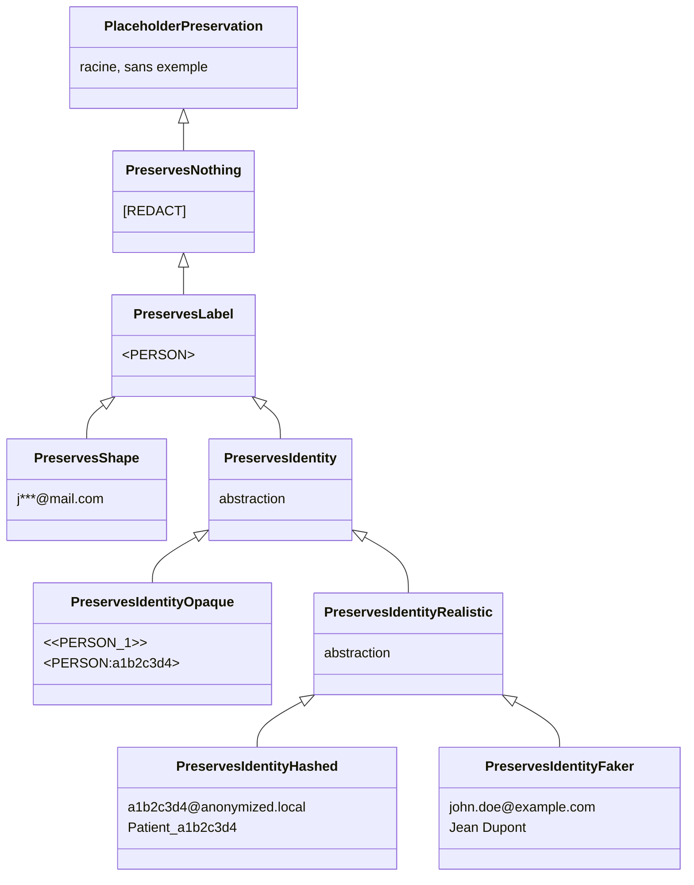

# Placeholder factories

Un **placeholder** est le jeton synthétique qui remplace une PII détectée dans un texte avant qu'il ne soit fourni au LLM. Au lieu d'envoyer `"Patrick habite à Paris"` au LLM, le pipeline transmet `"<<PERSON_1>> habite à <<LOCATION_1>>"`. Les valeurs originales restent dans le cache et la mémoire de conversation, le LLM ne les voit jamais.

!!! note "Pourquoi le nom 'placeholder factory' ?"

    "Placeholder" parce que c'est un substitut qui tient la place de la valeur originale. On aurait pu parler de "token" ou "jeton", mais ces termes sont déjà surchargés dans le contexte des LLM (tokens de langage). "Factory" parce que c'est un composant qui génère ces jetons à la volée, en fonction des entités détectées dans chaque message.

Une **placeholder factory** est le composant qui décide à quoi ressemblent ces jetons et combien d'information ils transportent. Deux questions structurent le choix :

1. *Les jetons sont-ils uniques par entité ?* `Patrick`{ .pii } et `Marie`{ .pii } ne doivent pas se ramener au même placeholder générique `<PERSON>`{ .placeholder }, sinon le LLM ne peut pas faire la distinction entre les deux. Un jeton unique par entité permet au LLM de raisonner sur les relations entre les entités : *"le manager est-il la même personne que `Patrick`{ .pii } ?"* devient *"`<<PERSON_1>>`{ .placeholder } est-il la même que `<<PERSON_2>>`{ .placeholder } ?"* et a une réponse claire.
2. *Les jetons sont-ils réversibles ?* À partir d'un jeton, peut-on récupérer la valeur originale sans connaître le mapping de cache ? C'est la condition nécessaire pour que le middleware puisse faire du remplacement de chaîne dans les arguments d'outil par exemple. Si deux placeholders différents se confondent dans le même jeton `<PERSON>`{ .placeholder }, il est impossible de savoir quelle valeur originale restaurer.

Six grandes familles de factories se positionnent à des points différents de ce spectre, et le choix a des conséquences directes sur les `ToolCallStrategy` utilisables sans risque. Voir [Stratégies d'appel outil](tool-call-strategies.md) pour le côté runtime.

- Nous pouvons remplacer une PII par un jeton générique constant (`[REDACT]`{ .placeholder }), qui ne révèle rien au LLM. C'est la stratégie de redaction classique, sans aucune information, mais elle rend impossible tout raisonnement sur les entités (un LLM ne peut pas voir que c'est le nom d'une ville et donc utiliser l'outil `get_weather` par exemple).
- Nous pouvons remplacer une PII par un jeton qui révèle son type (`<PERSON>`{ .placeholder }, `<EMAIL>`{ .placeholder }), mais pas son identité. Si nous avons plusieurs personnes dans la même conversation, elles se confondent toutes dans le même jeton `<PERSON>`{ .placeholder }, ce qui rend impossible les références croisées.
- Nous pouvons remplacer une PII par un jeton qui révèle son type et son identité de manière stable (`<<PERSON_1>>`{ .placeholder }, `<PERSON:a1b2c3d4>`{ .placeholder }). Le LLM sait que `<<PERSON_1>>`{ .placeholder } et `<<PERSON_2>>`{ .placeholder } sont des personnes différentes, même s'il ne connaît pas leur nom réel. Ce placeholder est a priori unique dans un texte donné, ce qui permet de faire du remplacement de chaîne pour la réversibilité.
- Nous pouvons remplacer une PII par un jeton qui préserve son format et sa "forme" générale, mais pas son contenu réel (`p***@mail.com`{ .placeholder }) : le LLM voit que c'est un email, peut-être même devine le domaine, mais ne voit pas l'adresse réelle. Cette stratégie est plus risquée côté sécurité (le LLM voit des fragments de la valeur réelle) et côté réversibilité (deux emails différents peuvent donner le même jeton `j***@mail.com`{ .placeholder }), mais elle a l'avantage de produire des textes plus naturels.
- Nous pouvons remplacer une PII par une valeur entièrement plausible et réaliste (`john.doe@gmail.com`{ .placeholder }), ce qui rend les textes de sortie plus fluides et naturels, mais expose au risque de collision avec de vraies valeurs (si `john.doe@gmail.com`{ .placeholder } est une vraie adresse dans le texte, le LLM peut la réutiliser dans un contexte où elle ne devrait pas, et le middleware ne pourra pas faire la différence entre la référence à la vraie valeur et la référence au placeholder).
- Nous pouvons remplacer une PII par une valeur plausible et réaliste avec un hash la rendant unique (`a1b2c3d4@anonymized.local`{ .placeholder }), ce qui combine les avantages du réalisme avec la garantie de non-collision.

---

## Détail des familles

### Marqueur constant : destruction totale

Le jeton est un marqueur fixe (par exemple `[REDACT]`{ .placeholder }). Le LLM apprend *qu'une* information a été retirée mais rien sur son type, son nombre, ni ses relations. La conversation perd toutes ses références internes : un agent qui doit traiter *"envoyer la facture au client"* ne peut pas savoir si le client est celui mentionné plus tôt ou un nouveau. Utile pour la rédaction d'archive, inutile dès qu'un agent a besoin de raisonner.

Aucune factory built-in ne porte ce niveau. Il existe dans la taxonomie pour qu'une factory utilisateur puisse le déclarer explicitement (tag `PreservesNothing`).

### Label seul : type connu, identités confondues

`<PERSON>`{ .placeholder }, `<EMAIL>`{ .placeholder }. Le LLM sait qu'il s'agit d'une personne, d'un email, d'une carte bancaire, et peut répondre aux questions qui dépendent uniquement du type. Mais deux personnes différentes dans la même conversation se confondent dans le même jeton. Le mode d'échec classique est la référence croisée : *"`Patrick`{ .pii } est-il la même personne que le manager mentionné plus tôt ?"* devient *"`<PERSON>`{ .placeholder } est-il le même que `<PERSON>`{ .placeholder } ?"*, ce qui est sans réponse.

Built-in : `RedactPlaceholderFactory` (sortie : `<PERSON>`{ .placeholder }). Tag `PreservesLabel`.

### Type + id stable, opaque

`<<PERSON_1>>`{ .placeholder }, `<PERSON:a1b2c3d4>`{ .placeholder }. La chaîne n'est manifestement *pas* une personne, un email ou un numéro de carte, c'est un placeholder. Le LLM ne peut pas la confondre avec une donnée réelle, les logs d'audit sont faciles à parcourir, et il y a **zéro chance** de collision avec une vraie valeur. Compromis : un prompt ou un outil aval strict qui valide "l'argument doit ressembler à un email" rejettera ces jetons.

Built-in : `CounterPlaceholderFactory` (`<<PERSON_1>>`{ .placeholder }), `HashPlaceholderFactory` (`<PERSON:a1b2c3d4>`{ .placeholder }). Tag `PreservesIdentity`.

### Type + id stable, format préservé et hashé

Une factory utilisateur peut produire des valeurs **qui ressemblent au format d'origine** mais dont le contenu est piloté par un hash, par exemple `a1b2c3d4@anonymized.local`{ .placeholder } pour un email, ou `Patient_a1b2c3d4`{ .placeholder } pour un nom. Le jeton passe la validation de format de base (regex email, longueur, caractères autorisés), donc les outils et les templates de prompts aval qui attendent une valeur d'apparence réelle continuent de fonctionner. Comme le contenu est un hash, le jeton est **unique et impossible à faire coïncider par hasard** avec une vraie valeur existante.

Aucune factory built-in ne propose ce schéma ; c'est l'approche recommandée quand le format compte. Sous-classer `AnyPlaceholderFactory[PreservesIdentity]` et produire un hash à l'intérieur de la forme désirée (voir la section *Écrire la sienne* plus bas).

### Type + id, plausible et réaliste (Faker)

`FakerPlaceholderFactory` renvoie des données factices entièrement plausibles : `john.doe@example.com`{ .placeholder }, `Jean Dupont`{ .placeholder }, `+33 6 12 34 56 78`{ .placeholder }. Le LLM ne peut pas distinguer la valeur d'une vraie, ce qui est parfois exactement ce qu'on veut (brouillons propres, pas de `<<PERSON_1>>`{ .placeholder } qui apparaissent dans un texte visible par l'utilisateur). Deux risques spécifiques accompagnent cette stratégie :

1. **Collision fortuite avec des valeurs réelles.** Un email Faker peut atterrir sur l'adresse réelle d'une vraie personne. Si une réponse d'outil contient ensuite cette adresse réelle, l'étape de déanonymisation ne peut pas savoir si elle doit la remplacer ou la laisser intacte.
2. **L'agent peut raisonner sur la valeur comme si elle était réelle.** Si un outil aval route sur le domaine de l'email, il routera sur le *faux* domaine, feature appréciable dans un flux `PASSTHROUGH` mais piège dans un flux `FULL` où des PII réelles reviennent vers le LLM.

Utiliser Faker pour de l'archivage, des démos ou une rédaction one-shot. Préférer les jetons opaques ou à format préservé hashé quand l'agent dispose d'outils qui touchent à de vrais systèmes. Tag `PreservesIdentity`.

### Format masqué : fuite partielle de valeur

`j***@mail.com`{ .placeholder }, `****4567`{ .placeholder }, `P******`{ .placeholder }. Le jeton conserve *une partie* de la valeur originale : le domaine de l'email, les quatre derniers chiffres d'une carte, la première lettre d'un nom. Le LLM peut raisonner au-delà du type : *"l'email est sur le domaine de l'entreprise"*, *"la carte se termine en 4567"*, *"le nom commence par P"*. Deux compromis viennent avec :

1. **Des fragments réels de la PII atteignent le LLM.** Il ne peut pas reconstruire la valeur complète, mais `j***@mail.com`{ .placeholder } situe déjà l'utilisateur dans un fournisseur de mail connu.
2. **Des collisions sont possibles.** Deux cartes différentes terminant par `4567` se confondent dans `****4567`{ .placeholder } ; deux emails partageant la première lettre et le domaine deviennent identiques. L'id est "majoritairement unique" mais sans garantie.

Built-in : `MaskPlaceholderFactory`. Tag `PreservesShape`. Le middleware le rejette pour la même raison que `PreservesLabel` : un jeton ambigu ne peut pas être désanonymisé par remplacement de chaîne.

---

## Tags de préservation

Chaque factory porte un **type fantôme** qui résume le niveau de préservation de ses jetons. C'est ce tag que le type-checker lit pour valider une factory face à ses consommateurs.

**Identité de chaque famille.**

| Famille | Exemple | Tag |
|---|---|---|
| Marqueur constant | `[REDACT]`{ .placeholder } | `PreservesNothing` |
| Label seul | `<PERSON>`{ .placeholder } | `PreservesLabel` |
| Id opaque | `<<PERSON_1>>`{ .placeholder }, `<PERSON:a1b2c3d4>`{ .placeholder } | `PreservesIdentity` |
| Id réaliste hashé | `a1b2c3d4@anonymized.local`{ .placeholder }, `Patient_a1b2c3d4`{ .placeholder } | `PreservesIdentity` |
| Id réaliste plausible (Faker) | `john.doe@example.com`{ .placeholder }, `Jean Dupont`{ .placeholder } | `PreservesIdentity` |
| Format masqué | `j***@mail.com`{ .placeholder }, `****4567`{ .placeholder } | `PreservesShape` |

**Propriétés et sécurité.** Chaque cellule est colorisée selon le niveau de risque qu'elle représente : **bleu** = meilleur (rien ne fuit), **vert** = correct (information minimale, par exemple le type seul), **jaune** = partiel (information ou collision conditionnelle), **rouge** = problématique (fuite réelle).

<table class="security-table" markdown="1">
<thead>
<tr><th>Famille</th><th>Type vu ?</th><th>PII distinguées ?</th><th>Fuite de valeur ?</th><th>Réversible ?</th><th>Collision ?</th></tr>
</thead>
<tbody>
<tr><td>Marqueur constant</td><td class="c-blue">non</td><td class="c-blue">non</td><td class="c-blue">aucune</td><td class="c-blue">non</td><td class="c-blue">non</td></tr>
<tr><td>Label seul</td><td class="c-green">oui</td><td class="c-blue">non</td><td class="c-blue">aucune</td><td class="c-blue">non</td><td class="c-blue">non</td></tr>
<tr><td>Id opaque</td><td class="c-green">oui</td><td class="c-yellow">oui</td><td class="c-blue">aucune</td><td class="c-yellow">oui</td><td class="c-blue">non</td></tr>
<tr><td>Id réaliste hashé</td><td class="c-green">oui</td><td class="c-yellow">oui</td><td class="c-blue">aucune</td><td class="c-yellow">oui</td><td class="c-blue">non</td></tr>
<tr><td>Id Faker</td><td class="c-green">oui</td><td class="c-yellow">oui</td><td class="c-blue">aucune</td><td class="c-yellow">oui</td><td class="c-yellow">risque</td></tr>
<tr><td>Format masqué</td><td class="c-green">oui</td><td class="c-yellow">oui</td><td class="c-yellow">partielle</td><td class="c-yellow">oui</td><td class="c-yellow">risque</td></tr>
</tbody>
</table>

<small>
Légende :
<span class="sec-legend c-blue">meilleur</span>
<span class="sec-legend c-green">correct</span>
<span class="sec-legend c-yellow">partiel</span>
<span class="sec-legend c-red">problématique</span>
</small>

Les tags forment une **hiérarchie d'héritage** que le type-checker exploite via la covariance de `AnyPlaceholderFactory[PreservationT_co]`. Tout `PreservesIdentity` est aussi un `PreservesLabel` (et un `PreservesNothing`), mais l'inverse est faux. Un consumer typé contre `PreservesIdentity` accepte ainsi tous les sous-types `Opaque` / `Realistic` / `Hashed` / `Faker`, et rejette `PreservesShape` / `PreservesLabel` / `PreservesNothing` à la vérification de types.



Une factory déclare le tag **le plus spécifique** qui matche ses garanties :

```python
class CounterPlaceholderFactory(AnyPlaceholderFactory[PreservesIdentityOpaque]): ...
class HashPlaceholderFactory(AnyPlaceholderFactory[PreservesIdentityOpaque]): ...
class FakerPlaceholderFactory(AnyPlaceholderFactory[PreservesIdentityFaker]): ...
class RedactPlaceholderFactory(AnyPlaceholderFactory[PreservesLabel]): ...
class MaskPlaceholderFactory(AnyPlaceholderFactory[PreservesShape]): ...
```

---

## Factories built-in

| Factory | Exemple de sortie | Tag | Unique par entité ? | Réversible ? |
|---|---|---|---|---|
| `CounterPlaceholderFactory` (défaut) | `<<PERSON_1>>`{ .placeholder } | `PreservesIdentity` | oui (par thread) | oui |
| `HashPlaceholderFactory` | `<PERSON:a1b2c3d4>`{ .placeholder } | `PreservesIdentity` | oui (déterministe) | oui |
| `FakerPlaceholderFactory` | valeur plausible aléatoire | `PreservesIdentity` | oui (mais peut collisionner avec une vraie valeur) | oui |
| `RedactPlaceholderFactory` | `<PERSON>`{ .placeholder } | `PreservesLabel` | non (label seul) | non |
| `MaskPlaceholderFactory` | `p***@mail.com`{ .placeholder } | `PreservesShape` | partielle | oui (avec risque de collision) |

`CounterPlaceholderFactory` et `HashPlaceholderFactory` sont les valeurs sûres par défaut. `FakerPlaceholderFactory` est réversible mais ses jetons peuvent collisionner avec de vraies valeurs dans les réponses d'outils. `RedactPlaceholderFactory` et `MaskPlaceholderFactory` sont des outils de redaction one-shot, non réversibles.

---

## Choisir le bon niveau

La placeholder factory est l'endroit où le **compromis confidentialité / capacité de raisonnement** est rendu explicite. La décision dépend du travail attendu de l'agent :

- **Agent de support client qui trie des tickets** : `PreservesIdentity`. L'agent doit suivre *quelle* personne pose la question et *à laquelle* elle fait référence, mais n'a jamais besoin du vrai nom pour appeler un outil.
- **Audit de conformité, rédaction d'archive, scrub one-shot** : `PreservesLabel` ou `PreservesNothing`. Il n'y a pas de raisonnement d'agent à préserver, l'objectif est une sortie propre à stocker ou transmettre.
- **Helpdesk qui doit suggérer "on dirait une carte Visa terminant par `4567`"** : `PreservesShape`, en assumant que des fragments partiels traversent la frontière LLM.

Le tag de préservation existe pour que ce choix soit visible par le type-checker, pas enseveli dans des détails de format de jeton. Une factory taguée `PreservesShape` ne peut pas être branchée sur le middleware *par accident* : l'erreur tombe à la vérification de types, pas sur le premier appel d'outil en production.

---

## Pourquoi `PIIAnonymizationMiddleware` exige `PreservesIdentity`

Le middleware travaille sur trois frontières : les **messages d'entrée** (LLM in), les **messages de sortie** (LLM out), et les **appels d'outil**. Les deux premières passent par le cache, les appels d'outil ne le peuvent pas.

**Messages d'entrée/sortie.** Quand `abefore_model` anonymise un message, il stocke le mapping `hash(texte_anonymisé) → original` dans le cache. La réponse du LLM est récupérée par lookup exact sur le hash, donc la déanonymisation est une simple consultation de clé. Cette opération fonctionne avec n'importe quelle factory, qu'il y ait ou non collision sur les jetons.

**Appels d'outil.** Le LLM produit les arguments d'outil en *combinant* et *paraphrasant* les placeholders qu'il vient de voir. Ce texte précis n'a jamais été produit par le pipeline, il n'est donc **pas dans le cache**. La seule façon de le déanonymiser est le **remplacement de chaîne** : on parcourt les arguments à la recherche des placeholders connus et on substitue la valeur originale de chaque entité. La logique est symétrique pour la réponse de l'outil, qu'on ré-anonymise en remplaçant les valeurs PII connues par leur jeton.

Cette substitution n'est non ambiguë **que si chaque entité a un placeholder unique**. Si deux entités se confondent dans `<PERSON>`{ .placeholder }, il est impossible de décider quelle valeur originale restaurer. Le middleware restreint donc son type accepté à `ThreadAnonymizationPipeline[PreservesIdentity]`. Brancher une factory `PreservesLabel` / `PreservesShape` / `PreservesNothing` sur le middleware est rejeté par `pyrefly` / `mypy` *avant* même que le programme ne tourne.

`ThreadAnonymizationPipeline` reproduit la contrainte au runtime via `get_preservation_tag()`, ce qui rejette aussi les factories non typées ou construites dynamiquement qui contourneraient le type-checker.

Voir [Stratégies d'appel outil](tool-call-strategies.md) pour la seule échappatoire (`ToolCallStrategy.PASSTHROUGH`, qui ne traverse jamais la frontière outil en clair).

---

## Écrire la sienne

Il suffit d'hériter de `AnyPlaceholderFactory[<tag>]` avec le bon tag de préservation, puis d'implémenter `create()`.

???+ example "Factory à tags UUID : `PreservesIdentity`"

    ```python
    import uuid
    from piighost.models import Entity
    from piighost.placeholder import AnyPlaceholderFactory
    from piighost.placeholder_tags import PreservesIdentity

    class UUIDPlaceholderFactory(AnyPlaceholderFactory[PreservesIdentity]):
        """Generates opaque UUID tags, e.g. <<a3f2-1b4c>>."""

        def create(self, entities: list[Entity]) -> dict[Entity, str]:
            result: dict[Entity, str] = {}
            seen: dict[str, str] = {}  # canonical → token

            for entity in entities:
                canonical = entity.detections[0].text.lower()
                if canonical not in seen:
                    seen[canonical] = f"<<{uuid.uuid4().hex[:8]}>>"
                result[entity] = seen[canonical]

            return result
    ```

??? example "Factory à format crochets : `PreservesIdentity`"

    ```python
    from collections import defaultdict
    from piighost.models import Entity
    from piighost.placeholder import AnyPlaceholderFactory
    from piighost.placeholder_tags import PreservesIdentity

    class BracketPlaceholderFactory(AnyPlaceholderFactory[PreservesIdentity]):
        """Generates tags in the format [PERSON:1], [LOCATION:2], etc."""

        def create(self, entities: list[Entity]) -> dict[Entity, str]:
            result: dict[Entity, str] = {}
            counters: dict[str, int] = defaultdict(int)

            for entity in entities:
                label = entity.label
                counters[label] += 1
                result[entity] = f"[{label}:{counters[label]}]"

            return result
    ```

---

## Voir aussi

- [Stratégies d'appel outil](tool-call-strategies.md) : comment le middleware utilise ces placeholders, et pourquoi `PASSTHROUGH` est le seul mode tolérant un tag plus faible.
- [Étendre PIIGhost](extending.md) : référence complète des protocoles et des autres points d'injection du pipeline.
- [Limites](limitations.md) : conséquences opérationnelles du choix de factory (cache, mise à l'échelle, hallucinations).
