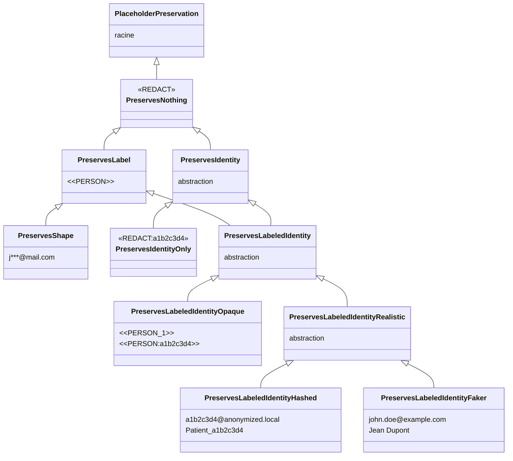

# Placeholder factories

Un **placeholder** est le placeholder synthétique qui remplace une PII détectée dans un texte avant qu'il ne soit fourni au LLM. Au lieu d'envoyer `"Patrick habite à Paris"` au LLM, le pipeline transmet `"<<PERSON:1>> habite à <<LOCATION:1>>"`. Les valeurs originales restent dans le cache et la mémoire de conversation, le LLM ne les voit jamais.

!!! note "Pourquoi le nom 'placeholder factory' ?"

    "Placeholder" parce que c'est un substitut qui tient la place de la valeur originale. On aurait pu parler de "token", mais ce terme est déjà surchargé dans le contexte des LLM (tokens de langage). "Factory" parce que c'est un composant qui génère ces placeholders à la volée, en fonction des entités détectées dans chaque message.

!!! note "Convention de format des placeholders"

    Les placeholders utilisés dans cette documentation et produits par les factories built-in suivent une convention simple :

    - **Placeholder synthétique** (qui ne ressemble à aucune PII réelle) : encadré par `<<` et `>>`. Exemples : `<<REDACT>>`{ .placeholder }, `<<PERSON>>`{ .placeholder }, `<<PERSON:1>>`{ .placeholder }, `<<PERSON:a1b2c3d4>>`{ .placeholder }, `<<REDACT:a1b2c3d4>>`{ .placeholder }. Les délimiteurs servent deux objectifs : un LLM (ou un humain qui relit) ne confond jamais le placeholder avec un mot du texte ou une balise HTML/XML générée par le modèle ; et le middleware peut faire du `str.replace` de manière fiable au moment de la désanonymisation (voir [Stratégies d'appel outil](tool-call-strategies.md) pour pourquoi c'est critique).
    - **Placeholder qui réplique un format de PII** (Faker, réaliste hashé, masqué) : pas de délimiteur. Exemples : `john.doe@example.com`{ .placeholder }, `Patient_a1b2c3d4`{ .placeholder }, `a1b2c3d4@anonymized.local`{ .placeholder }, `j***@mail.com`{ .placeholder }. L'absence de délimiteur est délibérée : le but est précisément de paraître naturel pour qu'un outil aval qui valide le format (regex email, longueur de carte) accepte le placeholder.

    La règle s'applique aussi à toute factory que vous écrirez : placeholder purement opaque ? encadrez-le. Placeholder qui imite une vraie valeur ? laissez-le brut.

Une **placeholder factory** est le composant qui décide à quoi ressemblent ces placeholders et combien d'information ils transportent. Deux questions structurent le choix :

1. *Les placeholders sont-ils uniques par entité ?* `Patrick`{ .pii } et `Marie`{ .pii } ne doivent pas se ramener au même placeholder générique `<<PERSON>>`{ .placeholder }, sinon le LLM ne peut pas faire la distinction entre les deux. Un placeholder unique par entité permet au LLM de raisonner sur les relations entre les entités : *"Jean est-il la même personne que `Patrick`{ .pii } ?"* devient *"`<<PERSON:1>>`{ .placeholder } est-il la même que `<<PERSON:2>>`{ .placeholder } ?"* et a une réponse claire.
2. *Les placeholders sont-ils réversibles ?* À partir d'un placeholder, peut-on récupérer la valeur originale sans connaître le mapping de cache ? C'est la condition nécessaire pour que le middleware puisse faire du remplacement de chaîne dans les arguments d'outil par exemple. Si deux placeholders différents se confondent dans le même placeholder `<<PERSON>>`{ .placeholder }, il est impossible de savoir quelle valeur originale restaurer.

Sept grandes familles de factories se positionnent à des points différents de ce spectre, et le choix a des conséquences directes sur les `ToolCallStrategy` utilisables sans risque. Voir [Stratégies d'appel outil](tool-call-strategies.md) pour le côté runtime.

- **Aucune information** (`<<REDACT>>`{ .placeholder }) : un placeholder constant qui ne révèle rien au LLM. Stratégie de caviardage classique. Aucun raisonnement possible sur les entités (un LLM ne peut pas voir que c'est le nom d'une ville et donc utiliser l'outil `get_weather`).
- **Id seul** (`<<REDACT:a1b2c3d4>>`{ .placeholder }) : un hash unique par entité, sans révéler le type. Le LLM voit qu'il y a deux entités distinctes mais ne sait pas si ce sont des personnes, des emails ou des cartes. Garde la réversibilité côté outil sans donner d'indice sémantique au modèle.
- **Type seul** (`<<PERSON>>`{ .placeholder }, `<<EMAIL>>`{ .placeholder }) : le type est révélé mais pas l'identité. Plusieurs personnes dans la même conversation se confondent dans le même placeholder `<<PERSON>>`{ .placeholder }, donc les références croisées deviennent impossibles.
- **Type + id (opaque)** (`<<PERSON:1>>`{ .placeholder }, `<<PERSON:a1b2c3d4>>`{ .placeholder }) : type révélé, identité stable, placeholder clairement synthétique. Le LLM sait que `<<PERSON:1>>`{ .placeholder } et `<<PERSON:2>>`{ .placeholder } sont des personnes différentes. Unique, donc réversible par remplacement de chaîne.
- **Type + valeur partielle** (`p***@mail.com`{ .placeholder }) : le format est préservé mais le contenu réel partiellement visible. Le LLM voit que c'est un email, devine peut-être le domaine, mais pas l'adresse complète. Plus risqué côté sécurité (fragments réels) et côté réversibilité (collisions possibles).
- **Type + id (Faker)** (`john.doe@gmail.com`{ .placeholder }) : valeur factice entièrement plausible. Texte de sortie fluide et naturel, mais risque de collision avec une vraie valeur du monde.
- **Type + id (réaliste hashé)** (`a1b2c3d4@anonymized.local`{ .placeholder }) : valeur factice réaliste avec un hash garantissant l'unicité. Combine le réalisme du format avec la garantie de non-collision.

---

## Détail des familles

### Aucune information : destruction totale

Le placeholder est un marqueur fixe (par exemple `<<REDACT>>`{ .placeholder }). Le LLM apprend *qu'une* information a été retirée mais rien sur son type, son nombre, ni ses relations. La conversation perd toutes ses références internes : un agent qui doit traiter *"envoyer la facture au client"* ne peut pas savoir si le client est celui mentionné plus tôt ou un nouveau. Utile pour la rédaction d'archive, inutile dès qu'un agent a besoin de raisonner.

Built-in : `RedactPlaceholderFactory` (sortie : `<<REDACT>>`{ .placeholder } par défaut, paramétrable via l'argument `value`). Tag `PreservesNothing`.

### Id seul : identité sans type

`<<REDACT:a1b2c3d4>>`{ .placeholder }. Compromis original : le placeholder garde la forme synthétique `<<...>>` mais ne révèle pas le label ; en revanche il contient un hash unique par entité. Le LLM ne sait pas si l'entité est une personne, un email ou une carte bancaire, mais voit que `<<REDACT:a1b2c3d4>>`{ .placeholder } et `<<REDACT:ef98abcd>>`{ .placeholder } sont deux entités différentes. C'est l'un des points les plus protecteurs tout en restant utilisable côté outil (le hash est unique, donc le remplacement de chaîne fonctionne).

Built-in : `RedactHashPlaceholderFactory` (sortie : `<<REDACT:a1b2c3d4>>`{ .placeholder }, préfixe paramétrable). Tag `PreservesIdentityOnly` (sous `PreservesIdentity`). Le middleware accepte cette factory comme n'importe quelle autre factory identité-préservante via la covariance.

### Type seul : type connu, identités confondues

`<<PERSON>>`{ .placeholder }, `<<EMAIL>>`{ .placeholder }. Le LLM sait qu'il s'agit d'une personne, d'un email, d'une carte bancaire, et peut répondre aux questions qui dépendent uniquement du type. Mais deux personnes différentes dans la même conversation se confondent dans le même placeholder. Le mode d'échec classique est la référence croisée : *"`Patrick`{ .pii } est-il la même personne que le manager mentionné plus tôt ?"* devient *"`<<PERSON>>`{ .placeholder } est-il le même que `<<PERSON>>`{ .placeholder } ?"*, ce qui est sans réponse.

Built-in : `LabelPlaceholderFactory` (sortie : `<<PERSON>>`{ .placeholder }). Tag `PreservesLabel`.

### Type + id (opaque)

`<<PERSON:1>>`{ .placeholder }, `<<PERSON:a1b2c3d4>>`{ .placeholder }. La chaîne n'est manifestement *pas* une personne, un email ou un numéro de carte, c'est un placeholder. Le LLM ne peut pas la confondre avec une donnée réelle, les logs d'audit sont faciles à parcourir, et il y a **zéro chance** de collision avec une vraie valeur. Compromis : un prompt ou un outil aval strict qui valide "l'argument doit ressembler à un email" rejettera ces placeholders.

Built-in : `LabelCounterPlaceholderFactory` (`<<PERSON:1>>`{ .placeholder }), `LabelHashPlaceholderFactory` (`<<PERSON:a1b2c3d4>>`{ .placeholder }). Tag `PreservesLabeledIdentityOpaque`.

### Type + id (réaliste hashé)

Une factory utilisateur peut produire des valeurs **qui ressemblent au format d'origine** mais dont le contenu est piloté par un hash, par exemple `a1b2c3d4@anonymized.local`{ .placeholder } pour un email, ou `Patient_a1b2c3d4`{ .placeholder } pour un nom. Le placeholder passe la validation de format de base (regex email, longueur, caractères autorisés), donc les outils et les templates de prompts aval qui attendent une valeur d'apparence réelle continuent de fonctionner. Comme le contenu est un hash, le placeholder est **unique et impossible à faire coïncider par hasard** avec une vraie valeur existante.

Built-in : `FakerHashPlaceholderFactory` (à configurer avec un mapping `label -> stratégie` couvrant chaque label émis par votre détecteur, **sans fallback** : un label inconnu lève `ValueError`). Tag `PreservesLabeledIdentityHashed`. Voir la section *Écrire la sienne* plus bas pour un exemple complet.

### Type + id (Faker)

`FakerPlaceholderFactory` renvoie des données factices entièrement plausibles : `john.doe@example.com`{ .placeholder }, `Jean Dupont`{ .placeholder }, `+33 6 12 34 56 78`{ .placeholder }. Le LLM ne peut pas distinguer la valeur d'une vraie, ce qui est parfois exactement ce qu'on veut (brouillons propres, pas de `<<PERSON:1>>`{ .placeholder } qui apparaissent dans un texte visible par l'utilisateur). Deux risques spécifiques accompagnent cette stratégie :

1. **Collision fortuite avec des valeurs réelles.** Un email Faker peut atterrir sur l'adresse réelle d'une vraie personne. Si une réponse d'outil contient ensuite cette adresse réelle, l'étape de déanonymisation ne peut pas savoir si elle doit la remplacer ou la laisser intacte.
2. **L'agent peut raisonner sur la valeur comme si elle était réelle.** Si un outil aval route sur le domaine de l'email, il routera sur le *faux* domaine, feature appréciable dans un flux `PASSTHROUGH` mais piège dans un flux `FULL` où des PII réelles reviennent vers le LLM.

Utiliser Faker pour de l'archivage, des démos ou une rédaction one-shot. Préférer les placeholders opaques ou à format préservé hashé quand l'agent dispose d'outils qui touchent à de vrais systèmes. Tag `PreservesLabeledIdentityFaker`.

### Type + valeur partielle : fuite partielle de valeur

`j***@mail.com`{ .placeholder }, `****4567`{ .placeholder }, `P******`{ .placeholder }. Le placeholder conserve *une partie* de la valeur originale : le domaine de l'email, les quatre derniers chiffres d'une carte, la première lettre d'un nom. Le LLM peut raisonner au-delà du type : *"l'email est sur le domaine de l'entreprise"*, *"la carte se termine en 4567"*, *"le nom commence par P"*. Deux compromis viennent avec :

1. **Des fragments réels de la PII atteignent le LLM.** Il ne peut pas reconstruire la valeur complète, mais `j***@mail.com`{ .placeholder } situe déjà l'utilisateur dans un fournisseur de mail connu.
2. **Des collisions sont possibles.** Deux cartes différentes terminant par `4567` se confondent dans `****4567`{ .placeholder } ; deux emails partageant la première lettre et le domaine deviennent identiques. L'id est "majoritairement unique" mais sans garantie.

Built-in : `MaskPlaceholderFactory`. Tag `PreservesShape`. Le middleware le rejette pour la même raison que `PreservesLabel` : un placeholder ambigu ne peut pas être désanonymisé par remplacement de chaîne.

---

## Tags de préservation

Chaque factory porte un **type fantôme** qui résume le niveau de préservation de ses placeholders. C'est ce tag que le type-checker lit pour valider une factory face à ses consommateurs.

**Identité de chaque famille.**

| Famille | Exemple | Tag |
|---|---|---|
| Aucune information | `<<REDACT>>`{ .placeholder } | `PreservesNothing` |
| Id seul | `<<REDACT:a1b2c3d4>>`{ .placeholder } | `PreservesIdentityOnly` |
| Type seul | `<<PERSON>>`{ .placeholder } | `PreservesLabel` |
| Type + id (opaque) | `<<PERSON:1>>`{ .placeholder }, `<<PERSON:a1b2c3d4>>`{ .placeholder } | `PreservesLabeledIdentityOpaque` |
| Type + id (réaliste hashé) | `a1b2c3d4@anonymized.local`{ .placeholder }, `Patient_a1b2c3d4`{ .placeholder } | `PreservesLabeledIdentityHashed` |
| Type + id (Faker) | `john.doe@example.com`{ .placeholder }, `Jean Dupont`{ .placeholder } | `PreservesLabeledIdentityFaker` |
| Type + valeur partielle | `j***@mail.com`{ .placeholder }, `****4567`{ .placeholder } | `PreservesShape` |

Deux angles de lecture, deux tableaux. **Confidentialité** : ce qui fuit vers le LLM (point de vue attaquant / privacy). **Exploitation** : ce que l'agent et le système peuvent faire avec le placeholder (point de vue capacités fonctionnelles). La même réponse peut être bonne d'un côté et problématique de l'autre, c'est exactement la tension qu'on rend explicite.

Code couleur commun aux deux tables : **bleu** = meilleur, **vert** = correct, **jaune** = partiel, **rouge** = problématique.

#### Confidentialité (ce qui fuit vers le LLM)

<table class="security-table" markdown="1">
<thead>
<tr><th>Famille</th><th>Type vu ?</th><th>PII distinguées ?</th><th>Fuite de valeur ?</th><th>Collision avec une vraie valeur ?</th></tr>
</thead>
<tbody>
<tr><td>Aucune information</td><td class="c-blue">non</td><td class="c-blue">non</td><td class="c-blue">aucune</td><td class="c-blue">non</td></tr>
<tr><td>Id seul</td><td class="c-blue">non</td><td class="c-green">oui</td><td class="c-blue">aucune</td><td class="c-blue">non</td></tr>
<tr><td>Type seul</td><td class="c-green">oui</td><td class="c-blue">non</td><td class="c-blue">aucune</td><td class="c-blue">non</td></tr>
<tr><td>Type + id (opaque)</td><td class="c-green">oui</td><td class="c-green">oui</td><td class="c-blue">aucune</td><td class="c-blue">non</td></tr>
<tr><td>Type + id (réaliste hashé)</td><td class="c-green">oui</td><td class="c-green">oui</td><td class="c-blue">aucune</td><td class="c-blue">non</td></tr>
<tr><td>Type + id (Faker)</td><td class="c-green">oui</td><td class="c-green">oui</td><td class="c-blue">aucune</td><td class="c-yellow">risque</td></tr>
<tr><td>Type + valeur partielle</td><td class="c-green">oui</td><td class="c-green">oui</td><td class="c-yellow">partielle</td><td class="c-yellow">risque</td></tr>
</tbody>
</table>

#### Exploitation par le LLM et l'agent

<table class="security-table" markdown="1">
<thead>
<tr><th>Famille</th><th>Raisonner sur le type</th><th>Suivre les références entre entités</th><th>Réversible côté outil</th><th>Stable entre messages</th></tr>
</thead>
<tbody>
<tr><td>Aucune information</td><td class="c-red">non</td><td class="c-red">non</td><td class="c-red">non</td><td class="c-red">non</td></tr>
<tr><td>Id seul</td><td class="c-red">non</td><td class="c-blue">oui</td><td class="c-blue">oui</td><td class="c-blue">oui</td></tr>
<tr><td>Type seul</td><td class="c-blue">oui</td><td class="c-red">non</td><td class="c-red">non</td><td class="c-yellow">partielle</td></tr>
<tr><td>Type + id (opaque)</td><td class="c-blue">oui</td><td class="c-blue">oui</td><td class="c-blue">oui</td><td class="c-blue">oui</td></tr>
<tr><td>Type + id (réaliste hashé)</td><td class="c-blue">oui</td><td class="c-blue">oui</td><td class="c-blue">oui</td><td class="c-blue">oui</td></tr>
<tr><td>Type + id (Faker)</td><td class="c-blue">oui</td><td class="c-blue">oui</td><td class="c-blue">oui</td><td class="c-blue">oui</td></tr>
<tr><td>Type + valeur partielle</td><td class="c-blue">oui</td><td class="c-yellow">majoritairement</td><td class="c-yellow">oui (collisions)</td><td class="c-yellow">oui (collisions)</td></tr>
</tbody>
</table>

<small>
Légende :
<span class="sec-legend c-blue">meilleur</span>
<span class="sec-legend c-green">correct</span>
<span class="sec-legend c-yellow">partiel</span>
<span class="sec-legend c-red">problématique</span>
</small>

Les tags forment une **hiérarchie d'héritage** que le type-checker exploite via la covariance de `AnyPlaceholderFactory[PreservationT_co]`. Deux axes orthogonaux structurent la taxonomie : *Label* (le placeholder révèle le type) et *Identity* (le placeholder est unique par entité). `PreservesLabeledIdentity` combine les deux via multi-héritage, donc une factory `<<PERSON:1>>` est à la fois un `PreservesLabel` *et* un `PreservesIdentity`. Un consumer typé contre `PreservesIdentity` accepte ainsi `PreservesIdentityOnly` *et* tous les `PreservesLabeledIdentity*`, et rejette `PreservesLabel` / `PreservesShape` / `PreservesNothing` qui n'ont pas la garantie d'unicité.



`PreservesLabeledIdentity` hérite à la fois de `PreservesLabel` et de `PreservesIdentity` (multi-héritage). C'est ce qui exprime le "**A est un B mais tous les B ne sont pas A**" : tout `PreservesLabeledIdentity` est aussi un `PreservesLabel` et un `PreservesIdentity`, mais l'inverse est faux. Un consumer typé contre `Pipeline[PreservesIdentity]` accepte donc les factories *avec ou sans* label, du moment qu'elles produisent des placeholders uniques par entité.

Une factory déclare le tag **le plus spécifique** qui matche ses garanties :

```python
class LabelCounterPlaceholderFactory(AnyPlaceholderFactory[PreservesLabeledIdentityOpaque]): ...
class LabelHashPlaceholderFactory(AnyPlaceholderFactory[PreservesLabeledIdentityOpaque]): ...
class FakerPlaceholderFactory(AnyPlaceholderFactory[PreservesLabeledIdentityFaker]): ...
class LabelPlaceholderFactory(AnyPlaceholderFactory[PreservesLabel]): ...
class MaskPlaceholderFactory(AnyPlaceholderFactory[PreservesShape]): ...
# Pas de built-in pour la branche id-only : à implémenter avec
# PreservesIdentityOnly pour un Redact hashé du type <<REDACT:a1b2c3d4>>.
```

---

## Factories built-in

| Factory | Style | Mécanisme | Exemple de sortie | Tag |
|---|---|---|---|---|
| `RedactPlaceholderFactory` | Redact | — | `<<REDACT>>`{ .placeholder } | `PreservesNothing` |
| `RedactCounterPlaceholderFactory` | Redact | Counter | `<<REDACT:1>>`{ .placeholder } | `PreservesIdentityOnly` |
| `RedactHashPlaceholderFactory` | Redact | Hash | `<<REDACT:a1b2c3d4>>`{ .placeholder } | `PreservesIdentityOnly` |
| `LabelPlaceholderFactory` | Label | — | `<<PERSON>>`{ .placeholder } | `PreservesLabel` |
| `LabelCounterPlaceholderFactory` (défaut) | Label | Counter | `<<PERSON:1>>`{ .placeholder } | `PreservesLabeledIdentityOpaque` |
| `LabelHashPlaceholderFactory` | Label | Hash | `<<PERSON:a1b2c3d4>>`{ .placeholder } | `PreservesLabeledIdentityOpaque` |
| `FakerCounterPlaceholderFactory` | Faker | Counter | `John Doe:1`{ .placeholder } | `PreservesLabeledIdentityHashed` |
| `FakerHashPlaceholderFactory` | Faker | Hash | `John Doe:a1b2c3d4`{ .placeholder } | `PreservesLabeledIdentityHashed` |
| `FakerPlaceholderFactory` | Faker | random | `john.doe@example.com`{ .placeholder } | `PreservesLabeledIdentityFaker` |
| `MaskPlaceholderFactory` | Mask | partial | `p***@mail.com`{ .placeholder } | `PreservesShape` |

Le naming suit le schéma `<Style><Mécanisme>PlaceholderFactory` :

- **Style** = ce que le placeholder préserve (Redact = rien, Label = type, Faker = forme PII, Mask = valeur partielle)
- **Mécanisme** = comment l'unicité est obtenue (Counter = compteur séquentiel, Hash = SHA-256 ; absent quand non pertinent)

`LabelCounterPlaceholderFactory` et `LabelHashPlaceholderFactory` sont les valeurs sûres par défaut. `RedactCounter` / `RedactHash` ajoutent l'unicité sans révéler le label (utile pour la réduction des biais). `FakerCounter` / `FakerHash` produisent un format réaliste : il faut **fournir explicitement une stratégie par label** (3 modes : base, template avec `{counter}` ou `{hash}`, callable comme `fake_ip()` ou `fake_phone()`). `FakerPlaceholderFactory` est réversible mais ses placeholders peuvent collisionner avec de vraies valeurs. `RedactPlaceholderFactory`, `LabelPlaceholderFactory` et `MaskPlaceholderFactory` sont des outils de caviardage non réversibles (rejetés par le middleware).

---

## Quel placeholder choisir ?

La placeholder factory est l'endroit où le **compromis confidentialité / capacité d'agent** est rendu explicite. Le bon choix dépend du contexte d'usage. Deux scénarios couvrent l'essentiel.

### Cas 1 : anonymisation simple (one-shot, archivage, conformité)

Le but est de produire une version assainie d'un document : caviardage d'un jugement, redaction d'un dossier RH avant archivage, scrubbing d'un export. Pas d'agent, pas d'outils, parfois même pas besoin de réversibilité.

| Besoin | Famille recommandée | Pourquoi |
|---|---|---|
| Effacer toute trace, sans réversibilité | **Aucune information** (`<<REDACT>>`{ .placeholder }) | Le plus protecteur, aucune fuite sémantique. Le document devient lisible mais le LLM ne peut rien en inférer. |
| Garder un texte lisible (le lecteur humain voit "[email]" plutôt que "<<REDACT>>") | **Type seul** (`<<PERSON>>`{ .placeholder }, `<<EMAIL>>`{ .placeholder }) | Le type aide la lecture humaine sans rien fuiter de la valeur. Built-in : `LabelPlaceholderFactory`. |
| Permettre une désanonymisation côté serveur (cache local) | **Type + id (opaque)** (`<<PERSON:1>>`{ .placeholder }) | Réversible via le cache, audit trivial, aucune collision. Built-in : `LabelCounterPlaceholderFactory` ou `LabelHashPlaceholderFactory`. |
| Suivre "qui est qui" sans révéler le type (sensible : médical, RH) | **Id seul** (`<<REDACT:a1b2c3d4>>`{ .placeholder }) | Distingue les entités sans aucun indice sémantique. À implémenter (pas de built-in). |

### Cas 2 : anonymisation pour LLM / agent avec outils

Le LLM raisonne sur la conversation, et les outils (CRM, BDD, mail) ont besoin des vraies valeurs au moment de l'appel. Le middleware fait du remplacement de chaîne sur les arguments d'outil, donc **il exige un placeholder unique par entité**.

Conséquence directe : seules les familles avec identité préservée (`Id seul`, toutes les variantes `Type + id`) sont compatibles. `Aucune information`, `Type seul` et `Type + valeur partielle` sont rejetées au type-check (et au runtime via `get_preservation_tag`).

| Besoin | Famille recommandée | Pourquoi |
|---|---|---|
| **Cas par défaut** | **Type + id (opaque)** (`<<PERSON:1>>`{ .placeholder }, `<<PERSON:a1b2c3d4>>`{ .placeholder }) | Réversible, opaque, zéro collision. La valeur sûre. Built-in : `LabelCounterPlaceholderFactory` (par thread) ou `LabelHashPlaceholderFactory` (déterministe). |
| L'outil aval valide un format (regex email, longueur de carte) | **Type + id (réaliste hashé)** (`a1b2c3d4@anonymized.local`{ .placeholder }) | Le placeholder passe la validation tout en gardant unicité et zéro collision. À implémenter (pas de built-in). |
| Sortie utilisateur doit paraître naturelle (brouillons, démos) | **Type + id (Faker)** (`john.doe@example.com`{ .placeholder }) | Texte fluide, aucun `<<PERSON:1>>`{ .placeholder } visible côté utilisateur. **Risque** : collision avec une vraie valeur dans une réponse d'outil. À éviter en `ToolCallStrategy.FULL`. Built-in : `FakerPlaceholderFactory`. |
| Réduction des biais (CV, candidature) | **Id seul** (`<<REDACT:a1b2c3d4>>`{ .placeholder }) | Le LLM ne voit pas le type, donc pas le genre/origine inférables d'un prénom. Distingue les candidats sans biaiser le raisonnement. |
| Type sensible (catégorie médicale, niveau d'habilitation) | **Id seul** (`<<REDACT:a1b2c3d4>>`{ .placeholder }) | Même raison : le type lui-même est une PII et ne doit pas atteindre le LLM. |

À éviter dans un agent :

- `LabelPlaceholderFactory` et `MaskPlaceholderFactory` sont rejetées par le middleware (pas d'unicité garantie). Utilisables hors middleware uniquement, ou en mode `ToolCallStrategy.PASSTHROUGH` (l'agent ne reçoit jamais les vraies valeurs).
- `FakerPlaceholderFactory` quand le pipeline est en `FULL` ou `INBOUND_ONLY` *et* que les outils peuvent renvoyer de vrais emails ou noms : risque de collision externe non détectable.

Le tag de préservation existe pour que ce choix soit visible par le type-checker, pas enseveli dans des détails de format de placeholder. Une factory taguée `PreservesShape` ne peut pas être branchée sur le middleware *par accident* : l'erreur tombe à la vérification de types, pas sur le premier appel d'outil en production.

---

## Pourquoi `PIIAnonymizationMiddleware` exige `PreservesIdentity`

Le middleware travaille sur trois frontières : les **messages d'entrée** (LLM in), les **messages de sortie** (LLM out), et les **appels d'outil**. Les deux premières passent par le cache, les appels d'outil ne le peuvent pas.

**Messages d'entrée/sortie.** Quand `abefore_model` anonymise un message, il stocke le mapping `hash(texte_anonymisé) → original` dans le cache. La réponse du LLM est récupérée par lookup exact sur le hash, donc la déanonymisation est une simple consultation de clé. Cette opération fonctionne avec n'importe quelle factory, qu'il y ait ou non collision sur les placeholders.

**Appels d'outil.** Le LLM produit les arguments d'outil en *combinant* et *paraphrasant* les placeholders qu'il vient de voir. Ce texte précis n'a jamais été produit par le pipeline, il n'est donc **pas dans le cache**. La seule façon de le déanonymiser est le **remplacement de chaîne** : on parcourt les arguments à la recherche des placeholders connus et on substitue la valeur originale de chaque entité. La logique est symétrique pour la réponse de l'outil, qu'on ré-anonymise en remplaçant les valeurs PII connues par leur placeholder.

Cette substitution n'est non ambiguë **que si chaque entité a un placeholder unique**. Si deux entités se confondent dans `<<PERSON>>`{ .placeholder }, il est impossible de décider quelle valeur originale restaurer. Le middleware restreint donc son type accepté à `ThreadAnonymizationPipeline[PreservesIdentity]`, ce qui via la covariance englobe à la fois `PreservesIdentityOnly` (Redact hashé sans label) et tous les `PreservesLabeledIdentity*` (avec label). Brancher une factory `PreservesLabel` / `PreservesShape` / `PreservesNothing` sur le middleware est rejeté par `pyrefly` / `mypy` *avant* même que le programme ne tourne.

`ThreadAnonymizationPipeline` reproduit la contrainte au runtime via `get_preservation_tag()`, ce qui rejette aussi les factories non typées ou construites dynamiquement qui contourneraient le type-checker.

Voir [Stratégies d'appel outil](tool-call-strategies.md) pour la seule échappatoire (`ToolCallStrategy.PASSTHROUGH`, qui ne traverse jamais la frontière outil en clair).

---

## Écrire la sienne

Il suffit d'hériter de `AnyPlaceholderFactory[<tag>]` avec le bon tag de préservation, puis d'implémenter `create()`.

???+ example "Factory à tags UUID (id sans label) : `PreservesIdentityOnly`"

    ```python
    import uuid
    from piighost.models import Entity
    from piighost.placeholder import AnyPlaceholderFactory
    from piighost.placeholder_tags import PreservesIdentityOnly

    class UUIDPlaceholderFactory(AnyPlaceholderFactory[PreservesIdentityOnly]):
        """Generates opaque UUID tags, e.g. <<a3f2-1b4c>>."""

        def create(self, entities: list[Entity]) -> dict[Entity, str]:
            result: dict[Entity, str] = {}
            seen: dict[str, str] = {}  # canonical → token

            for entity in entities:
                canonical = entity.detections[0].text.lower()
                if canonical not in seen:
                    seen[canonical] = f"<<{uuid.uuid4().hex[:8]}>>"
                result[entity] = seen[canonical]

            return result
    ```

??? example "Factory à format crochets (label + id) : `PreservesLabeledIdentityOpaque`"

    ```python
    from collections import defaultdict
    from piighost.models import Entity
    from piighost.placeholder import AnyPlaceholderFactory
    from piighost.placeholder_tags import PreservesLabeledIdentityOpaque

    class BracketPlaceholderFactory(AnyPlaceholderFactory[PreservesLabeledIdentityOpaque]):
        """Generates tags in the format [PERSON:1], [LOCATION:2], etc."""

        def create(self, entities: list[Entity]) -> dict[Entity, str]:
            result: dict[Entity, str] = {}
            counters: dict[str, int] = defaultdict(int)

            for entity in entities:
                label = entity.label
                counters[label] += 1
                result[entity] = f"[{label}:{counters[label]}]"

            return result
    ```

??? example "Configurer `FakerHashPlaceholderFactory` (réaliste hashé, sans fallback)"

    Vous fournissez un mapping `label -> stratégie`. Trois modes coexistent et le dispatch se fait au runtime :

    1. **Base** : `str` sans `{hash}` → la factory ajoute `:hash`. Ex. `"John Doe"` → `John Doe:a1b2c3d4`.
    2. **Template** : `str` avec `{hash}` → substitution. Ex. `"{hash}@example.com"` → `a1b2c3d4@example.com`.
    3. **Callable** : fonction `(hash) -> str`. Idéal pour les types qui ont besoin d'un format strict (IP, téléphone, IBAN…) — utilisez les helpers `fake_*` qui seedent Faker avec le hash.

    **Pas de fallback** : un label inconnu lève `ValueError` listant les labels enregistrés. Configuration drift caught immediately.

    ```python
    from piighost.ph_factory.faker_hash import (
        FakerHashPlaceholderFactory,
        fake_ip,
        fake_phone,
        fake_iban,
    )

    factory = FakerHashPlaceholderFactory(
        strategies={
            "person":     "John Doe",                  # base → "John Doe:a1b2c3d4"
            "location":   "Paris",                      # base → "Paris:a1b2c3d4"
            "email":      "{hash}@example.com",         # template → "a1b2c3d4@example.com"
            "url":        "https://example.com/{hash}", # template
            "ip_address": fake_ip(),                    # callable → "192.168.42.7"
            "phone":      fake_phone(),                 # callable → "+33 6 12 34 56 78"
            "iban":       fake_iban(),                  # callable → "FR76..."
        },
        hash_length=8,
    )
    ```

    Si vous ne fournissez pas `strategies`, des defaults sensés sont utilisés (`person` → `"John Doe"`, `email` → `"{hash}@example.com"`, `phone` → `fake_phone()`, etc.).

??? example "Configurer `FakerCounterPlaceholderFactory` (réaliste compté, sans fallback)"

    Même API à 3 modes que `FakerHashPlaceholderFactory`, mais avec un compteur séquentiel par label au lieu d'un hash. Le placeholder de template est `{counter}`.

    ```python
    from piighost.ph_factory.faker_hash import FakerCounterPlaceholderFactory

    factory = FakerCounterPlaceholderFactory(
        strategies={
            "person":   "John Doe",                  # → "John Doe:1", "John Doe:2"…
            "email":    "{counter}@example.com",     # → "1@example.com", "2@example.com"…
        },
    )
    ```

---

## Voir aussi

- [Stratégies d'appel outil](tool-call-strategies.md) : comment le middleware utilise ces placeholders, et pourquoi `PASSTHROUGH` est le seul mode tolérant un tag plus faible.
- [Étendre PIIGhost](extending.md) : référence complète des protocoles et des autres points d'injection du pipeline.
- [Limites](limitations.md) : conséquences opérationnelles du choix de factory (cache, mise à l'échelle, hallucinations).
