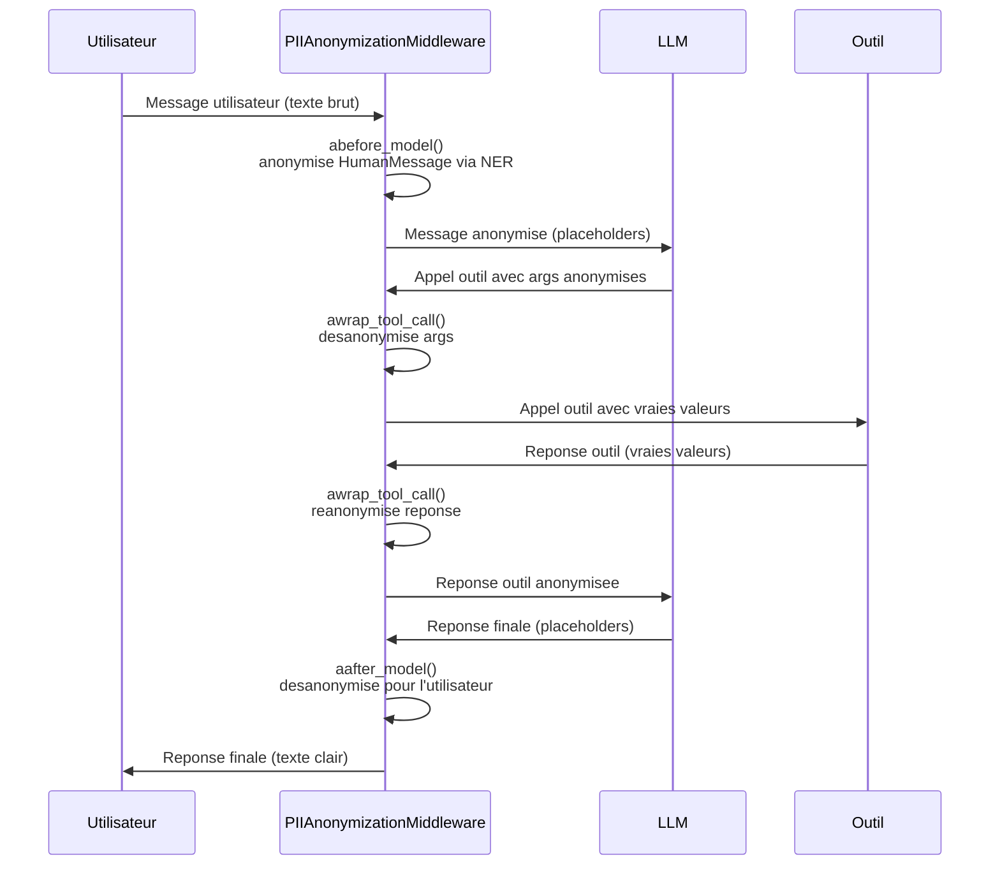

# Reference Middleware

Module : `piighost.middleware`

---

## `PIIAnonymizationMiddleware`

Middleware LangChain qui anonymise les donnees personnelles de facon transparente autour de la frontiere LLM / outils.

Etend `AgentMiddleware` de LangChain et intercepte le cycle de l'agent en **3 points** :

| Hook | Moment | Operation |
|------|--------|-----------|
| `abefore_model` | Avant chaque appel LLM | Anonymise tous les messages |
| `aafter_model` | Apres chaque reponse LLM | Desanonymise pour l'utilisateur |
| `awrap_tool_call` | Autour de chaque outil | Desanonymise les args, reanonymise la reponse |

### Constructeur

```python
PIIAnonymizationMiddleware(pipeline: ThreadAnonymizationPipeline)
```

| Parametre | Type | Description |
|-----------|------|-------------|
| `pipeline` | `ThreadAnonymizationPipeline` | Pipeline conversationnel configuré avec mémoire |

### Utilisation

```python
from piighost.middleware import PIIAnonymizationMiddleware
from piighost.pipeline import ThreadAnonymizationPipeline
from langchain.agents import create_agent

middleware = PIIAnonymizationMiddleware(pipeline=conv_pipeline)

agent = create_agent(
    model="openai:gpt-5.4",
    tools=[...],
    middleware=[middleware],
)
```

---

## Hooks detailles

### `abefore_model(state, runtime) -> dict | None` *(async)*

Appele avant chaque appel au LLM. Anonymise tous les messages via `pipeline.anonymize()`.

### `aafter_model(state, runtime) -> dict | None` *(async)*

Appele apres chaque reponse du LLM. Desanonymise via `pipeline.deanonymize()` puis `pipeline.deanonymize_with_ent()` en cas de `CacheMissError`.

### `awrap_tool_call(request, handler) -> ToolMessage | Command` *(async)*

1. **Desanonymise** les arguments `str` → l'outil recoit les vraies valeurs
2. **Execute** l'outil via `handler(request)`
3. **Reanonymise** la reponse via `pipeline.anonymize()`

---

## Flux complet



---

## Dependance LangChain

`PIIAnonymizationMiddleware` requiert que `langchain` soit installe. Si ce n'est pas le cas, une `ImportError` est levee :

```
ImportError: You must install piighost[langchain] for use middleware
```

Installation :

```bash
uv add piighost langchain langgraph
```

---

## Exemple complet

```python
import asyncio
from gliner2 import GLiNER2
from langchain.agents import create_agent
from langchain_core.tools import tool

from piighost.anonymizer import Anonymizer
from piighost.pipeline import ThreadAnonymizationPipeline
from piighost.detector import Gliner2Detector
from piighost.linker.entity import ExactEntityLinker
from piighost.entity_resolver import MergeEntityConflictResolver
from piighost.middleware import PIIAnonymizationMiddleware
from piighost.placeholder import CounterPlaceholderFactory
from piighost.span_resolver import ConfidenceSpanConflictResolver


@tool
def get_info(person: str) -> str:
    """Retourne des informations sur une personne."""
    return f"{person} est ingenieur logiciel a Paris."


model = GLiNER2.from_pretrained("fastino/gliner2-multi-v1")

detector = Gliner2Detector(model=model, labels=["PERSON", "LOCATION"], threshold=0.5)
span_resolver = ConfidenceSpanConflictResolver()
entity_linker = ExactEntityLinker()
entity_resolver = MergeEntityConflictResolver()
anonymizer = Anonymizer(CounterPlaceholderFactory())

pipeline = ThreadAnonymizationPipeline(
    detector=detector,
    span_resolver=span_resolver,
    entity_linker=entity_linker,
    entity_resolver=entity_resolver,
    anonymizer=anonymizer,
)
middleware = PIIAnonymizationMiddleware(pipeline=pipeline)

agent = create_agent(
    model="openai:gpt-5.4",
    system_prompt="Tu es un assistant utile. Traite les placeholders comme des vraies valeurs.",
    tools=[get_info],
    middleware=[middleware],
)


async def main():
    result = await agent.ainvoke({
        "messages": [{"role": "user", "content": "Qui est Patrick ?"}]
    })
    print(result["messages"][-1].content)


asyncio.run(main())
```
