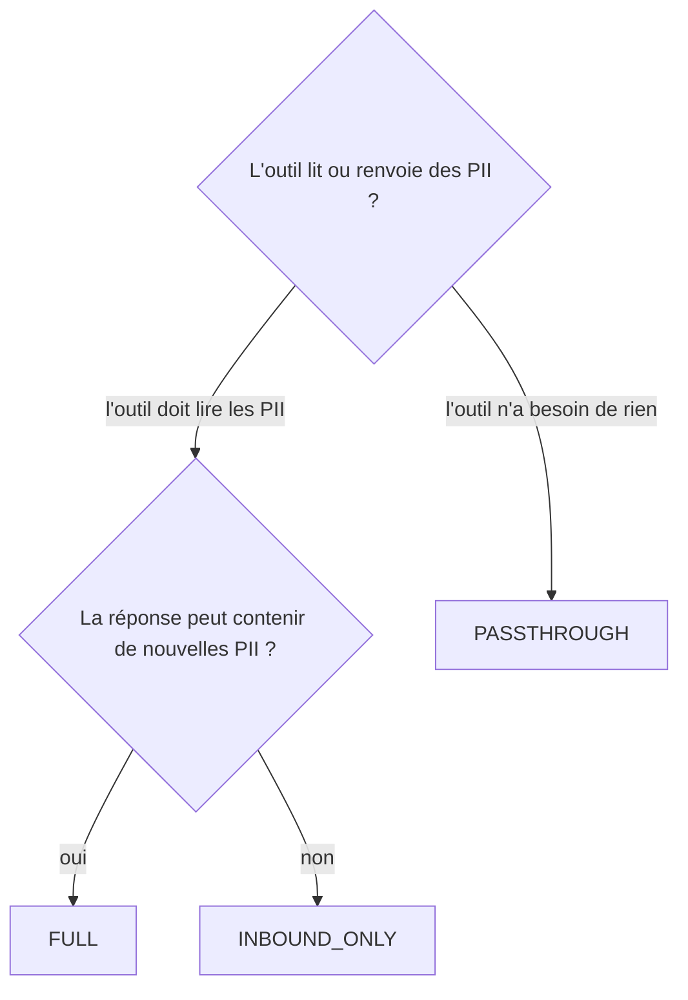

# Stratégies d'appel outil

`PIIAnonymizationMiddleware` opère sur **deux canaux distincts**, qui n'offrent pas du tout les mêmes garanties de fiabilité. Choisir la bonne `ToolCallStrategy` commence par comprendre pourquoi.

---

## Deux canaux, deux mécanismes

### Le canal LLM : basé sur le cache, fiable

Dans `abefore_model`, le middleware envoie au LLM un texte anonymisé *exact*, et stocke le mapping `hash(texte_anonymisé) → original` dans le cache. Quand le LLM répond, `aafter_model` cherche la réponse par hash et restaure l'original. C'est un lookup déterministe sur une clé, il ne peut pas être ambigu, et il fonctionne quel que soit le placeholder utilisé : la clé est le texte complet, pas les placeholders en eux-mêmes.

Tant que le LLM renvoie tel quel le texte anonymisé qu'il a reçu (le contrat des messages d'entrée), ce canal est fiable.

### Le canal outil : remplacement de chaîne, fragile

Dans `awrap_tool_call`, le LLM produit les arguments d'outil en combinant, fragmentant, paraphrasant les placeholders qu'il vient de voir. Ce texte arbitraire n'a jamais été produit par le pipeline, il n'est donc **pas dans le cache**. Pareil pour la réponse de l'outil : `piighost` ne l'a jamais vue.

Les deux directions retombent donc sur du **remplacement de chaîne brut** :

- *Arguments d'outil (LLM → outil)* : on parcourt les arguments à la recherche des placeholders connus, et on remplace chacun par la valeur originale de son entité.
- *Réponse de l'outil (outil → LLM)* : on parcourt la réponse à la recherche des valeurs PII connues, et on remplace chacune par le placeholder correspondant.

Le remplacement brut n'est correct que si le mapping est **non ambigu**. Si deux entités partagent le placeholder `<<PERSON>>`{ .placeholder }, impossible de savoir laquelle restaurer dans les arguments. Si deux entités se confondent dans le même placeholder masqué dans la réponse, la mémoire de conversation devient lacunaire. C'est la raison structurelle pour laquelle le middleware n'accepte que des factories taguées `PreservesIdentity`. Voir [Placeholder factories](placeholder-factories.md).

---

## Les trois stratégies

`ToolCallStrategy` est le sélecteur qui décide ce qui franchit la frontière outil.

| Stratégie | L'outil voit | Traitement de la réponse | Quand l'utiliser |
|---|---|---|---|
| `FULL` (défaut) | les vraies valeurs (arguments désanonymisés) | re-détectée et ré-anonymisée par le pipeline complet | outils qui peuvent émettre de nouvelles PII (BDD, CRM, recherche) |
| `INBOUND_ONLY` | les vraies valeurs (arguments désanonymisés) | renvoyée telle quelle, ré-anonymisée paresseusement au prochain `abefore_model` | outils dont la réponse est connue sans PII ou déjà anonymisée |
| `PASSTHROUGH` | les placeholders tels quels | renvoyée telle quelle | outils qui ne doivent jamais voir de PII réelles, ou qui n'en ont pas besoin |

### `FULL`

Symétrique : on désanonymise les arguments, puis on passe la réponse par `pipeline.anonymize()`, qui re-détecte et ré-anonymise. Toute nouvelle PII renvoyée par l'outil est rattrapée et transformée en placeholder avant que le LLM ne la voie. Coûte une passe de détection par appel d'outil.

### `INBOUND_ONLY`

Plus rapide : on saute la passe de détection sur la réponse et on laisse le prochain `abefore_model` rattraper d'éventuelles PII comme texte ambiant. On gagne sur le coût de NER au prix d'une latence différée, ce qui est rentable quand la sortie d'outil est structurée et connue propre (lookup d'identifiant interne, drapeau de statut, valeur numérique).

### `PASSTHROUGH`

Frontière de confidentialité la plus stricte : les outils n'observent jamais de PII réelle. L'outil reçoit la chaîne placeholder telle quelle, et sa réponse est transmise sans réécriture. Utile quand les outils de l'agent travaillent sur des identifiants opaques, ou quand l'outil est lui-même la couche LLM-facing d'un autre système d'anonymisation.

`PASSTHROUGH` est le seul mode qui tolère une factory `PreservesLabel` / `PreservesShape` / `PreservesNothing`. Comme la frontière outil n'est jamais traversée en clair, l'exigence d'unicité des placeholders disparaît. (On ne peut toujours pas brancher une telle factory directement sur `PIIAnonymizationMiddleware`, le type-checker la rejettera ; l'échappatoire est d'utiliser le pipeline brut hors du middleware.)

---

## Choisir une stratégie

Règle générale :

- Par défaut, `FULL`. C'est le réglage le plus défensif et le seul qui rattrape automatiquement les PII introduites par l'outil.
- Passer à `INBOUND_ONLY` uniquement quand on peut prouver que la forme de la réponse est sans PII et que le gain de latence compte.
- Utiliser `PASSTHROUGH` quand la confidentialité prime sur la fonctionnalité, ou quand l'outil est conçu pour travailler sur des placeholders.

---

## Voir aussi

- [Placeholder factories](placeholder-factories.md) : la contrainte d'unicité du placeholder qui motive `PreservesIdentity`.
- [Architecture](architecture.md) : diagrammes de séquence des canaux LLM et outil.
- [Limites](limitations.md) : choix du backend de cache et interactions avec la stratégie.
